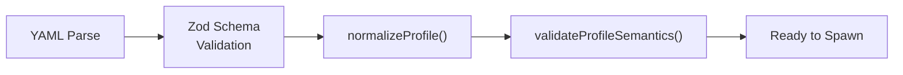

# Agent Configuration System

Agent profiles are YAML declarations that define how agents are spawned, what context they receive, and how the TUI presents them. The system uses Zod schemas for runtime validation, replacing static YAML schema files with type-safe, self-documenting validation.

## Profile Schema Fields

Every agent YAML file is validated against [ref:.allhands/harness/src/lib/schemas/agent-profile.ts:RawAgentProfileSchema:fb892e5], which enforces this contract:

| Field | Type | Default | Purpose |
|-------|------|---------|---------|
| `name` | string (required) | -- | Agent identifier, doubles as tmux window name |
| `flow` | string (required) | -- | Flow file relative to `.allhands/flows/` |
| `prompt_scoped` | boolean | `false` | When true, multiple instances spawn (one per prompt) |
| `message_template` | string | -- | Template with `${VAR}` interpolation for launch context |
| `template_vars` | array | `[]` | Required variables declared for the template |
| `tui_action` | string | -- | TUI action name that triggers this agent |
| `tui_label` | string | -- | Display label in TUI (falls back to capitalized name) |
| `tui_requires_spec` | boolean | `false` | Gates TUI action behind active spec selection |
| `non_coding` | boolean | `false` | Marks agent as non-coding, affecting downstream behaviors |

## Template Variable System

Template variables are the mechanism through which agents receive runtime context at spawn. The variable registry lives in [ref:.allhands/harness/src/lib/schemas/template-vars.ts:TemplateVars:730f114] and defines four categories:

**Path variables** -- resolve to filesystem locations:
- `SPEC_PATH`, `ALIGNMENT_PATH`, `PROMPTS_FOLDER`, `PROMPT_PATH`, `OUTPUT_PATH`, `PLANNING_FOLDER`

**Identifier variables** -- resolve to names or numbers:
- `SPEC_NAME`, `PROMPT_NUMBER` (validated as two-digit string via regex)

**Branch/context variables** -- resolve to runtime state:
- `BRANCH` (current git branch name)

**Spec metadata variables** -- resolve to spec properties:
- `SPEC_TYPE` (spec type from frontmatter: milestone, investigation, optimization, refactor, documentation, triage)

**Emergent planner variables** -- resolve to settings-driven context:
- `HYPOTHESIS_DOMAINS` (comma-separated list of hypothesis domains from `settings.json`)

> **Change note**: `WORKFLOW_TYPE` has been removed. It was replaced by `SPEC_TYPE`, which reads directly from spec frontmatter rather than from workflow YAML files (which have been deleted). `PROMPT_NUMBER` is no longer used by the emergent agent but remains in the registry for other agents.

Template resolution validates that every `${VAR}` in `message_template` maps to a registered variable name in [ref:.allhands/harness/src/lib/schemas/template-vars.ts:TEMPLATE_VAR_NAMES:730f114], and that the runtime context provides non-empty values for all declared `template_vars`.

## Validation Pipeline

Profile validation happens in two stages:

1. **Schema validation** -- [ref:.allhands/harness/src/lib/schemas/agent-profile.ts:RawAgentProfileSchema:fb892e5] checks types, applies defaults, and rejects unknown fields
2. **Normalization** -- [ref:.allhands/harness/src/lib/schemas/agent-profile.ts:normalizeProfile:fb892e5] transforms snake_case YAML fields to camelCase TypeScript, producing the [ref:.allhands/harness/src/lib/schemas/agent-profile.ts:AgentProfile:fb892e5] interface
3. **Semantic validation** -- [ref:.allhands/harness/src/lib/schemas/agent-profile.ts:validateProfileSemantics:fb892e5] performs cross-field checks:
   - Every `${VAR}` in `message_template` must exist in `template_vars`
   - Every entry in `template_vars` must be referenced in `message_template`
   - Template variables must be registered in [ref:.allhands/harness/src/lib/schemas/template-vars.ts:TemplateVars:730f114]

Semantic validation returns warnings (not errors) for unused variables, allowing forward-compatible profiles.

## Non-Coding Agents

Three agents are configured with `non_coding: true`:

| Agent | Role |
|-------|------|
| Coordinator | Cross-phase orchestration |
| Judge | Milestone quality gate |
| Emergent | Hypothesis planning (plan-only, creates prompt files for executors) |

The emergent agent was rearchitected from a coding execution agent to a non-coding planning agent. It is `prompt_scoped: true` but `non_coding: true` -- multiple instances spawn to create prompt files across hypothesis domains, but none write code directly.

## Key Design Decisions

- **Snake_case YAML, camelCase TypeScript**: Agent configs are authored in YAML-idiomatic snake_case. The normalization layer bridges to TypeScript conventions, keeping both sides natural.
- **Closed variable registry**: Only variables registered in [ref:.allhands/harness/src/lib/schemas/template-vars.ts:TEMPLATE_VAR_NAMES:730f114] can be used. This prevents typos and ensures every variable has a documented purpose via Zod `.describe()`.
- **Prompt-scoped multiplexing**: The `prompt_scoped` flag distinguishes singleton agents (planner, judge, coordinator) from parallelizable agents (executor, emergent). The TUI uses this to spawn N instances for N prompts. Note that prompt-scoped does not imply coding -- the emergent agent is prompt-scoped but non-coding.
- **TUI as first-class concern**: The `tui_action`, `tui_label`, and `tui_requires_spec` fields embed presentation logic directly in the profile, avoiding a separate UI configuration layer.
