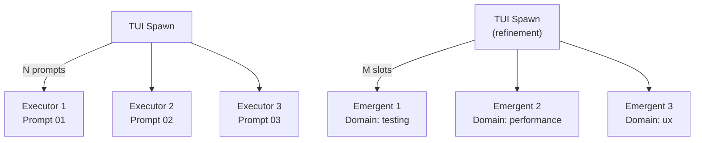

# Execution Agents

Execution agents are the only agents that produce code changes. Both are **prompt-scoped** (`prompt_scoped: true`), meaning the harness spawns multiple parallel instances -- one per prompt. This is the core parallelism mechanism in the harness.

## Agent Comparison

| Aspect | Executor | Emergent |
|--------|----------|----------|
| Config | [ref:.allhands/agents/executor.yaml::79b9873] | [ref:.allhands/agents/emergent.yaml::79b9873] |
| Flow | `PROMPT_TASK_EXECUTION.md` | `EMERGENT_REFINEMENT_EXECUTION.md` |
| Prompt scoped | Yes | Yes |
| Template vars | `PROMPT_PATH`, `ALIGNMENT_PATH` | `ALIGNMENT_PATH`, `PROMPTS_FOLDER`, `PROMPT_NUMBER`, `HYPOTHESIS_DOMAINS` |
| Input | Pre-existing prompt file | Self-authored prompt file |
| Phase | Primary execution | Refinement cycle |

Both agents receive `DO NOT ask for any user input for this task.` as the first line of their message template -- they are fully autonomous.

## Executor Agent

The executor is the workhorse. It receives a single prompt file path and an alignment doc, then implements exactly what the prompt specifies. Its simplicity is deliberate:

- **One prompt, one executor** -- clear ownership and bounded context per **Context is Precious**
- **No domain selection** -- the planner already decided what to build
- **Alignment doc as guardrail** -- provides project-level conventions without bloating the prompt

The executor's template injects only `PROMPT_PATH` and `ALIGNMENT_PATH`. All task scoping comes from the prompt file content itself.

## Emergent Agent

The emergent agent is qualitatively different from the executor. Rather than receiving a pre-authored prompt, it **creates its own prompt file** from a set of hypothesis domains, then executes it. This enables refinement work that wasn't anticipated during planning.

Its template provides richer context:

- `ALIGNMENT_PATH` -- same project-level guardrails
- `PROMPTS_FOLDER` -- where to write the new prompt file
- `PROMPT_NUMBER` -- assigned number ensuring unique, ordered prompt files
- `HYPOTHESIS_DOMAINS` -- the available domains for this workflow (e.g., `testing, stability, performance, feature, ux, integration`)

The agent's message template instructs it to **select a domain that diversifies from prior prompts**, and notes that **more tangential domains require feature flags**. This creates a self-organizing refinement cycle where each emergent agent explores a different facet of quality.

## Prompt-Scoped Parallelism

Because `prompt_scoped: true`, the TUI multiplexes these agents across available work. Executors map 1:1 to existing prompts. Emergent agents receive assigned numbers and self-select domains, allowing the harness to scale refinement without human domain assignment.

## Key Design Decision: Self-Authored Prompts

The emergent agent's ability to write its own prompt file before executing it is rooted in **Quality Engineering (Not Quantity Engineering)**. After primary execution completes, the remaining quality gaps are unknown in advance. Rather than having humans author refinement prompts, the emergent agent uses hypothesis domains as creative constraints, producing **variant prompt files with validation requirements** that the judge can later evaluate.
