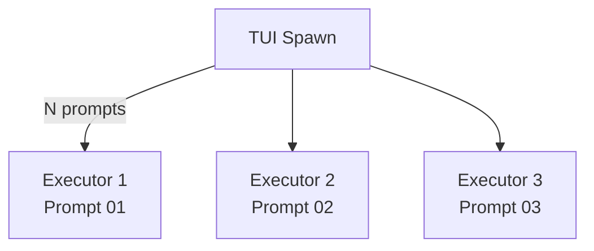

# Execution Agents

The executor is the only agent that produces code changes from pre-authored prompt files. It is **prompt-scoped** (`prompt_scoped: true`), meaning the harness spawns multiple parallel instances -- one per prompt. This is the core parallelism mechanism in the harness.

> **Note**: The emergent agent was previously grouped here as an execution agent. It has been rearchitected to a plan-only hypothesis planner (`non_coding: true`) and now belongs with the planning agents. See [docs/agents/planning-agents.md](planning-agents.md).

## Executor Configuration

[ref:.allhands/agents/executor.yaml::a0ae2f8]

| Field | Value |
|-------|-------|
| Flow | `PROMPT_TASK_EXECUTION.md` |
| Prompt scoped | Yes |
| Non-coding | No |
| TUI action | `executor` |
| Requires spec | Yes |
| Template vars | `PROMPT_PATH`, `ALIGNMENT_PATH` |

The executor is the workhorse. It receives a single prompt file path and an alignment doc, then implements exactly what the prompt specifies. Its simplicity is deliberate:

- **One prompt, one executor** -- clear ownership and bounded context per **Context is Precious**
- **No domain selection** -- the planner already decided what to build
- **Alignment doc as guardrail** -- provides project-level conventions without bloating the prompt

The executor's template injects only `PROMPT_PATH` and `ALIGNMENT_PATH`. All task scoping comes from the prompt file content itself. The first line of its message template is `DO NOT ask for any user input for this task.` -- it is fully autonomous.

## Prompt-Scoped Parallelism

Because `prompt_scoped: true`, the TUI multiplexes executor instances across available prompt files. Each executor maps 1:1 to an existing prompt, ensuring clear ownership boundaries. The planner determines what to build; executors determine how.

## Relationship to Planning Phase

Executors cannot begin until planning produces prompt files. The upstream agents that generate prompts are:

- **Planner** -- decomposes specs into ordered prompt files during the planning phase
- **Emergent** -- creates `type:emergent` prompt files during the hypothesis planning phase (see [planning-agents.md](planning-agents.md))

Both produce prompt files that executors consume. The executor makes no distinction between planner-authored and emergent-authored prompts -- it implements whatever the prompt file specifies.
