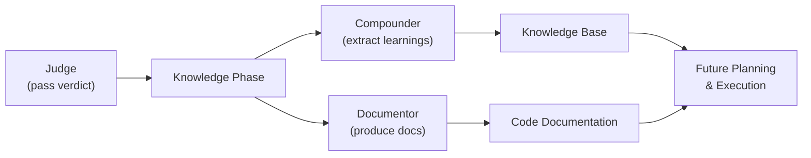

# Knowledge Agents

Knowledge agents run **after execution completes**. They do not produce features -- they produce understanding. Both the compounder and documentor transform completed work into durable knowledge artifacts, operationalizing the **Knowledge Compounding** principle: everything feeds forward.

## Agent Comparison

| Aspect | Compounder | Documentor |
|--------|------------|------------|
| Config | [ref:.allhands/agents/compounder.yaml::c9f0e13] | [ref:.allhands/agents/documentor.yaml::b4246b9] |
| Flow | `COMPOUNDING.md` | `DOCUMENTATION.md` |
| TUI label | Compounder | Documentor |
| TUI action | `compound` | `compound` |
| Requires spec | Yes | Yes |
| Prompt scoped | No | No |
| Non-coding | No | No |

Both agents share identical template variables:
- `SPEC_PATH` -- the completed spec for retrospective analysis
- `ALIGNMENT_PATH` -- project conventions and accumulated decisions
- `PROMPTS_FOLDER` -- completed prompt files containing implementation history

## Shared TUI Action

Both agents use `tui_action: compound`. This groups them as a single user-facing capability -- the compounding phase -- even though they run distinct flows. The TUI presents them as related operations on the same completed work.

## Compounder Agent

The compounder extracts **decisions, patterns, pivots, and limitations** from completed prompt work. Its output compounds the organization's knowledge base, making future planning and execution benefit from past work.

What the compounder captures:
- Why decisions were made (not just what was built)
- Patterns that emerged during implementation
- Limitations discovered that affect future specs
- Best practices validated or invalidated by execution results

This directly serves **Knowledge Compounding** -- decisions, pivots, limitations, disagreements, realizations, and best practices all feed forward.

## Documentor Agent

The documentor produces **documentation artifacts** from completed work. Where the compounder extracts tacit knowledge, the documentor produces explicit documentation tied to the codebase.

The distinction matters: compounding captures organizational learning that lives in the harness knowledge base, while documentation produces artifacts (docs, READMEs, architecture decision records) that live alongside the code.

## Lifecycle Position

Knowledge agents are the terminal phase of the milestone lifecycle. They run after the judge has approved the work, ensuring they operate on validated output rather than in-progress code. Their artifacts compound value for every subsequent milestone.
