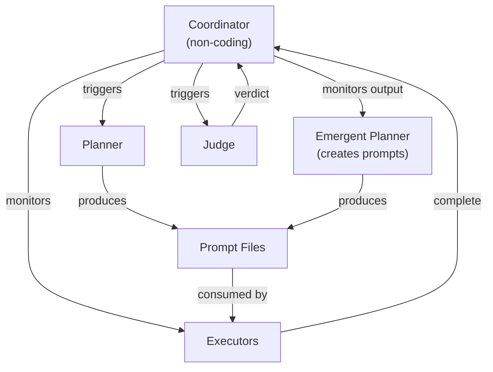

# Orchestration Agent

The coordinator is the only agent explicitly designed for **cross-phase orchestration**. It operates at the milestone level, tracking spec progression without writing code itself.

## Configuration

[ref:.allhands/agents/coordinator.yaml::27a9130]

| Field | Value |
|-------|-------|
| Flow | `COORDINATION.md` |
| TUI action | `coordinator` |
| Non-coding | **Yes** |
| Prompt scoped | No |
| Requires spec | Yes |

## Template Context

The coordinator receives the broadest template context of any singleton agent:

- `SPEC_NAME` -- the milestone being coordinated
- `SPEC_PATH` -- full spec for requirement awareness
- `ALIGNMENT_PATH` -- project conventions and decisions
- `PROMPTS_FOLDER` -- visibility into prompt file state (planned, in-progress, completed)

This four-variable context gives the coordinator full situational awareness across the spec's lifecycle without requiring it to read execution outputs directly.

## Why Non-Coding Orchestration

The coordinator is one of three `non_coding: true` agents (alongside the judge and emergent). This constraint is architectural, not incidental:

- **Separation of concerns** -- coordination decisions (what to run next, what's blocked, what's done) must not be entangled with implementation
- **Context preservation** -- a non-coding agent avoids accumulating code-level context that would dilute its orchestration judgment, per **Context is Precious**
- **Role clarity** -- executors implement, the coordinator sequences; mixing these creates agents that do both poorly

## Relationship to Other Agents

The coordinator is the hub that connects phases. It does not directly control other agents -- the TUI handles spawning -- but it provides the decision-making layer for when phases transition. The coordinator monitors the emergent planner's output (new prompt files appearing in the prompts folder) rather than monitoring it as an executor, since the emergent agent now produces planning artifacts, not code changes. This maps to the **Quality Engineering** principle: the coordinator's role is judgment about sequencing, not implementation.
