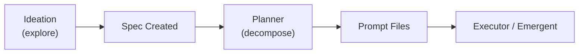

# Planning Agents

Planning agents operate upstream of execution. They translate human intent into machine-executable prompt files -- the fundamental unit of work in the harness. Two agents divide this responsibility: ideation explores the problem space freely, while the planner decomposes a spec into ordered prompts.

## Agent Comparison

| Aspect | Ideation | Planner |
|--------|----------|---------|
| Config | [ref:.allhands/agents/ideation.yaml::79b9873] | [ref:.allhands/agents/planner.yaml::79b9873] |
| Flow | `IDEATION_SESSION.md` | `SPEC_PLANNING.md` |
| Requires spec | No | Yes |
| Prompt scoped | No | No |
| Template vars | None | `SPEC_NAME`, `SPEC_PATH`, `PROMPTS_FOLDER` |
| TUI action | `ideation` | `planner` |

## Ideation Agent

The ideation agent is the only agent that requires **no spec context**. It runs the `IDEATION_SESSION.md` flow with an empty message template, making it a blank-slate exploration tool. This aligns with the **Ideation First** principle -- front-loading exploration prevents low-level decision fatigue during implementation and discovers limitations before they block progress.

Key characteristics:
- No `template_vars` and empty `message_template` -- the agent receives no pre-structured context
- Not prompt-scoped -- runs as a singleton session
- Produces specs and roadmap artifacts as output, feeding downstream agents

## Planner Agent

The planner operates on a selected spec, decomposing it into prompt files within the spec's prompts folder. It receives three template variables that scope its work:

- `SPEC_NAME` -- identifies the milestone being planned
- `SPEC_PATH` -- the spec file containing requirements and acceptance criteria
- `PROMPTS_FOLDER` -- the target directory where prompt files are written

The planner embodies **Prompt Files as Units of Work** -- its sole output is an ordered set of prompt files that executors will pick up. Each prompt file scopes 3-5 tasks with clear validation requirements, keeping downstream context bounded per **Context is Precious**.

## Lifecycle Position

Ideation is optional and human-initiated. The planner is the bridge between a spec and execution -- no prompts exist until the planner runs. This makes the planner a critical dependency in the milestone workflow: executors and emergent agents cannot begin until planning produces prompt files.
