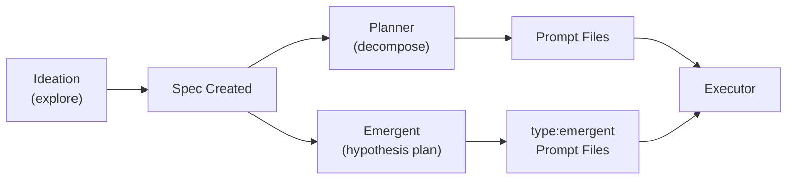

# Planning Agents

Planning agents operate upstream of execution. They translate human intent into machine-executable prompt files -- the fundamental unit of work in the harness. Three agents divide this responsibility: ideation explores the problem space freely, the planner decomposes a spec into ordered prompts, and the emergent agent creates hypothesis-driven prompt files across quality domains.

## Agent Comparison

| Aspect | Ideation | Planner | Emergent |
|--------|----------|---------|----------|
| Config | [ref:.allhands/agents/ideation.yaml::faf0f2d] | [ref:.allhands/agents/planner.yaml::9013364] | [ref:.allhands/agents/emergent.yaml::9b6a9d4] |
| Flow | `IDEATION_SESSION.md` | `SPEC_PLANNING.md` | `EMERGENT_PLANNING.md` |
| Requires spec | No | Yes | Yes |
| Prompt scoped | No | No | Yes |
| Non-coding | No | No | **Yes** |
| Template vars | None | `SPEC_NAME`, `SPEC_PATH`, `PROMPTS_FOLDER` | `ALIGNMENT_PATH`, `PROMPTS_FOLDER`, `HYPOTHESIS_DOMAINS`, `BRANCH` |
| TUI action | `new-initiative` | `planner` | `emergent` |
| TUI label | Ideation | Planner | Emergent |

## Ideation Agent

The ideation agent is the only agent that requires **no spec context**. It runs the `IDEATION_SESSION.md` flow with an empty message template, making it a blank-slate exploration tool. This aligns with the **Ideation First** principle -- front-loading exploration prevents low-level decision fatigue during implementation and discovers limitations before they block progress.

Key characteristics:
- No `template_vars` and empty `message_template` -- the agent receives no pre-structured context
- Not prompt-scoped -- runs as a singleton session
- Produces specs and roadmap artifacts as output, feeding downstream agents
- TUI action `new-initiative` routes through the ideation agent with a flow override for non-milestone spec types

## Planner Agent

The planner operates on a selected spec, decomposing it into prompt files within the spec's prompts folder. It receives three template variables that scope its work:

- `SPEC_NAME` -- identifies the initiative being planned
- `SPEC_PATH` -- the spec file containing requirements and acceptance criteria
- `PROMPTS_FOLDER` -- the target directory where prompt files are written

The planner embodies **Prompt Files as Units of Work** -- its sole output is an ordered set of prompt files that executors will pick up. Each prompt file scopes 3-5 tasks with clear validation requirements, keeping downstream context bounded per **Context is Precious**.

## Emergent Agent (Hypothesis Planner)

The emergent agent creates hypothesis-driven prompt files across quality domains. Unlike the planner (which decomposes a spec top-down), the emergent agent identifies quality gaps and generates `type:emergent` prompt files that executors later implement. It is the only planning agent that is both **prompt-scoped** and **non-coding**:

- `non_coding: true` -- creates prompt files but does not write code
- `prompt_scoped: true` -- multiple instances spawn in parallel, each exploring a different hypothesis domain
- Flow: `EMERGENT_PLANNING.md` -- a plan-only flow (not an execution flow)

Template variables provide the planning context:
- `ALIGNMENT_PATH` -- project-level conventions and decisions
- `PROMPTS_FOLDER` -- where to write new prompt files
- `HYPOTHESIS_DOMAINS` -- available quality domains from `settings.json` (e.g., `testing, stability, performance, feature, ux, integration`)
- `BRANCH` -- current git branch for scoping

The emergent agent's message template instructs it to **select a domain that diversifies from prior prompts**, always producing at least one prompt file. It operates in three progressive work modes:

1. **Core Goal Work** -- domains directly supporting the spec's acceptance criteria
2. **Adjacent Improvements** -- domains that strengthen surrounding code quality
3. **Novel Experiments** -- tangential domains that require feature flags, exploring beyond the spec's boundaries

As core goals are met, the agent shifts progressively toward more tangential work. This creates a self-organizing planning cycle where each instance explores a different facet of quality, producing prompt files that executors consume downstream.

> **Key decision**: "Emergent" is the canonical agent name; "hypothesis planner" describes its functional role. The agent was rearchitected from a combined plan-and-execute agent (previously `non_coding: false`, flow `EMERGENT_REFINEMENT_EXECUTION.md`) to a plan-only agent. It no longer uses `PROMPT_NUMBER` -- prompt numbering is handled by the prompts folder conventions.

## Lifecycle Position

Ideation is optional and human-initiated. The planner and emergent agent both produce prompt files, but through different mechanisms:

- **Planner** -- deterministic top-down decomposition of a spec into ordered prompts
- **Emergent** -- hypothesis-driven exploration of quality gaps, creating emergent prompts

Executors make no distinction between planner-authored and emergent-authored prompts. Both are consumed identically. This means all three planning agents feed into the same execution phase, with the emergent agent providing lateral quality coverage that the planner's structured decomposition may miss.
