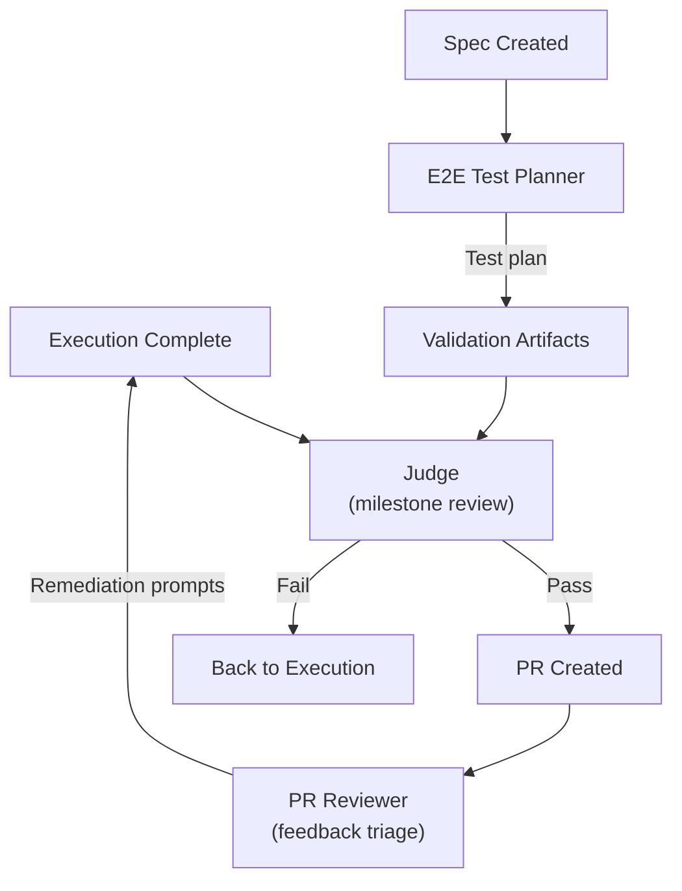

# Quality and Review Agents

Three agents handle validation and review at different stages of the lifecycle. They share a common purpose -- ensuring work meets acceptance criteria -- but operate at different scopes and produce different outputs.

## Agent Overview

| Aspect | Judge | PR Reviewer | E2E Test Planner |
|--------|-------|-------------|------------------|
| Config | [ref:.allhands/agents/judge.yaml::597e87f] | [ref:.allhands/agents/pr-reviewer.yaml::631b3e9] | [ref:.allhands/agents/e2e-test-planner.yaml::89753a5] |
| Flow | `JUDGE_REVIEWING.md` | `PR_REVIEWING.md` | `E2E_TEST_PLAN_BUILDING.md` |
| TUI label | Review Jury | Review PR | E2E Tests |
| Non-coding | **Yes** | No | No |
| Requires spec | Yes | Yes | Yes |
| Prompt scoped | No | No | No |

## Judge Agent

The judge is the milestone-level quality gate. It reviews completed work against the spec's acceptance criteria, operating as a **non-coding** agent (`non_coding: true`). This distinction matters: the judge evaluates but does not modify code.

Template variables:
- `SPEC_NAME` -- identifies what milestone is being judged
- `ALIGNMENT_PATH` -- provides project conventions for evaluation context

The TUI action `review-jury` signals its role as an adjudicator. The judge embodies **Agentic Validation Tooling** -- programmatic validation that makes human supervision redundant for routine quality checks. Its output determines whether a milestone proceeds to merge or returns for rework.

## PR Reviewer Agent

The PR reviewer translates external PR feedback (GitHub comments, review threads) into actionable prompt-level work. Unlike the judge, it **is a coding agent** -- it can create new prompt files or modify existing ones based on review feedback.

Template variables:
- `SPEC_NAME` -- the milestone under review
- `ALIGNMENT_PATH` -- project conventions
- `PROMPTS_FOLDER` -- where to write remediation prompts if needed

This agent bridges the gap between human PR review and the prompt-based execution model. Rather than expecting developers to manually address review comments, the PR reviewer converts feedback into the harness's native work format.

## E2E Test Planner Agent

The E2E test planner produces structured test plans from spec requirements. It receives the richest template context of the three review agents:

- `PLANNING_FOLDER` -- the `.planning/{branch}` directory for test plan artifacts
- `SPEC_PATH` -- full spec for requirement extraction
- `ALIGNMENT_PATH` -- project conventions including testing patterns
- `OUTPUT_PATH` -- explicit output location for the generated test plan

This agent operationalizes the **Agentic Validation Tooling** principle by creating verification infrastructure. Its test plans feed back into execution agents as validation requirements, closing the loop between "what should we test" and "is it working."

## Review Lifecycle Position

The judge sits at the convergence point: it consumes execution output and test plan artifacts to render a verdict. The PR reviewer operates post-merge-request, handling the external feedback loop. The E2E test planner can run early -- as soon as a spec exists -- producing validation criteria that inform both execution and judgment.
