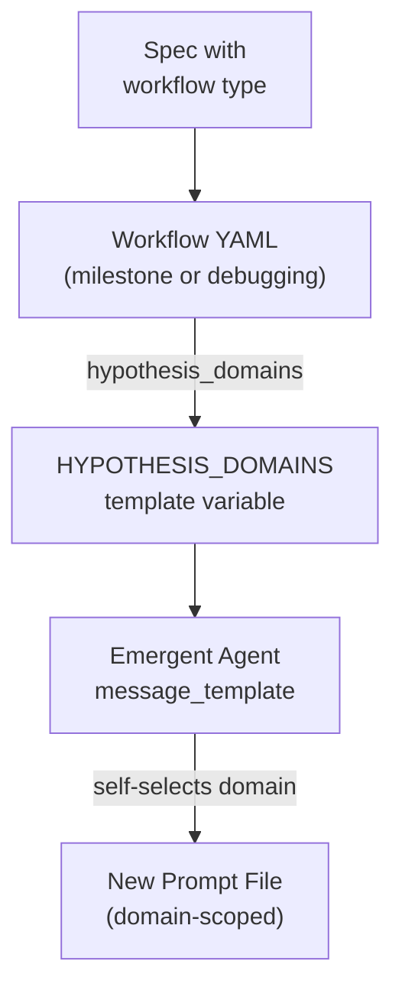

# Workflow-Agent Orchestration

Workflow configurations are YAML files that shape agent behavior without modifying agent profiles. They define the **hypothesis domains** available to emergent refinement agents and provide workflow-level metadata that contextualizes execution. The same agents operate differently depending on which workflow drives the spec.

## Workflow Configurations

| Aspect | Milestone | Debugging |
|--------|-----------|-----------|
| Config | [ref:.allhands/workflows/milestone.yaml::79b9873] | [ref:.allhands/workflows/debugging.yaml::79b9873] |
| Purpose | Feature development with full planning-execution cycle | Issue diagnosis and resolution |
| Domain count | 6 | 5 |
| Domain focus | Broad (feature + quality) | Narrow (diagnosis + stability) |

## Hypothesis Domains

Hypothesis domains are the creative constraint mechanism for emergent agents. Each domain represents a category of refinement work an emergent agent can self-assign.

**Milestone domains:**
- `testing` -- test coverage and test quality
- `stability` -- error handling, resilience
- `performance` -- speed, resource efficiency
- `feature` -- functional completeness
- `ux` -- user experience refinement
- `integration` -- cross-system boundary work

**Debugging domains:**
- `reproduction` -- reliable reproduction steps, test cases
- `diagnosis` -- root cause analysis, logging, tracing
- `stability` -- error handling, edge case fixes
- `testing` -- regression tests, coverage for fix
- `integration` -- system boundary validation

The debugging workflow intentionally omits `feature`, `performance`, and `ux` domains present in milestone. It introduces `reproduction` and `diagnosis` -- domains irrelevant to greenfield feature work but critical for issue resolution. This domain narrowing ensures emergent agents stay focused on the debugging objective rather than drifting into feature work.

## How Domains Flow to Agents

The `hypothesis_domains` list from the workflow YAML is serialized into the `HYPOTHESIS_DOMAINS` template variable, which the emergent agent's `message_template` receives at spawn. The agent then selects a domain that diversifies from prior prompts, creating organic coverage across quality dimensions.

## Domain Selection as Quality Engineering

This architecture embodies **Quality Engineering (Not Quantity Engineering)**:

- Domains are **constraints, not assignments** -- emergent agents choose within them, they don't receive directives
- The domain list defines the **quality surface area** -- what dimensions matter for this type of work
- Different workflows have different quality surfaces -- debugging doesn't need UX refinement, milestones don't need reproduction steps
- Agents are instructed that **tangential domains require feature flags**, creating a natural risk gradient

## Extending Workflows

Adding a new workflow type means defining:
1. A `name` and `description` for the workflow
2. A `hypothesis_domains` list scoped to that workflow's quality concerns

No agent profiles need to change. The emergent agent's template already interpolates `HYPOTHESIS_DOMAINS` generically -- it adapts to whatever domains the workflow provides. This separation of workflow concerns from agent definitions keeps the system composable per **Context is Precious**.
