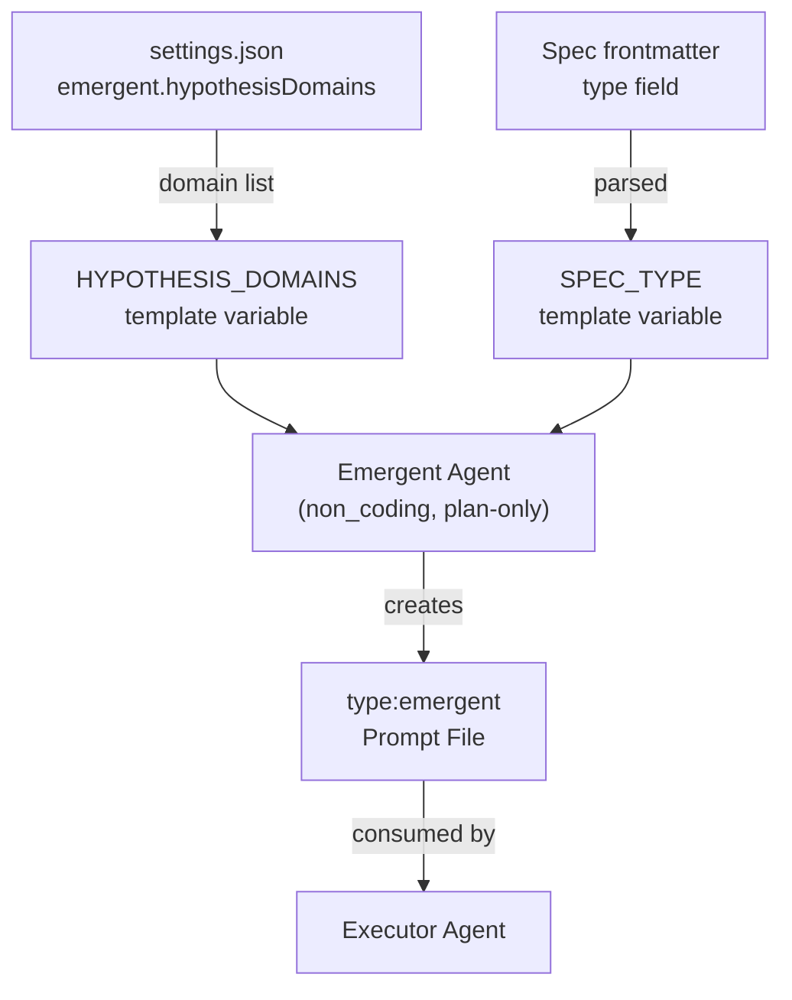

# Workflow-Agent Orchestration

Hypothesis domains shape how the emergent agent explores quality dimensions during planning. These domains were previously defined in workflow YAML files (`.allhands/workflows/milestone.yaml`, `.allhands/workflows/debugging.yaml`). That entire system has been deleted. Hypothesis domains now come from `settings.json` via `EmergentSettings`, and the concept of "workflow configurations" is replaced by **initiative types** -- six spec types that determine how work flows through the harness.

## What Changed

| Before | After |
|--------|-------|
| `.allhands/workflows/` directory with YAML files | **Deleted entirely** |
| `milestone.yaml`, `debugging.yaml` configs | Hypothesis domains in `settings.json` |
| `WORKFLOW_TYPE` template variable | `SPEC_TYPE` template variable |
| Two workflow types (milestone, debugging) | Six initiative types via spec frontmatter |
| Workflow loader (`workflow.ts`, `workflows.ts`) | Settings-based domain resolution |

## Initiative Types

The harness now supports six spec types, each representing a distinct initiative category:

- `milestone` -- feature development with full planning-execution cycle
- `investigation` -- exploratory analysis and research
- `optimization` -- performance and efficiency improvements
- `refactor` -- structural code improvements
- `documentation` -- knowledge artifact production
- `triage` -- issue diagnosis and resolution

The spec type is parsed from frontmatter and made available via the [ref:.allhands/harness/src/lib/schemas/template-vars.ts:TemplateVars:aa2cf15] `SPEC_TYPE` variable. Agents receive this at spawn, enabling type-aware behavior without separate workflow configuration files.

## Hypothesis Domains

Hypothesis domains remain the creative constraint mechanism for the emergent agent. Each domain represents a category of planning work the emergent agent can self-assign when creating prompt files.

The domain list now comes from `settings.json` under `emergent.hypothesisDomains` (`EmergentSettings`), rather than from per-workflow YAML files. This centralizes domain configuration alongside other emergent agent settings.

The emergent agent's [ref:.allhands/agents/emergent.yaml::48bd111] template receives domains via the `HYPOTHESIS_DOMAINS` template variable. The agent selects a domain that diversifies from prior prompts, creating organic coverage across quality dimensions.

## How Domains Flow to the Emergent Agent

The emergent agent is now `non_coding: true` -- it creates prompt files but does not implement them. Executors pick up emergent-authored prompts the same way they pick up planner-authored prompts.

## Domain Selection as Quality Engineering

This architecture embodies **Quality Engineering (Not Quantity Engineering)**:

- Domains are **constraints, not assignments** -- the emergent agent chooses within them, it does not receive directives
- The domain list defines the **quality surface area** -- what dimensions matter for this initiative
- Agents are instructed that **tangential domains require feature flags**, creating a natural risk gradient
- The emergent agent's `BRANCH` template variable provides git context for scoping prompt files to the current work

## Extending Initiative Types

Adding a new initiative type means:
1. Adding a spec type to the frontmatter schema
2. Updating `SPEC_TYPE` validation to include the new type

No agent profiles need to change. The emergent agent's template already interpolates `HYPOTHESIS_DOMAINS` and `SPEC_TYPE` generically -- it adapts to whatever the settings and spec provide. This separation of initiative concerns from agent definitions keeps the system composable per **Context is Precious**.
