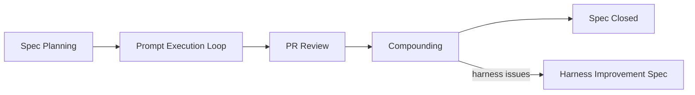
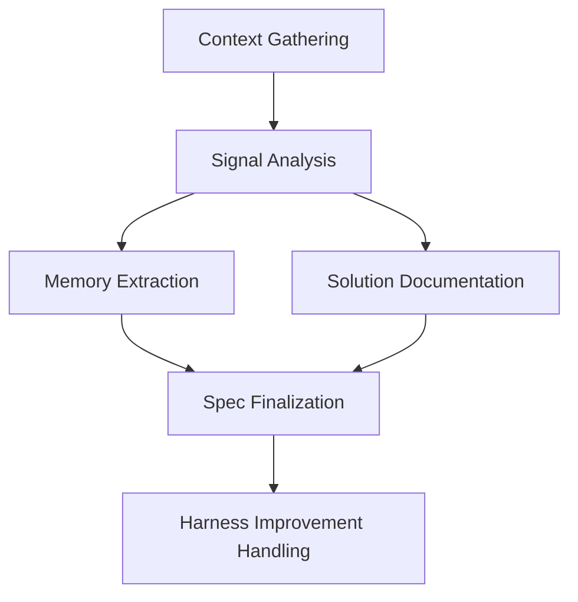
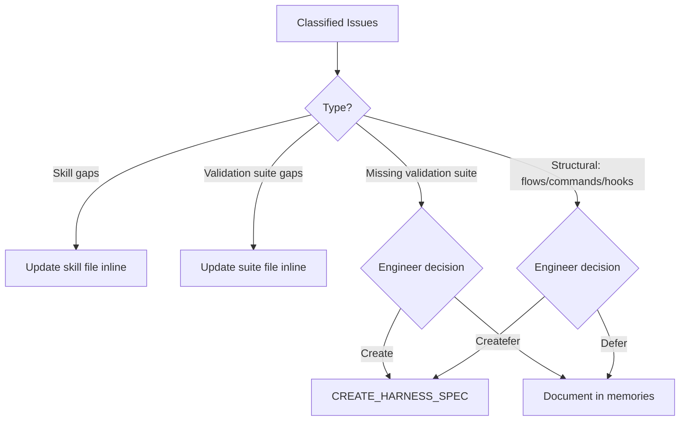

# Compounding Flow

The compounding flow exists to close the feedback loop after a spec completes. Without it, knowledge gained during implementation -- decisions, failures, workarounds, engineer preferences -- evaporates between sessions. Per **Knowledge Compounding**, everything feeds forward.

This flow runs after all prompts in a spec have been executed and reviewed. It is intentionally the last step before a spec is considered fully closed.

## Lifecycle Position

The flow is idempotent -- running it again on a spec with no new changes produces no output.

## Phase Progression

The flow progresses through five ordered phases, each building on the previous. The final phase (Harness Improvement) is intentionally last so that all other compounding artifacts are complete before any diversion into structural changes.

## Signal Analysis

The core analytical phase reads all spec artifacts and identifies patterns across four signal categories:

| Signal Category | What It Reveals | Key Indicators |
|----------------|-----------------|----------------|
| Prompt Signals | Execution and planning quality | Failed prompts, patch counts, blocker learnings |
| Tooling Signals | Skill and validation suite effectiveness | Per-tool impact map of what each tool caught vs. missed |
| Decision Signals | Engineer intent and preferences | Rejections, overrides, compromise patterns |
| Emergent Work Signals | Quality control preferences | Kept vs. reverted emergent work |

The tooling signals phase produces a **per-tool impact map** that cross-references every prompt's skills and validation suites against its summary (Limitations, Decisions, Learnings). This map becomes evidence for harness improvement specs.

A key design decision: emergent prompts are never framed as "scope creep." Per **Quality Engineering**, emergent work discovers valuable variants. Reverted emergent work is expected experimentation cost per **Software is Cheap**.

## Knowledge Outputs

The flow produces three distinct knowledge artifacts:

| Artifact | Location | Purpose |
|----------|----------|---------|
| Memories | `docs/memories.md` | Lightweight learnings searchable via `ah memories search` |
| Solutions | `docs/solutions/<category>/` | Detailed problem-solution documentation for non-trivial issues |
| Spec Finalization | `.planning/<spec>/spec.md` | Historical record with implementation reality vs. original plan |

### Memory Categories

Memories are captured across five categories when signals exist: technical learnings, engineer preference memories, systemic validation signals, harness behavior patterns. Each memory is tagged with domain and source (`user-steering` vs `agent-inferred`) for relevance scoring in future recall.

### Solution Documentation

Solutions target problems that required multiple investigation attempts, had non-obvious resolutions, or involve agentic anti-patterns. Trivial fixes are explicitly excluded. After writing, solutions are cross-referenced against existing solutions via `ah solutions search` to build a connected knowledge graph.

## Harness Improvement Classification

The final phase classifies detected issues and requires engineer interview before action:

Inline updates (skills, validation suites) require engineer approval. Structural changes always go through a spec. Deferred items are documented in `docs/memories.md` under "Deferred Harness Improvements."

## Key Design Decisions

- **Engineer interview is mandatory** before finalizing the compounding summary -- the flow must not finalize without sign-off on classified issues
- **Harness modification requires first principle justification** -- changes must trace back to principles in [ref:.allhands/principles.md::79b9873]
- **Spec finalization preserves original Goals and Non-Goals** unmodified for historical contrast against the new Implementation Reality section
- **The per-tool impact map is evidence, not a stored artifact** -- it feeds directly into harness improvement specs rather than being persisted separately

## Source Flow

[ref:.allhands/flows/COMPOUNDING.md::79b9873]
