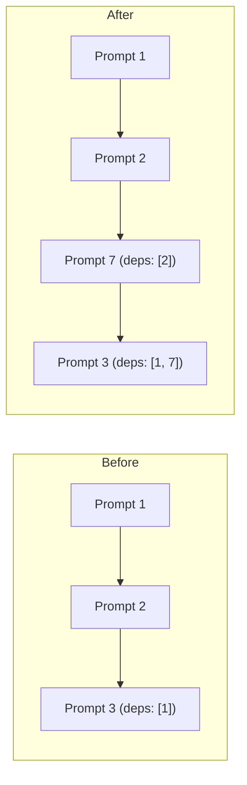

# Coordination Flow

The coordination flow provides an engineer-facing orchestration layer during active prompt execution. It exists because prompt loops are autonomous -- once started, agents execute prompts independently. The engineer needs a control plane to intervene, patch, and steer without breaking the execution model.

Per **Frontier Models are Capable**, this agent orchestrates without implementing. It modifies only harness-managed files (prompts, alignment docs) and never writes implementation code.

## Coordination Services

The flow presents six services to the engineer, each addressing a different intervention need:

| Service | Purpose | Delegation |
|---------|---------|------------|
| Quick Patch | Deterministic fix for a specific issue | [ref:.allhands/flows/shared/PROMPT_TASKS_CURATION.md::79b9873] |
| Interjection | Insert new prompt into active dependency graph | Internal (see below) |
| Emergent Surgery | Triage emergent refinement prompts | [ref:.allhands/flows/shared/EMERGENT_REFINEMENT_ANALYSIS.md::79b9873] |
| Prompt Edit | Modify prompts given engineer concerns | [ref:.allhands/flows/shared/PROMPT_TASKS_CURATION.md::79b9873] |
| Agent Status | Check tmux windows and agent health | Tmux patterns |
| Kill/Restart | Terminate broken agents and fix prompts | Tmux + prompt edit |

## Prompt Interjection

Interjection is the most architecturally significant service. It inserts new prompts into the active dependency graph mid-loop without renumbering existing prompts. The event loop detects new prompt files automatically -- sequencing is controlled entirely through dependency mapping.

The interjection process:

1. Engineer specifies "run after" and "run before" prompts
2. Coordinator assigns next available prompt number (append-only, never renumber)
3. New prompt gets `dependencies` set to "run after" prompts
4. "Run before" prompts get their `dependencies` patched to include the new prompt
5. Per **Ideation First**, resulting execution order is confirmed with the engineer before writing files

When an interjection fixes prior execution issues, the prompt is additionally marked as a user-patch.

## User-Patch Prompts

A cross-cutting concern shared between services. Whenever a prompt is created to fix issues from prior execution:

- Frontmatter includes `type: user-patch` and `patches_prompts: [X, Y]`
- Body documents what went wrong, engineer feedback, and specific issues
- Per **Knowledge Compounding**, this metadata enables the compounding flow to trace failures back to root causes and improve skills/validation suites

## Decision Documentation

Per **Knowledge Compounding**, the coordination flow captures engineer contributions in two locations:

- **Prompt files**: Expectations, compromises, decisions
- **Alignment doc**: Engineer steering appended to agent summaries (summaries are never deleted)

## Conversational Approach

Per **Ideation First**, the coordinator always clarifies before acting. It asks what the engineer wants to accomplish, presents options with tradeoffs, confirms understanding before modifying files, and surfaces relevant context from prompts and the alignment doc. This is an interactive agent, not a fire-and-forget automation.

## Source Flow

[ref:.allhands/flows/COORDINATION.md::79b9873]
