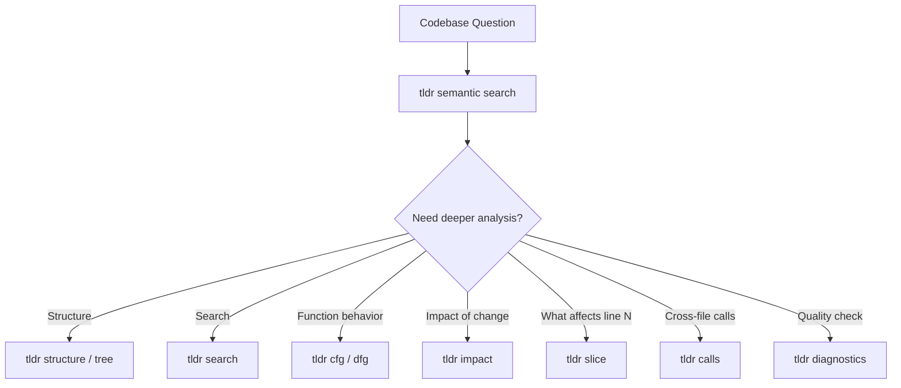

# Core Harness Integration

Every agent in the harness loads [ref:.allhands/flows/CORE.md::79b9873] as its foundation. This flow exists because of a single principle: **Context is Precious**. Agents degrade with large context windows, so codebase discovery must be targeted and structured rather than brute-force file reading.

## Two Mandatory Discovery Tools

The core integration enforces two tools for all codebase interaction:

| Tool | Purpose | When |
|------|---------|------|
| `ah knowledge docs search` | Semantic search over documented project knowledge | Any discovery task tied to crucial project understanding |
| `tldr` | Structured code analysis (trees, codemaps, control flow, data flow) | Retrieving file-level and function-level codebase context |

These replace ad-hoc file reads. The constraint is deliberate: agents that read files directly consume context on content that may be irrelevant. Structured tools return only what matters.

## Discovery Protocol

The mandated sequence reflects a progressive disclosure pattern -- start broad, narrow to specifics:

## tldr Capability Categories

### Core Analysis

File trees, code structure maps, pattern search, full file extraction, and LLM-ready context bundles. These are the building blocks agents use before reading raw files.

### Flow Analysis

Control flow graphs, data flow graphs, program slices, and cross-file call graphs. These enable agents to understand function behavior without reading every line -- critical for keeping context budgets low.

### Codebase Analysis

Reverse call graphs (`impact`), dead code detection (`dead`), and architectural layer detection (`arch`). These support refactoring decisions and cleanup tasks.

### Import Analysis

Forward imports (`imports`) and reverse import tracking (`importers`). These answer "what does this file depend on?" and "who depends on this module?" -- essential for understanding blast radius.

### Quality and Testing

Type checking and linting via `diagnostics`. Agents run this before tests to catch errors without consuming test execution context.

## Why This Exists as a Shared Flow

Per **Knowledge Compounding**, centralizing these directives in a single flow prevents every agent-specific flow from repeating the same tooling instructions. All agents inherit codebase discovery capability from this one file, and improvements to discovery practices propagate to every agent simultaneously.

The flow is deliberately terse -- per **Frontier Models are Capable**, agents deduce how to combine these tools for their specific tasks. The flow provides the "what tools exist and when to use them" while trusting agents to figure out the "how" for their domain.
