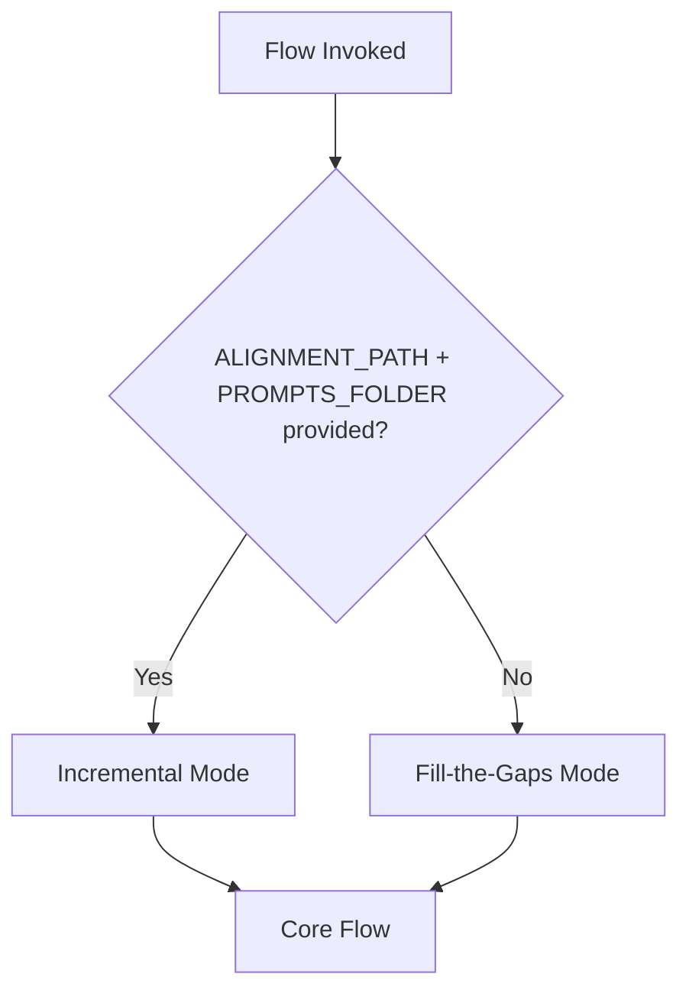
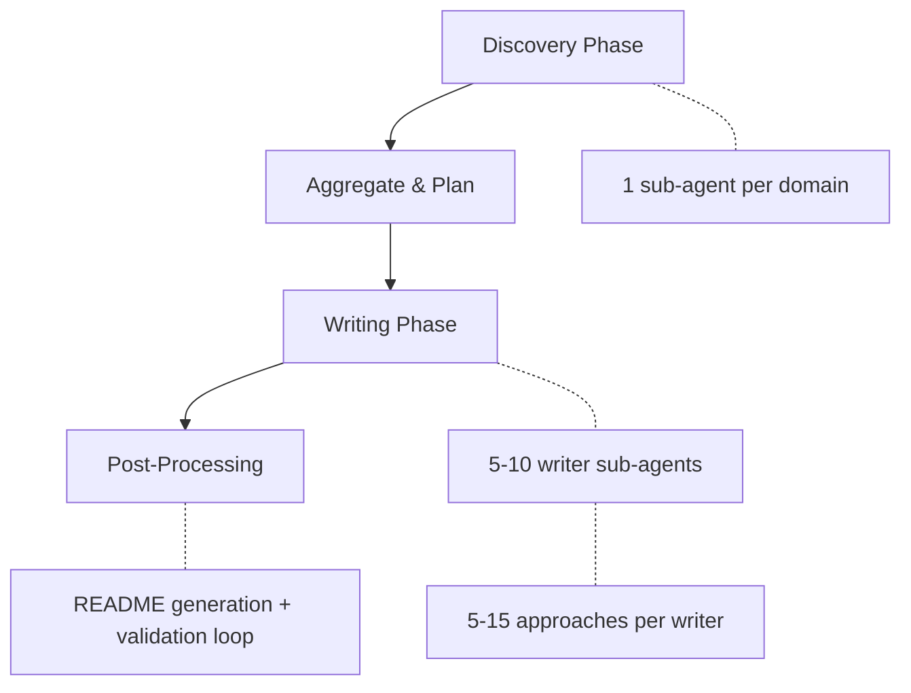

# Documentation Orchestration

The documentation flow creates and maintains engineering knowledge docs that expose code through file references and LSP symbols. Per **Knowledge Compounding**, docs enable semantic discovery of code through compounded understanding of use cases, intent, and key decisions.

Per **Context is Precious**, the orchestrator delegates discovery and writing to sub-agents rather than performing all work in a single context window.

## Mode Detection

The flow operates in two modes, selected automatically based on context variables:

| Mode | Trigger | Scope | Knowledge Source |
|------|---------|-------|-----------------|
| Fill-the-Gaps | Cold start or refresh, no spec context | All domains, full repo scan | Inferred from code |
| Incremental | Feature branch with spec context | Affected domains only | Prompts, commits, alignment docs |

If no message or context variables are provided, the flow defaults directly to Fill-the-Gaps without asking.

## Pre-flight Requirement

A clean git working tree is mandatory. File references include a git commit hash component -- uncommitted files have no hash, and modified files produce stale hashes that break immediately after the next commit.

## Fill-the-Gaps Initialization

1. Run `ah docs validate --json` to identify invalid refs, stale refs, and missing frontmatter
2. Detect domains: read `docs.json` or infer from project structure (checking monorepo markers like `pnpm-workspace.yaml`, `turbo.json`, `nx.json`)
3. Present detected domains to user for confirmation
4. Persist confirmed domains to `docs.json` for future incremental runs

## Incremental Initialization

1. Read alignment doc and prompt files for session knowledge
2. Run `git diff` against merge base for changed files
3. Run `ah docs validate --json` for current staleness
4. Impact analysis via `ah knowledge docs search` to find related docs
5. Categorize changes: **Edit** (existing docs reference changed code), **Create** (new functionality), **Stale** (outdated refs)

## Core Pipeline

Both modes converge into a shared four-phase pipeline:

### Discovery Phase

One discovery sub-agent per domain, each following [ref:.allhands/flows/shared/DOCUMENTATION_DISCOVERY.md::f3f2716]. Discovery identifies all documentable approaches/features, groups them intelligently, and checks existing coverage. Key constraint: stay under 20 approaches per domain, grouping aggressively.

### Aggregate and Plan

The orchestrator merges discovery results, filters out fully-covered approaches, and groups remaining approaches into writer assignments. Target: 5-10 writers total, each handling 5-15 approaches from one domain or related subset.

### Writing Phase

Writer sub-agents follow [ref:.allhands/flows/shared/DOCUMENTATION_WRITER.md::8447f47]. Each writer receives its approaches with file lists, symbols, the target directory, any existing docs to edit, and session knowledge (in incremental mode). The `group` field controls subdirectory placement.

### Post-Processing

The orchestrator handles cross-domain concerns that individual writers lack context for:

- **README generation**: Top-level `docs/README.md`, per-domain `docs/<domain>/README.md`, and per-group READMEs for subdirectories with 3+ docs
- **Finalize and validate loop**: Run `ah docs finalize`, then `ah docs validate --json`. If issues exist, spawn fixup writers and repeat until clean
- **Reindex**: Run `ah knowledge docs reindex` to update semantic search

## Ownership Boundaries

| Artifact | Owner |
|----------|-------|
| Approach docs | Writer sub-agents |
| README.md files | Orchestrator (cross-domain context) |
| `docs/solutions/`, `docs/memories.md` | Compounding flow (never written by documentation) |

## Source Flows

- [ref:.allhands/flows/DOCUMENTATION.md::dc3e5c6]
- [ref:.allhands/flows/shared/DOCUMENTATION_DISCOVERY.md::f3f2716]
- [ref:.allhands/flows/shared/DOCUMENTATION_WRITER.md::8447f47]
