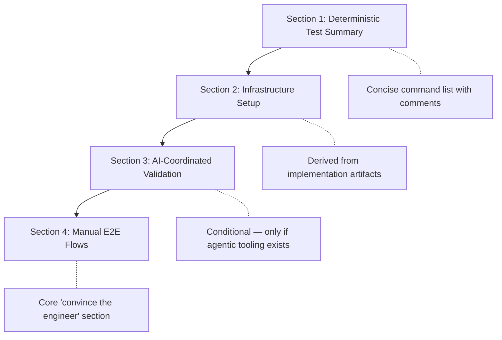

# E2E Test Plan Building

The E2E test plan flow produces a document that convinces the engineer a milestone works as expected. Per **Agentic Validation Tooling**, engineers are excluded from prompt-by-prompt validation -- this plan provides the comprehensive proof they need through a single artifact.

The plan is not a restatement of automated test output. It layers deterministic summaries, infrastructure setup, AI-coordinated validation, and manual flows into a progressive document the engineer can use to verify the milestone end-to-end.

## Plan Structure

The test plan follows a four-section progressive structure, where each section builds on the previous:

### Section Design Decisions

| Section | What It Contains | What It Avoids |
|---------|-----------------|----------------|
| Deterministic Test Summary | Runnable commands grouped by domain, inline comments | Detailed breakdowns, file listings, coverage percentages |
| Infrastructure Setup | Dependencies, env, database, services, dev servers | Assumed knowledge; derives everything from artifacts |
| AI-Coordinated Validation | Agent prompts for Playwright MCP, load testing, profiling | Inclusion when no agentic tooling exists for the project |
| Manual E2E Flows | User flows, edge cases, regression scenarios | Duplicating what automated tests already cover |

## Update Mode

The plan supports incremental updates. When a test plan already exists at the output path:

1. Extract `last_commit` from frontmatter
2. Diff commits and files since that commit
3. Compare alignment doc prompt summaries against covered prompts
4. Append new scenarios rather than rewriting existing coverage

This makes the plan a living document that grows with the milestone.

## Variant Awareness

Per **Quality Engineering**, implementation may produce disposable variants (A/B implementations, backend alternatives, experimental features). The infrastructure setup section documents how to switch between variants using feature flags, environment variables, or infrastructure flags, with setup commands for each testable variant.

## Infrastructure as Documentation Quality Signal

A key insight: if infrastructure setup cannot be derived from implementation artifacts (commits, summaries, code, existing docs), it signals inadequate documentation. The subsequent documentation phase will face the same challenge. This makes the E2E test plan an early warning system for documentation gaps.

## AI-Coordinated Validation

Section 3 is conditional -- it only appears when the project has tooling that supports agentic testing:

- UI automation (Playwright MCP, simulator automation, browser MCPs)
- Load testing tools (k6, artillery, locust)
- Performance profiling (flamegraphs, memory profilers, bundle analyzers)
- Database inspection/scripting
- API testing tools (curl automation, Postman/Insomnia MCPs)

When present, the section provides example prompts engineers can give to agent sessions to exercise specific flows. When absent, the section notes which tooling categories would be valuable.

## Source Flow

[ref:.allhands/flows/E2E_TEST_PLAN_BUILDING.md::79b9873]
