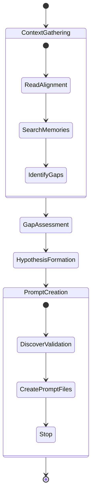
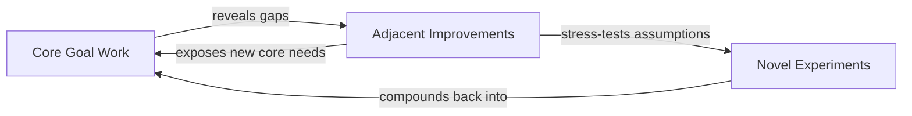
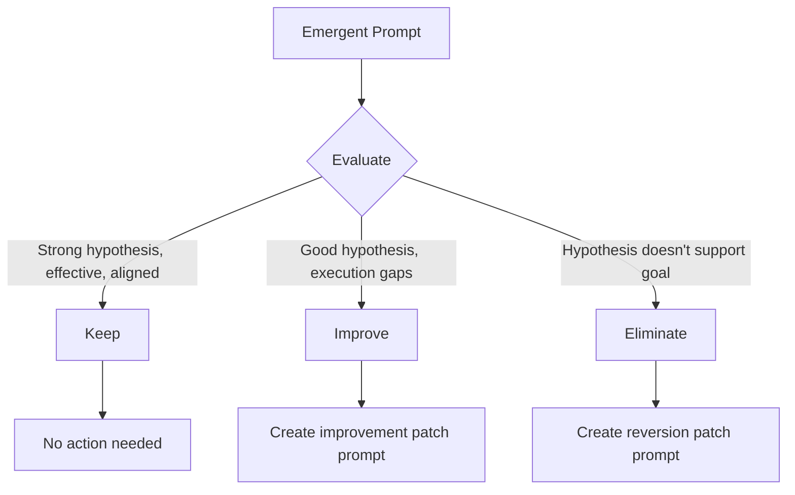

# Emergent Refinement

Planned prompts address known requirements. Emergent refinement addresses the unknown -- the improvements, extensions, and experiments that only become visible after initial implementation exists. Per **Quality Engineering**, emergent work discovers which variants are valuable, not just what was explicitly requested.

## Core Concept: Hypothesis-Driven Planning

Every emergent prompt starts with a hypothesis: "If I implement X, then Y outcome will result." This is fundamentally different from planned prompts, which start with "The spec requires X." The hypothesis framing forces agents to articulate expected outcomes, making success measurable and failure informative.

The emergent agent is a **plan-only** agent -- it creates `type: emergent` prompt files but never executes them. Executors pick up these prompts through the standard execution loop. This separation of planning and execution keeps each concern bounded in its own context window.

[ref:.allhands/flows/EMERGENT_PLANNING.md::4eddba4]

## Planning Lifecycle

The planner stops after creating prompt files. Executors handle implementation, and validation suites discovered by the planner are attached to prompts for executors to run.

## Work Mode Diversification

Emergent agents select from three work modes, cycling between them based on what prior prompts have already explored:

| Mode | Purpose | Examples |
|------|---------|---------|
| Core Goal Work | Directly addresses spec goals, acceptance criteria, known gaps | Missing edge cases, error recovery paths |
| Adjacent Improvements | Tangentially related enhancements that compound core work | Performance optimization, UX polish |
| Novel Experiments | Creative extensions behind feature flags that stress-test assumptions | Alternative approaches, exploratory features |

These are not sequential phases. An agent doing novel experiments may discover a core stability gap, returning to consolidation. Per **Knowledge Compounding**, each mode feeds the others -- adjacent work exposes core needs, novel work stress-tests assumptions.

## Validation Discovery

The planner discovers applicable validation suites during prompt creation and attaches them to prompt frontmatter via `validation_suites`. The planner does not run validation -- executors do when they pick up the prompts. This ensures emergent work meets the same quality bar as planned work without conflating planning with execution.

## Completion Protocol

The planner completes after creating prompt files. Each prompt includes the work mode type in its metadata so subsequent emergent planning rounds can diversify their mode selection. Alignment files and prompt files are not git tracked -- only implementation changes committed by executors are.

The planner must always produce at least one prompt. If core goals are met, it creates adjacent improvements or novel experiments. Per **Knowledge Compounding**, each round compounds work.

## Post-Refinement Analysis

[ref:.allhands/flows/shared/EMERGENT_REFINEMENT_ANALYSIS.md::4eddba4]

After a batch of emergent prompts completes, an analysis phase evaluates each one:

### Classification Decision Tree

| Classification | Criteria | Action |
|---------------|----------|--------|
| Keep | Strong hypothesis, effective execution, aligned with goals | None |
| Improve | Good hypothesis, but execution gaps remain | Create `type: user-patch` improvement prompt |
| Eliminate | Hypothesis doesn't support spec goal | Create `type: user-patch` reversion prompt using git hashes |

### Engineer Decision Point

The analysis presents findings holistically -- comparing emergent prompts against each other, highlighting patterns of effective versus ineffective hypotheses. The engineer accepts, adjusts, or overrides recommendations. Per **Knowledge Compounding**, all decisions and rationale are documented in the alignment doc to prevent future agents from re-proposing eliminated approaches.

## Why Emergent Refinement Exists

Per **Prompt Files as Units of Work**, novelty emerges from prompt tasking. Planned prompts capture what engineers know they want. Emergent refinement captures what they didn't know they wanted until the system existed. The separation of planning from execution ensures the planner can focus entirely on hypothesis quality while executors focus on implementation quality. The framing as "indefinite compounding" rather than "percentage complete" reflects the principle that there is always a next valuable iteration to discover.
