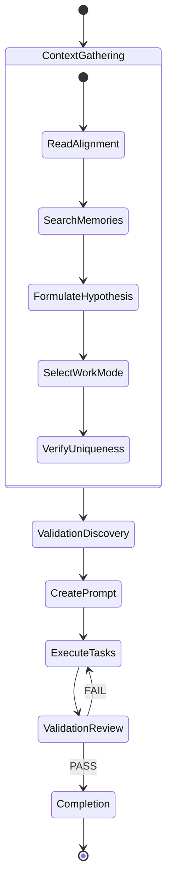
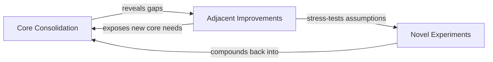
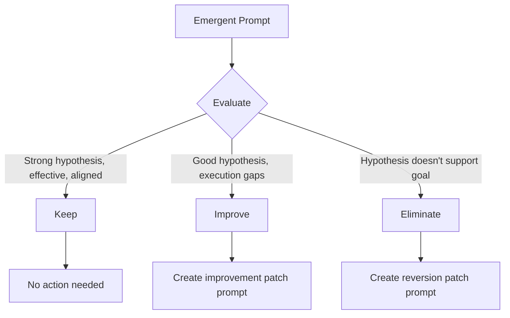

# Emergent Refinement

Planned prompts address known requirements. Emergent refinement addresses the unknown -- the improvements, extensions, and experiments that only become visible after initial implementation exists. Per **Quality Engineering**, emergent work discovers which variants are valuable, not just what was explicitly requested.

## Core Concept: Hypothesis-Driven Work

Every emergent prompt starts with a hypothesis: "If I implement X, then Y outcome will result." This is fundamentally different from planned prompts, which start with "The spec requires X." The hypothesis framing forces agents to articulate expected outcomes, making success measurable and failure informative.

[ref:.allhands/flows/EMERGENT_REFINEMENT_EXECUTION.md::79b9873]

## Execution Lifecycle

## Work Mode Diversification

Emergent agents select from three work modes, cycling between them based on what prior prompts have already explored:

| Mode | Purpose | Examples |
|------|---------|---------|
| Core Consolidation | Testing, stability, error handling | Missing edge cases, error recovery paths |
| Adjacent Improvements | Tangentially related enhancements | Performance optimization, UX polish |
| Novel Experiments | Creative extensions behind feature flags | Alternative approaches, exploratory features |

These are not sequential phases. An agent doing novel experiments may discover a core stability gap, returning to consolidation. Per **Knowledge Compounding**, each mode feeds the others -- adjacent work exposes core needs, novel work stress-tests assumptions.

## Mandatory Validation Steps

Two validation subtasks are non-negotiable:

1. **Before creating the prompt**: Spawn subtask for validation tooling discovery to find applicable validation suites
2. **After implementation**: Spawn subtask for validation review (same gate as planned prompts)

This ensures emergent work meets the same quality bar as planned work, preventing the "quick experiment" from degrading codebase quality.

## Completion Protocol

The completion order mirrors planned prompt execution with one addition: the work type is included in the summary so subsequent emergent agents can diversify their mode selection. Alignment files and prompt files are not git tracked -- only implementation changes are committed.

## Post-Refinement Analysis

[ref:.allhands/flows/shared/EMERGENT_REFINEMENT_ANALYSIS.md::79b9873]

After a batch of emergent prompts completes, an analysis phase evaluates each one:

### Classification Decision Tree

| Classification | Criteria | Action |
|---------------|----------|--------|
| Keep | Strong hypothesis, effective execution, aligned with goals | None |
| Improve | Good hypothesis, but execution gaps remain | Create `type: user-patch` improvement prompt |
| Eliminate | Hypothesis doesn't support milestone goal | Create `type: user-patch` reversion prompt using git hashes |

### Engineer Decision Point

The analysis presents findings holistically -- comparing emergent prompts against each other, highlighting patterns of effective versus ineffective hypotheses. The engineer accepts, adjusts, or overrides recommendations. Per **Knowledge Compounding**, all decisions and rationale are documented in the alignment doc to prevent future agents from re-proposing eliminated approaches.

## Why Emergent Refinement Exists

Per **Prompt Files as Units of Work**, novelty emerges from prompt tasking. Planned prompts capture what engineers know they want. Emergent refinement captures what they didn't know they wanted until the system existed. The framing as "indefinite compounding" rather than "percentage complete" reflects the principle that there is always a next valuable iteration to discover.
