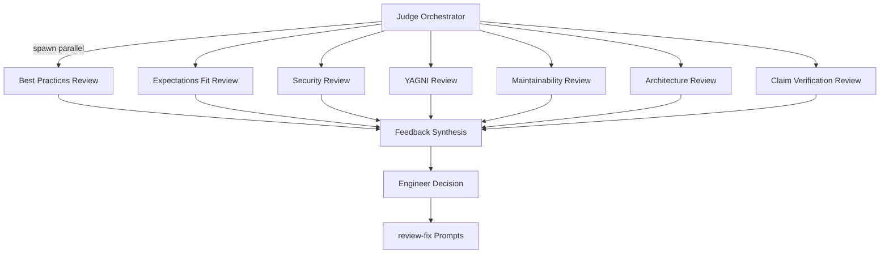

# Judge Reviewing

After implementation is complete, the judge orchestrates a jury of specialized reviewers to assess the work against planning artifacts and the original spec. The design embodies **Quality Engineering**: the question is not "does this work?" but "which issues matter enough to fix?" The engineer makes all final decisions.

[ref:.allhands/flows/JUDGE_REVIEWING.md::79b9873]

## Jury Architecture

All seven reviewers run in parallel as independent subtasks. The judge never reads jury flow files directly -- per **Context is Precious**, each subtask loads only its own review flow.

## Reviewer Specializations

### Domain Best Practices

[ref:.allhands/flows/shared/jury/BEST_PRACTICES_REVIEW.md::79b9873]

Spawned per domain touched by the implementation (expo/react-native, trpc/serverless, database/drizzle/supabase, web/tanstack/nextjs, dev tooling, CI/CD). Each reviewer extracts domain skills and codebase knowledge, then compares implementation against extracted patterns for compliance, preferences, pitfalls, and consistency.

Fallback: if no skill findings exist for a domain, the reviewer falls back to web research. Per **Knowledge Compounding**, this gap signals a missing skill that should be created.

### Expectations Fit

[ref:.allhands/flows/shared/jury/EXPECTATIONS_FIT_REVIEW.md::79b9873]

Verifies implementation honors desires, concerns, and decisions from ideation and planning. Checks: engineer desires implemented, success criteria met, concerns addressed, planning decisions honored, scope matched, and -- critically -- goal achievement versus mere task completion.

### Security

[ref:.allhands/flows/shared/jury/SECURITY_REVIEW.md::79b9873]

Reviews against OWASP Top 10 and common vulnerability patterns. File-type-aware: API endpoints get input validation and auth checks, database queries get parameterization review, frontend gets XSS and CSRF analysis, config files get secrets exposure scanning.

### YAGNI

[ref:.allhands/flows/shared/jury/YAGNI_REVIEW.md::79b9873]

Detects over-engineering with source-awareness: agentic over-reach gets highest priority (P1), post-planning engineer decisions get P2, original planning decisions get P3. Agents systematically over-engineer, so this reviewer provides a deliberate counterweight.

Patterns detected: beyond-scope implementation, unused code, over-abstraction, unnecessary feature flags, impossible error handling, premature optimization, orphaned artifacts, dead exports, and defensive overkill.

### Maintainability

[ref:.allhands/flows/shared/jury/MAINTAINABILITY_REVIEW.md::79b9873]

Targets agentic anti-patterns specifically:

| Anti-Pattern | Description |
|-------------|-------------|
| Hallucination | Imports that don't exist, APIs used incorrectly |
| Duplication | Re-implementing existing utilities |
| Miscommunication | Prompt A establishes pattern, Prompt B ignores it |
| Inconsistency | Different approaches for same problem |
| Over-abstraction | Unnecessary wrappers, premature generalization |
| Orphaned artifacts | Files created but never connected |

Includes LOC reduction estimates for simplification recommendations.

### Architecture

[ref:.allhands/flows/shared/jury/ARCHITECTURE_REVIEW.md::79b9873]

Verifies SOLID principles, dependency direction (toward stable abstractions), circular dependency detection, layer violation detection, and boundary crossing analysis. Compares against both documented architecture and implicit patterns discovered via `ah knowledge docs search`.

### Claim Verification

[ref:.allhands/flows/shared/jury/CLAIM_VERIFICATION_REVIEW.md::79b9873]

Verifies factual assertions in prompts and alignment docs against actual codebase state. Categorizes claims as existence, absence, behavior, or location claims, each with different verification methods. Flags common verification failure patterns like "based on search results..." or "similar to X, Y does..."

## Feedback Synthesis

[ref:.allhands/flows/shared/REVIEW_OPTIONS_BREAKDOWN.md::79b9873]

After all reviewers complete, findings are organized into actionable options:

| Severity | Criteria | Engineer Action |
|----------|----------|-----------------|
| Blocking | Prevents goal achievement, broken functionality | Must address |
| Recommended | Best practice violations, potential issues | Should address |
| Optional | Style improvements, minor enhancements | May address |

Duplicates across reviewers are combined and elevated -- repeated concerns prove urgency. The engineer chooses which issues to accept and which to decline, with reasoning documented in the alignment doc.

## Output: Review-Fix Prompts

Accepted fixes become `type: review-fix` prompts created per [ref:.allhands/flows/shared/PROMPT_TASKS_CURATION.md::79b9873]. Per **Knowledge Compounding**, declined items are documented with reasoning to prevent future re-suggestion of rejected approaches.
