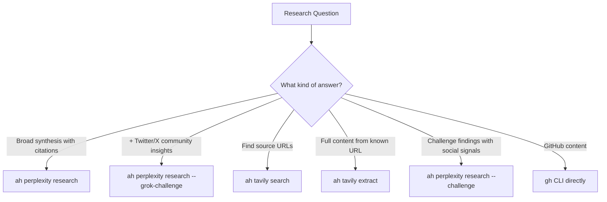
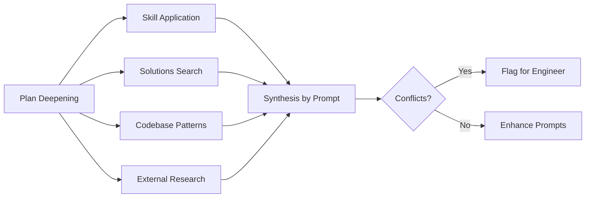

# Plan Deepening and Research

Research in the harness is never open-ended browsing. Every research flow serves a specific consumer -- an ideation interview, a planning session, a prompt being enhanced -- and each has constraints that prevent context waste. This document covers the four research-oriented flows and how they compose.

## Research Tool Selection

[ref:.allhands/flows/shared/RESEARCH_GUIDANCE.md::79b9873]

Before any research begins, agents must select the right tool for the depth needed:

The combination strategy is deliberate: when unsure, run multiple tools in parallel and compare result quality. Per **Context is Precious**, this is faster than sequential attempts with wrong tools.

## Codebase Understanding

[ref:.allhands/flows/shared/CODEBASE_UNDERSTANDING.md::79b9873]

This flow governs how agents explore the codebase without consuming excessive context. It enforces a strict search hierarchy:

| Priority | Tool | Use When |
|----------|------|----------|
| 1st | `ah knowledge docs search` | Any discovery task -- returns engineered knowledge with "why" context |
| 2nd | `tldr semantic search` / grep | Knowledge search insufficient, need code-level patterns |
| 3rd | LSP | Known symbol name from knowledge search results |
| 4th | `ah solutions search` / `ah memories search` | Similar problem solved before, or engineer preferences exist |
| 5th | `ast-grep` | Structured code pattern matching as last resort |

Knowledge search results include `insight` (engineering knowledge), `lsp_entry_points` (files with exploration rationale), and `design_notes` (architectural decisions). This is richer than raw file reads and costs fewer tokens.

### Query Formatting

Queries must be complete sentences, not keyword soup. `"how does the retry mechanism handle rate limits when calling external APIs"` outperforms `"retry rate limit api"` because the knowledge system indexes on semantic meaning.

## External Technology Guidance

[ref:.allhands/flows/shared/EXTERNAL_TECH_GUIDANCE.md::79b9873]

When implementation requires external libraries or services, this flow provides two parallel research channels:

| Channel | Tool | Returns |
|---------|------|---------|
| Documentation | `ah context7 search` | Official API references, configuration patterns, version-specific behaviors |
| Open source exploration | `gh search` + local clone to `.reposearch/` | Real implementation patterns, architectural decisions, library usage examples |

The clone-and-browse approach leverages the agent's file navigation capabilities -- regex search, pattern matching, and direct file reading across a cloned repository. This is more capable than API-based code search for understanding implementation patterns.

## Plan Deepening

[ref:.allhands/flows/shared/PLAN_DEEPENING.md::79b9873]

Plan deepening is an optional enhancement phase that runs after planning is complete but before execution begins. It enriches prompts with research findings without changing their scope.

### Spawned Research Axes

Each axis runs in parallel:

- **Skill application**: Matches available skills to plan domains, extracts patterns and gotchas
- **Solutions search**: Checks `ah solutions search` and `ah memories search` for relevant past learnings
- **Codebase patterns**: Discovers existing implementations of similar patterns via `CODEBASE_UNDERSTANDING.md`
- **External research**: For novel technologies or high-risk domains via `RESEARCH_GUIDANCE.md`

### Enhancement Constraints

Plan deepening adds a `## Research Insights` section to each prompt. It preserves all original content -- tasks, acceptance criteria, and scope are never modified. If research conflicts with the current plan, conflicts are flagged for engineer review rather than resolved automatically.

### When to Use Plan Deepening

| Scenario | Recommended? |
|----------|-------------|
| Complex architectural decisions | Yes |
| High-risk domains (security, payments, data migrations) | Yes |
| Novel technologies not yet in codebase | Yes |
| Large specs with many unknowns | Yes |
| Straightforward feature work with established patterns | No -- adds overhead without proportional value |

Per **Knowledge Compounding**, plan deepening is where past solutions and skills compound most directly into future work. Each research finding that makes it into a prompt prevents an executor from having to rediscover the same knowledge.
