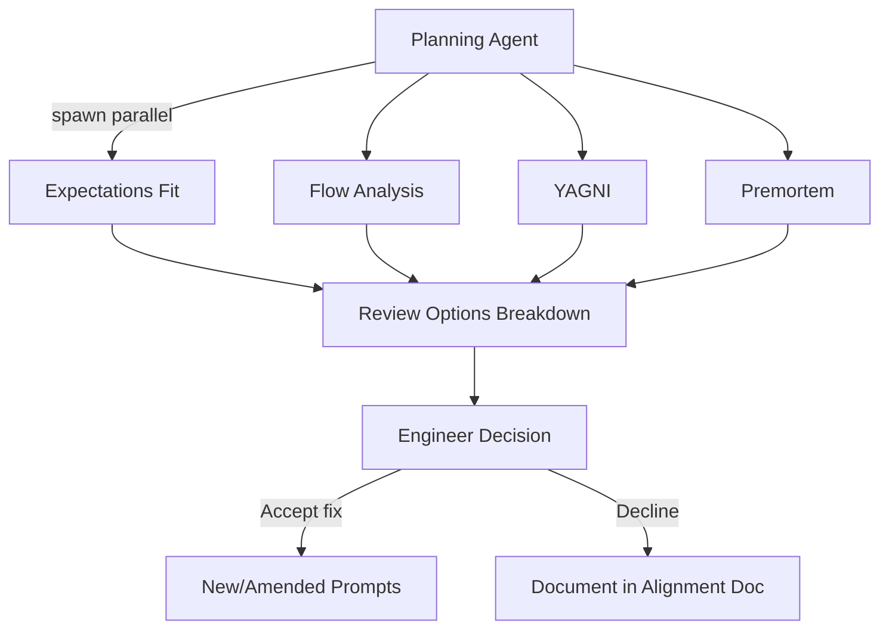

# Plan Review Jury

The plan review jury runs after planning is complete but before any prompt executes. While the [judge review](judge-reviewing.md) evaluates finished implementation, this jury evaluates the plan itself -- catching issues when they are cheapest to fix. Per **Quality Engineering**, detecting risks before execution prevents wasted agent cycles.

## Jury Composition

The plan review jury has four members, each spawned as a parallel subtask during the planning phase described in [ref:.allhands/flows/SPEC_PLANNING.md::cc0b192]:

## Expectations Fit

[ref:.allhands/flows/shared/jury/PROMPTS_EXPECTATIONS_FIT.md::7fee0b6]

Treats the spec doc as ground truth and traces every engineer expectation to the prompts that address it. Detects:

- Spec desires not covered by any prompt
- Prompts that contradict spec expectations
- Alignment doc decisions that deviate from spec without explanation
- Coverage holes where an engineer expectation has no implementing prompt

Output is gap-oriented: P1 for missing coverage, P2 for inconsistencies, P3 for ambiguities that could be interpreted multiple ways.

## Flow Analysis

[ref:.allhands/flows/shared/jury/PROMPTS_FLOW_ANALYSIS.md::16202d3]

Analyzes prompt dependencies and ordering with a derisking lens. The core questions come from thinking like a tech lead:

| Priority | Question |
|----------|----------|
| Feasibility | Which prompts reveal if implementation is even possible? |
| Stability | Which prompts prove core architecture works? |
| Blockers | Which prompts unblock the most other work? |
| Confidence | Which prompts give earliest signal on success? |
| Wiring | Do prompts plan how components connect? |

The analysis builds a dependency graph, identifies the critical path, recommends reordering for maximum derisking, and assesses parallelization opportunities with merge-risk ratings (safe, medium, high based on file overlap).

## YAGNI

[ref:.allhands/flows/shared/jury/PROMPTS_YAGNI.md::3b8082f]

Evaluates planning artifacts for over-engineering with decision-source awareness:

| Source | Priority |
|--------|----------|
| Agent-proposed complexity | Higher priority -- agents systematically over-engineer |
| Engineer-decided complexity | Lower priority -- explicit awareness, but perspective still offered |

Detects premature abstraction, future-proofing, over-configuration, defensive complexity, feature creep within planned prompts, and scope bloat (10+ files or 7+ tasks). Emergent prompts and disposable variants are explicitly excluded from feature creep detection -- they exist to discover value by design.

## Premortem

[ref:.allhands/flows/shared/jury/PROMPT_PREMORTEM.md::aef49b5]

Identifies failure modes before they happen, using a verification protocol that prevents false alarms:

### Risk Taxonomy

| Category | Symbol | Meaning |
|----------|--------|---------|
| Tiger | `[TIGER]` | Clear threat requiring action or explicit acceptance |
| Paper Tiger | `[PAPER]` | Looks threatening but acceptable with evidence |
| Elephant | `[ELEPHANT]` | Unspoken concern nobody raised yet |

### Verification Protocol

Before flagging any Tiger, the premortem reviewer must confirm: the relevant prompts were read, the alignment doc was checked for existing mitigation, and the concern is actually in scope. If any check fails, it cannot be flagged as a Tiger.

### Checklist Dimensions

The premortem works through four systematic categories: prompt completeness (acceptance criteria, validation tooling, dependencies, scope), technical risks (external dependencies, breaking changes, migration paths, security, error handling), integration risks (component wiring, feature flags, cross-prompt testing), and process risks (requirements clarity, validation suite coverage, parallel execution conflicts).

## Feedback Synthesis

All four jury members' findings flow into [ref:.allhands/flows/shared/REVIEW_OPTIONS_BREAKDOWN.md::739ad0a], which ranks items P1/P2/P3, deduplicates across reviewers, and presents options to the engineer.

### Premortem Integration Rules

| Premortem Finding | Maps To | Handling |
|-------------------|---------|----------|
| Tigers (high severity) | P1 | Require explicit accept or fix decision |
| Tigers (medium severity) | P2 | Recommend addressing, allow skip |
| Elephants | Discussion points | Surface to engineer, document response |
| Paper Tigers | Acknowledged | Note as acceptable risk in alignment doc |
| Checklist gaps | P2 or P3 | Prompt amendments to close gaps |

The engineer's decisions -- including explicitly accepted risks -- are documented in the alignment doc per **Knowledge Compounding**, preventing future jury reviews from re-raising the same concerns.

## Quick Premortem Variant

[ref:.allhands/flows/shared/QUICK_PREMORTEM.md::1aa1d20]

For single prompts (emergent refinement, review-fix, PR-review), a lightweight 3-minute premortem variant exists. It answers five questions (biggest failure mode, external dependency risk, rollback feasibility, uncovered edge cases, unclear requirements) and returns a go/adjust/block recommendation. Full premortems are reserved for complete milestone prompt sets.
