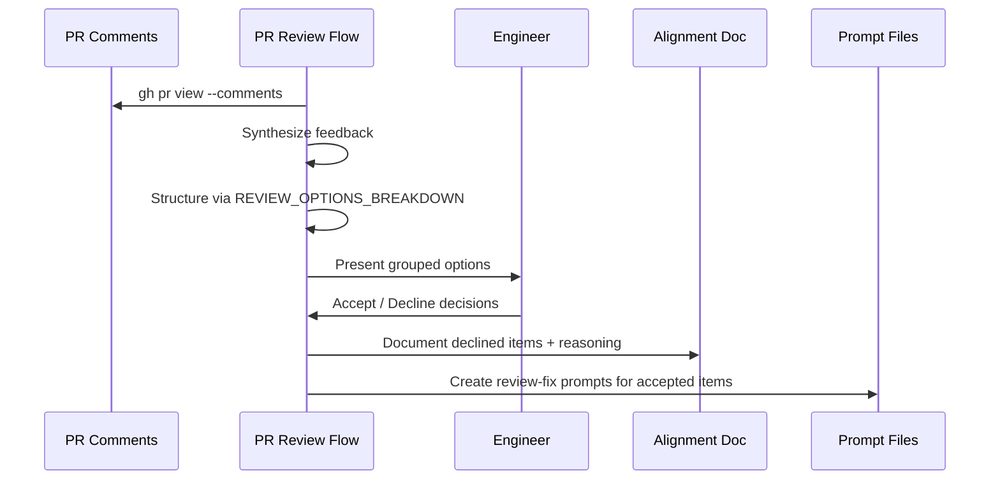

# PR Reviewing Flow

The PR reviewing flow bridges the gap between external code review feedback and the harness prompt model. PR comments arrive as unstructured text; this flow synthesizes them into structured decisions and actionable prompts.

Per **Knowledge Compounding**, what the engineer declines is as important as what they accept. Declined items are documented to prevent future agents from re-suggesting rejected approaches.

## Flow Sequence

## Feedback Processing

The flow reads PR comments via `gh` CLI, then structures feedback using the review options breakdown methodology from [ref:.allhands/flows/shared/REVIEW_OPTIONS_BREAKDOWN.md::79b9873]. Feedback is grouped by severity and effort before presentation to the engineer.

## Decision Handling

| Decision | Action | Why |
|----------|--------|-----|
| Accepted | Create `type: review-fix` prompt with PR comment context | Feeds into prompt execution loop |
| Declined | Document in alignment doc with engineer reasoning | Prevents re-suggestion by future agents |

Both outcomes produce artifacts. The accepted path creates prompts following [ref:.allhands/flows/shared/PROMPT_TASKS_CURATION.md::79b9873]. The declined path updates the alignment doc (schema via `ah schema alignment`) with explicit rejection rationale. This dual-tracking ensures no review feedback is lost regardless of the engineer's decision.

## Prompt Creation

Review-fix prompts include:
- Frontmatter `type: review-fix`
- PR comment context in the body
- Acceptance criteria derived from the reviewer's concern

The flow completes once all prompts are created and the alignment doc is updated. These prompts then enter the normal execution loop.

## Source Flow

[ref:.allhands/flows/PR_REVIEWING.md::79b9873]
