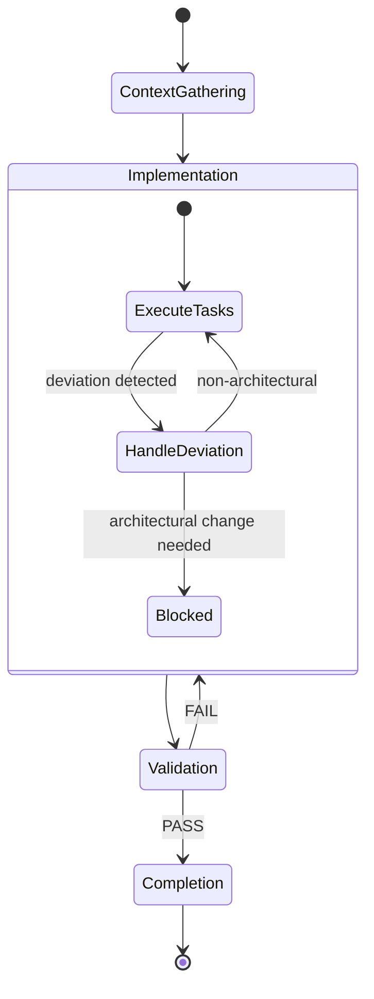
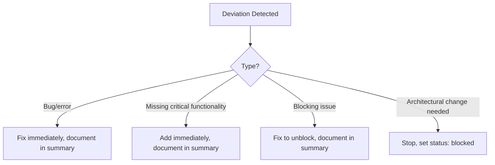

# Prompt Task Execution

Prompts are the atomic unit of work in the harness. Each prompt file IS the task -- a self-contained specification with tasks, acceptance criteria, validation suites, and skills. The execution flow ensures every prompt passes through a validation gate before completion and that all work is documented for downstream agents.

## Execution Lifecycle

## Context Gathering

[ref:.allhands/flows/PROMPT_TASK_EXECUTION.md::79b9873]

The executor reads the prompt file and the alignment doc. If FAILURE SUMMARY sections exist from prior attempts, the agent adapts to their redirections. Additional codebase search is available but typically unnecessary -- per **Context is Precious**, prompts should contain sufficient context from the planning phase.

## Prompt Curation Principles

[ref:.allhands/flows/shared/PROMPT_TASKS_CURATION.md::79b9873]

Prompts are designed with strict context budget awareness:

| Context Usage | Agent Quality | Implication |
|---------------|--------------|-------------|
| 0-30% | Peak | Thorough, comprehensive work |
| 30-50% | Good | Solid execution |
| 50-70% | Degrading | Efficiency mode kicks in |
| 70%+ | Poor | Rushed, minimal output |

This drives hard scope limits: 2-6 tasks per prompt, target 50% context max, and prompts modifying 7+ files must be split. The principle is **Context is Precious** applied at the individual agent level.

### Key Curation Rules

- Completed prompts (`status: done`) are immutable -- create new prompts to extend or fix
- Prompts must plan **wiring**, not just artifacts -- tasks connect components via API calls, imports, and state flow
- Skills and validation suites are embedded in frontmatter, not discovered at execution time
- Testing is NOT a separate prompt -- validation happens via `validation_suites` attached to feature prompts

## Deviation Handling

Per **Frontier Models are Capable**, executors handle deviations autonomously:

The boundary is clear: executors can fix anything within the prompt's conceptual scope but must stop and escalate if the fix requires new database tables, major schema changes, or new services.

## Validation Gate

[ref:.allhands/flows/shared/PROMPT_VALIDATION_REVIEW.MD::79b9873]

Every prompt must pass validation review before completion. The reviewer is a separate subtask that provides independent judgment.

### Review Dimensions

The reviewer checks three levels of completion:

| Level | What it Means |
|-------|---------------|
| Existence | Files were created or modified |
| Substantive | Implementation is real, not placeholder |
| Wired | Components are connected (imports, API calls, state rendering) |

Task completion does not equal goal achievement. The reviewer specifically scans for stub patterns: `TODO`, `return null`, `return {}`, empty handlers, orphaned code, and unconnected APIs.

### Validation Quality Critique

The reviewer evaluates not just whether tests pass, but whether the validation itself is meaningful. Red flags include mock tests that don't test real implementation, validation curated to look like it passes, and redundant tests that add no confidence.

### Iteration Protocol

If validation fails, the executor acts on feedback and resubmits. After attempt 2 with genuine limitations, the executor may communicate compromises -- the reviewer may still reject, but rigid blocking on diminishing returns wastes cycles.

## Completion Protocol

The completion order is critical and exists to prevent race conditions with parallel agents:

1. Write success summary to prompt file (including deviations handled)
2. Append summary to alignment doc's Prompt Summaries section
3. Commit implementation changes only (prompt and alignment files are NOT git tracked)
4. Set `status: done` in frontmatter (must be after summaries)
5. Rename prompt file with `-DONE` suffix
6. Stop

Per **Knowledge Compounding**, the alignment doc summary enables other agents to see completed work without reading each individual prompt -- reducing context consumption across the entire agent fleet.
