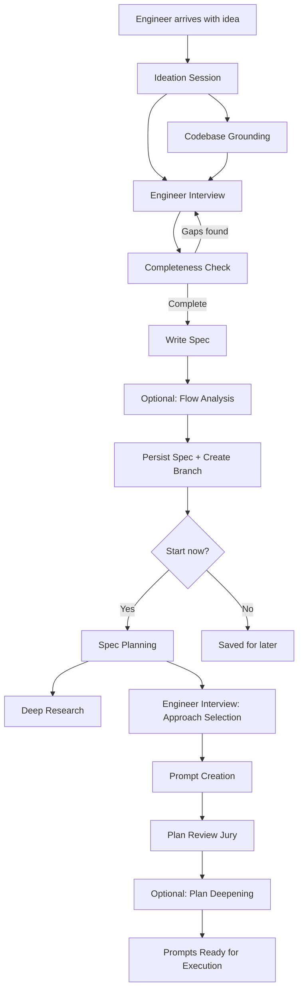

# Spec Planning

Spec planning is the harness's front door. Before any prompt is written or any code is generated, an engineer's intent must be captured, grounded in codebase reality, and structured into an actionable plan. This process spans two major phases -- ideation (capturing intent) and planning (transforming intent into executable prompts).

## Ideation-to-Execution Lifecycle

## Phase 1: Ideation Session

[ref:.allhands/flows/IDEATION_SESSION.md::79b9873]

The ideation session is an interview-driven process grounded in the principle of **Ideation First**: front-load exploration to prevent low-level decision fatigue during implementation.

### Parallel Grounding

While the interview proceeds, parallel subtasks run codebase and research exploration:

| Subtask Type | Flow | Purpose |
|-------------|------|---------|
| Codebase grounding (1-3 tasks) | [ref:.allhands/flows/shared/IDEATION_CODEBASE_GROUNDING.md::79b9873] | Discover existing implementations, roadmap dependencies, and hard constraints |
| Research (0-2 tasks) | [ref:.allhands/flows/shared/RESEARCH_GUIDANCE.md::79b9873] | Find high-level solution approaches for novel problems |

The grounding subtask overlays codebase findings against the roadmap, distinguishing between what exists now and what is planned -- because ideation must account for future state, not just current state.

### Interview Dimensions

The interview elicits six dimensions: goals, motivations, concerns, desires, capabilities, and expectations. Each has dedicated deep-dive categories (UX, data/state, technical, scale, integrations, security) with knowledge gap detection signals that trigger deeper probing.

Key design decision: questions are asked **one at a time**. This prevents cognitive overload and allows the agent to adapt each question based on prior answers -- a deliberate application of **Context is Precious** to the human side.

### Preference Language

Specs use calibrated language that preserves engineer intent fidelity:

| Engineer Signal | Spec Language |
|----------------|---------------|
| Strong preference | "Engineer desires X" / "Engineer expects X" |
| Flexible preference | "Engineer likes X but open to alternatives" |
| Just an idea | "Engineer proposes X, open-ended for architect" |
| No opinion | Left in Open Questions |

This matters because downstream planning agents use this language to determine how much latitude they have.

## Spec Creation and Persistence

[ref:.allhands/flows/shared/CREATE_SPEC.md::79b9873]

The spec is written to `specs/roadmap/{name}.spec.md`, persisted via `ah specs persist`, and its branch is created. The roadmap is reindexed so future ideation sessions can discover this spec as a dependency.

### Spec Variants

Not all specs follow the ideation interview. Two specialized spec types exist for infrastructure needs:

| Spec Type | Flow | Trigger |
|-----------|------|---------|
| Harness improvement | [ref:.allhands/flows/shared/CREATE_HARNESS_SPEC.md::79b9873] | Compounding identifies systemic harness issues |
| Validation tooling | [ref:.allhands/flows/shared/CREATE_VALIDATION_TOOLING_SPEC.md::79b9873] | Gap analysis reveals missing validation infrastructure |

Both follow `CREATE_SPEC.md` for persistence but have distinct interview formats and body structures. Validation tooling specs create blocking dependencies on the original feature spec.

### Optional: Flow Analysis

[ref:.allhands/flows/shared/SPEC_FLOW_ANALYSIS.md::79b9873]

For user-facing features with multiple paths, the spec can be analyzed for user flow completeness. This identifies missing flows, ambiguous transitions, undefined error states, and scope boundaries -- all presented as questions, not mandates.

## Phase 2: Spec Planning

[ref:.allhands/flows/SPEC_PLANNING.md::79b9873]

Planning transforms the spec into executable prompts. This is where **Quality Engineering** takes over: the question shifts from "what does the engineer want?" to "which implementation approach is best?"

### Research Before Options

Planning spawns parallel research subtasks before presenting any options:

| Research Type | Flow | Purpose |
|--------------|------|---------|
| Codebase understanding (1-4 tasks) | [ref:.allhands/flows/shared/CODEBASE_UNDERSTANDING.md::79b9873] | Ground implementation approaches in existing patterns |
| Solution research (0-3 tasks) | [ref:.allhands/flows/shared/RESEARCH_GUIDANCE.md::79b9873] | Isolate optimal solutions for novel problems |
| External tech (as needed) | [ref:.allhands/flows/shared/EXTERNAL_TECH_GUIDANCE.md::79b9873] | Acquire documentation and implementation guidance |

### Disposable Variant Architecture

When the engineer selects multiple approaches for the same decision point, the planning agent creates variant prompts that execute in parallel behind feature flags. This is a direct application of **Quality Engineering**: software is cheap, so multiple variants can be tested rather than debated.

The planning agent is the only agent authorized to architect variant prompt structures. This prevents downstream agents from creating uncoordinated variants.

### Plan Verification

Before jury review, the planner self-verifies across five dimensions: requirement coverage, task completeness, key links planned (components wiring together), scope sanity (2-3 tasks per prompt, fewer than 7 files), and validation coverage.

### Plan Review Jury

The plan passes through a jury of four specialized reviewers before execution begins. See the [plan-review-jury documentation](plan-review-jury.md) for details on this pre-execution review gate.
