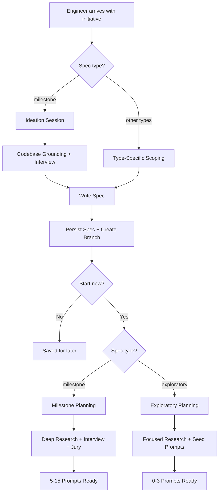

# Spec Planning

Spec planning is the harness's front door. Before any prompt is written or any code is generated, an engineer's intent must be captured, grounded in codebase reality, and structured into an actionable plan. Milestone specs go through a full ideation session; all other spec types enter through type-specific scoping flows. Both paths converge at spec persistence, after which the spec `type` field drives planning depth.

## Ideation-to-Execution Lifecycle

## Phase 1: Ideation Session (Milestone Only)

[ref:.allhands/flows/IDEATION_SESSION.md::4eddba4]

The ideation session is an interview-driven process grounded in the principle of **Ideation First**: front-load exploration to prevent low-level decision fatigue during implementation. Non-milestone specs bypass ideation and enter through [type-specific scoping flows](type-specific-scoping-flows.md) instead.

### Parallel Grounding

While the interview proceeds, parallel subtasks run codebase and research exploration:

| Subtask Type | Flow | Purpose |
|-------------|------|---------|
| Codebase grounding (1-3 tasks) | [ref:.allhands/flows/shared/IDEATION_CODEBASE_GROUNDING.md::4eddba4] | Discover existing implementations, roadmap dependencies, and hard constraints |
| Research (0-2 tasks) | [ref:.allhands/flows/shared/RESEARCH_GUIDANCE.md::4eddba4] | Find high-level solution approaches for novel problems |

The grounding subtask overlays codebase findings against the roadmap, distinguishing between what exists now and what is planned -- because ideation must account for future state, not just current state.

### Interview Dimensions

The interview elicits six dimensions: goals, motivations, concerns, desires, capabilities, and expectations. Each has dedicated deep-dive categories (UX, data/state, technical, scale, integrations, security) with knowledge gap detection signals that trigger deeper probing.

Key design decision: questions are asked **one at a time**. This prevents cognitive overload and allows the agent to adapt each question based on prior answers -- a deliberate application of **Context is Precious** to the human side.

### Preference Language

Specs use calibrated language that preserves engineer intent fidelity:

| Engineer Signal | Spec Language |
|----------------|---------------|
| Strong preference | "Engineer desires X" / "Engineer expects X" |
| Flexible preference | "Engineer likes X but open to alternatives" |
| Just an idea | "Engineer proposes X, open-ended for architect" |
| No opinion | Left in Open Questions |

This matters because downstream planning agents use this language to determine how much latitude they have.

## Spec Creation and Persistence

[ref:.allhands/flows/shared/CREATE_SPEC.md::4eddba4]

The spec is written to `specs/roadmap/{name}.spec.md`, persisted via `ah specs persist`, and its branch is created. The roadmap is reindexed so future ideation sessions can discover this spec as a dependency.

### Spec Variants

Not all specs follow the ideation interview. Several specialized spec types exist:

| Spec Type | Flow | Trigger |
|-----------|------|---------|
| Harness improvement | [ref:.allhands/flows/shared/CREATE_HARNESS_SPEC.md::4eddba4] | Compounding identifies systemic harness issues |
| Validation tooling | [ref:.allhands/flows/shared/CREATE_VALIDATION_TOOLING_SPEC.md::4eddba4] | Gap analysis reveals missing validation infrastructure |
| Investigation | [ref:.allhands/flows/INVESTIGATION_SCOPING.md::4eddba4] | Engineer scopes a hypothesis-driven diagnosis |
| Optimization | [ref:.allhands/flows/OPTIMIZATION_SCOPING.md::4eddba4] | Engineer scopes a performance improvement |
| Refactor | [ref:.allhands/flows/REFACTOR_SCOPING.md::4eddba4] | Engineer scopes a structural transformation |
| Documentation | [ref:.allhands/flows/DOCUMENTATION_SCOPING.md::4eddba4] | Engineer scopes a documentation effort |
| Triage | [ref:.allhands/flows/TRIAGE_SCOPING.md::4eddba4] | Engineer scopes an externally-signaled issue |

Harness and validation specs follow `CREATE_SPEC.md` for persistence but have distinct interview formats. The five scoping flows (investigation through triage) each conduct a type-specific interview before delegating to `CREATE_SPEC.md`. See [type-specific-scoping-flows](type-specific-scoping-flows.md) for details.

### Optional: Flow Analysis

[ref:.allhands/flows/shared/SPEC_FLOW_ANALYSIS.md::4eddba4]

For user-facing features with multiple paths, the spec can be analyzed for user flow completeness. This identifies missing flows, ambiguous transitions, undefined error states, and scope boundaries -- all presented as questions, not mandates.

## Planning Depth by Spec Type

[ref:.allhands/flows/SPEC_PLANNING.md::4eddba4]

Per **Frontier Models are Capable**, the spec `type` field determines planning depth. This branching happens after spec persistence, when planning begins:

| Spec Type | Planning Path | Research Depth | Interview | Jury | Output |
|-----------|--------------|----------------|-----------|------|--------|
| `milestone` (or missing) | Milestone Planning | 1-4 deep subtasks | Full decision interview | Yes | 5-15 prompts + detailed alignment doc |
| `investigation` | Exploratory Planning | 1-2 focused subtasks | Open questions only (skippable) | No | 0-3 seed prompts + problem-focused alignment doc |
| `optimization` | Exploratory Planning | 1-2 focused subtasks | Open questions only (skippable) | No | 0-3 seed prompts + problem-focused alignment doc |
| `refactor` | Exploratory Planning | 1-2 focused subtasks | Open questions only (skippable) | No | 0-3 seed prompts + problem-focused alignment doc |
| `documentation` | Exploratory Planning | 1-2 focused subtasks | Open questions only (skippable) | No | 0-3 seed prompts + problem-focused alignment doc |
| `triage` | Exploratory Planning | 1-2 focused subtasks | Open questions only (skippable) | No | 0-3 seed prompts + problem-focused alignment doc |

## Phase 2: Spec Planning -- Milestone Path

Planning transforms the spec into executable prompts. This is where **Quality Engineering** takes over: the question shifts from "what does the engineer want?" to "which implementation approach is best?"

### Research Before Options

Planning spawns parallel research subtasks before presenting any options:

| Research Type | Flow | Purpose |
|--------------|------|---------|
| Codebase understanding (1-4 tasks) | [ref:.allhands/flows/shared/CODEBASE_UNDERSTANDING.md::4eddba4] | Ground implementation approaches in existing patterns |
| Solution research (0-3 tasks) | [ref:.allhands/flows/shared/RESEARCH_GUIDANCE.md::4eddba4] | Isolate optimal solutions for novel problems |
| External tech (as needed) | [ref:.allhands/flows/shared/EXTERNAL_TECH_GUIDANCE.md::4eddba4] | Acquire documentation and implementation guidance |

### Disposable Variant Architecture

When the engineer selects multiple approaches for the same decision point, the planning agent creates variant prompts that execute in parallel behind feature flags. This is a direct application of **Quality Engineering**: software is cheap, so multiple variants can be tested rather than debated.

The planning agent is the only agent authorized to architect variant prompt structures. This prevents downstream agents from creating uncoordinated variants.

### Plan Verification

Before jury review, the planner self-verifies across five dimensions: requirement coverage, task completeness, key links planned (components wiring together), scope sanity (2-3 tasks per prompt, fewer than 7 files), and validation coverage.

### Plan Review Jury

The plan passes through a jury of four specialized reviewers before execution begins. See the [plan-review-jury documentation](plan-review-jury.md) for details on this pre-execution review gate.

## Phase 2: Spec Planning -- Exploratory Path

Exploratory planning is intentionally lightweight. Per **Frontier Models are Capable**, exploratory specs leave room for hypothesis-driven discovery by the emergent planner rather than pre-specifying all work upfront.

### Focused Research

1-2 targeted research subtasks grounded in the specific problem domain. External research is only spawned if the spec references external tools or novel approaches.

### Engineer Scope Narrowing

Open questions from the spec are presented to the engineer via `AskUserQuestion`. Each question can be answered to narrow scope or skipped -- skipped questions remain open for hypothesis-driven discovery. The interview is kept brief; exploratory specs intentionally leave room for discovery.

### Seed Prompt Creation

0-3 seed prompts created as testable hypotheses grounded in research findings. These target the most concrete, immediately actionable aspects of the spec. Remaining open questions are left for the emergent planner to design experiments around.

### Exploratory Alignment Doc

The alignment doc for exploratory specs emphasizes the problem space over the solution:

- **Overview**: Problem statement, evidence, context, and unresolved questions -- the emergent planner reads these to design experiments
- **Hard User Requirements**: Success criteria and constraints
- **Engineer Decisions**: Only deviations from recommendations

Unresolved questions (skipped interview questions, open spec questions) are documented prominently. Per **Knowledge Compounding**, this enables the emergent planner to discover and test answers through hypothesis-driven work.
