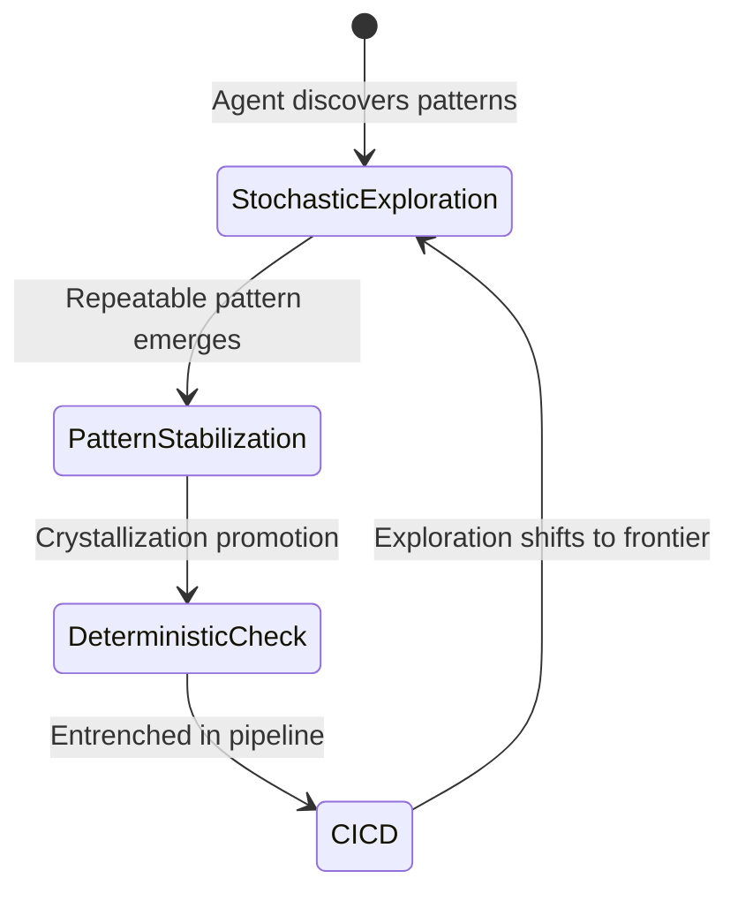
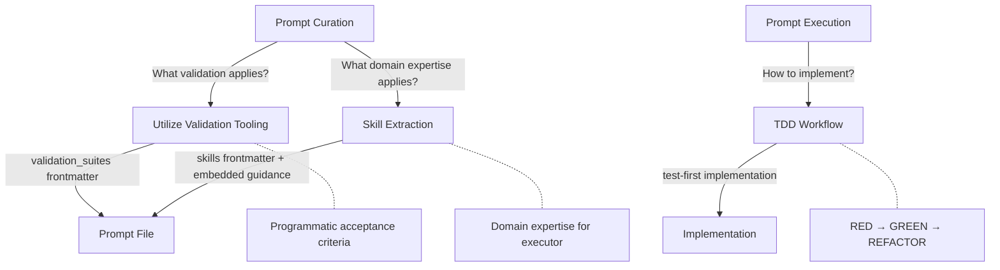

# Validation and Skills Integration

These three shared flows form the quality infrastructure that prompt curation and execution depend on. They are invoked as sub-flows -- typically from prompt curation -- to ensure every prompt carries the right validation suites, domain expertise, and testing methodology.

## Two-Dimensional Validation Practice Model

Per **Agentic Validation Tooling**, every validation domain has two first-class dimensions:

| Dimension | Nature | Phase | Purpose |
|-----------|--------|-------|---------|
| **Stochastic** | Agent-driven exploratory testing using model intuition | During implementation | Probe edge cases, test user flows, verify quality beyond deterministic checks |
| **Deterministic** | Binary pass/fail gating | Acceptance criteria | CI/CD-enforceable commands that gate completion |

These dimensions map to suite body sections: **Stochastic Validation** teaches agents how to explore; **Deterministic Integration** provides the commands that gate acceptance criteria.

### Suite Existence Threshold

A validation suite MUST have a meaningful stochastic dimension to justify existing. Per [ref:.allhands/principles.md::6668667], deterministic-only tools (type checking, linting, formatting) are test commands referenced directly in acceptance criteria and CI/CD -- they are NOT suites.

### Crystallization Lifecycle

Stochastic exploration and deterministic gating are connected by a compounding lifecycle:



Per [ref:.allhands/flows/COMPOUNDING.md::29f9dfe], the compounding flow evaluates crystallization during its Tooling Signals phase and promotes stable stochastic patterns into deterministic checks during Harness Improvement.

---

## How These Flows Connect



---

## Validation Tooling Discovery

[ref:.allhands/flows/shared/UTILIZE_VALIDATION_TOOLING.md::79b9873]

This flow matches implementation tasks to existing validation suites. Per **Agentic Validation Tooling**, programmatic validation replaces human supervision for routine checks.

### Discovery Pipeline

1. **Discover**: Run `ah validation-tools list` to get available suites (name, description, globs, file path, `tools`)
2. **Match**: Two parallel approaches:
   - Glob pattern matching against files being touched
   - Semantic inference from suite descriptions against task nature
   - The `tools` field identifies which tooling each suite wraps -- useful for matching against available MCP tools and installed CLI commands
3. **Read**: For each matched suite, read its body sections:
   - **Stochastic Validation** -- how agents explore quality during implementation
   - **Deterministic Integration** -- CI-gated commands for acceptance criteria
4. **Integrate**: Derive acceptance criteria from **Deterministic Integration** commands; use **Stochastic Validation** during implementation. Add suite paths to `validation_suites` frontmatter.
5. **Gap analysis**: Document unmatched validation needs for future `CREATE_VALIDATION_TOOLING`

### Validation Ordering

Acceptance criteria (deterministic dimension) are ordered progressively to fail fast:

> Compiles --> Unit tests --> Integration tests --> E2E

Stochastic exploration during implementation is not ordered -- agents follow model intuition to probe quality.

---

## Skill Extraction

[ref:.allhands/flows/shared/SKILL_EXTRACTION.md::79b9873]

This flow finds and distills domain expertise from skill files into actionable prompt guidance. Per **Knowledge Compounding**, skills are "how to do it right" -- expertise that compounds across prompts.

### Extraction Pipeline

1. **Discover**: Run `ah skills list` to get available skills (name, description, globs, file path)
2. **Match**: Same dual approach as validation -- glob patterns and semantic inference
3. **Read**: Extract key patterns, best practices, and references from each `.allhands/skills/<name>/SKILL.md`
4. **Synthesize**: Distill task-relevant knowledge (not full skill file copies)
5. **Embed**: Add skill paths to `skills` frontmatter and embed guidance in prompt Tasks section

### Key Distinction from Validation

| Aspect | Validation Suites | Skills |
|--------|------------------|--------|
| What they provide | Commands to verify correctness | Knowledge to implement correctly |
| When they apply | After implementation (checking) | During implementation (guiding) |
| Output location | `validation_suites` frontmatter | `skills` frontmatter + prompt body |
| Who consumes them | Validation runners | Prompt executors |

---

## TDD Workflow

[ref:.allhands/flows/shared/TDD_WORKFLOW.md::79b9873]

This flow applies test-driven development to prompt execution. Per **Agentic Validation Tooling**, tests written first create clear acceptance criteria and prevent scope drift.

### The Cycle

```
RED --> GREEN --> REFACTOR
 |        |          |
 |        |          +-- Improve code quality (tests still pass)
 |        +-- Write minimal code to pass tests
 +-- Write failing tests from acceptance criteria
```

### When to Apply

| Context | TDD Depth |
|---------|-----------|
| High-risk domains (auth, payments, data) | Full -- every acceptance criterion tested first |
| Core business logic | Full -- tests define behavior |
| UI components | Light -- key interactions tested |
| Integration glue code | Light -- happy path + error cases |
| Scripts/utilities | Optional -- judgment call |
| Exploratory/spike work | Skip -- write tests after if keeping |
| Pure UI layout changes | Skip -- visual review sufficient |
| Configuration changes | Skip -- integration test coverage |

### Test Evidence

TDD produces test evidence tables that map acceptance criteria to specific tests and their pass/fail status. This evidence feeds into prompt summaries and ultimately into the compounding flow for knowledge extraction.
