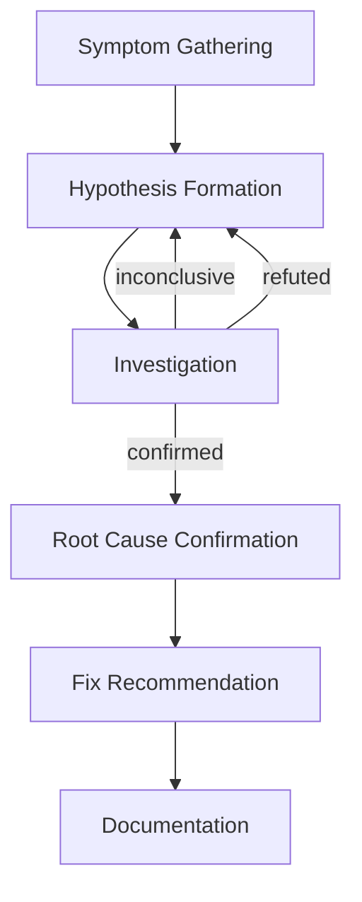

# Work-in-Progress Flows

These flows are under active development. They define useful capabilities but lack finalized integration points with the milestone workflow. Both are usable standalone but their invocation paths from other flows are TBD.

---

## Debug Investigation

[ref:.allhands/flows/wip/DEBUG_INVESTIGATION.md::8d96611]

A structured investigation methodology for complex bugs with unclear root causes. Per **Agentic Validation Tooling**, systematic debugging beats random exploration.

### Investigation Phases

The flow enforces a discipline: gather symptoms before hypothesizing, verify hypotheses with evidence before concluding, never guess at root cause without verification.

### Hypothesis-Driven Approach

Each investigation cycle produces structured evidence:

| Phase | Output |
|-------|--------|
| Symptom Gathering | Error messages, reproduction steps, frequency, recent changes |
| Hypothesis Formation | 2-3 ranked hypotheses with confidence, supporting/contradicting evidence, verification method |
| Investigation | Per-hypothesis file examination, findings, and conclusion (confirmed / refuted / inconclusive) |
| Root Cause | Description, location, evidence chain, explanation of why other hypotheses were wrong |

### Common Debug Patterns

The flow includes a reference table mapping symptom patterns to likely causes:

| Symptom | First Check |
|---------|-------------|
| Works locally, fails in CI | Environment diff: vars, paths, deps |
| Intermittent failures | Race condition: async timing, shared state |
| Started after deploy | Recent changes: git diff from last working |
| Only affects some users | Data-dependent: user data differences |
| Works sometimes on refresh | Caching: cache invalidation logic |

### Potential Integration Approaches

Integration with the milestone workflow is under consideration via four paths:
1. Patch prompt type (`type: debug`) following this flow
2. Pre-implementation phase when initial execution fails
3. Emergent debug when emergent refinement hits blockers
4. Coordinator service option in the coordination flow

---

## Memory Recall

[ref:.allhands/flows/wip/MEMORY_RECALL.md::38dd927]

A query interface for the simple memory file at `docs/memories.md`. Per **Knowledge Compounding**, memories enable reuse of solutions without re-discovery.

### Memory Format

Memories use a table format with four columns:

| Column | Values |
|--------|--------|
| Name | Short identifier |
| Domain | `planning`, `validation`, `implementation`, `harness-tooling`, `ideation` |
| Source | `user-steering` (engineer directed) or `agent-inferred` (discovered during work) |
| Description | 1-3 sentences of self-contained learning |

### Recall Process

1. Read `docs/memories.md`
2. Filter by domain if provided
3. Scan descriptions for keyword relevance
4. Return matching memories with context

### Relevance Scoring

Memories are prioritized by domain match, keyword overlap, and source authority (`user-steering` outranks `agent-inferred` for preference-based queries).

### Caller Flows

| Flow | Query Focus |
|------|-------------|
| Spec Planning | Planning patterns, past decisions |
| Prompt Execution | Implementation approaches, solutions |
| Ideation Session | Similar initiatives, prior engineer preferences |
| Compounding | Verify memory doesn't already exist before adding |

For detailed technical solutions beyond lightweight memories, the recall flow also directs callers to `ah solutions search`.
