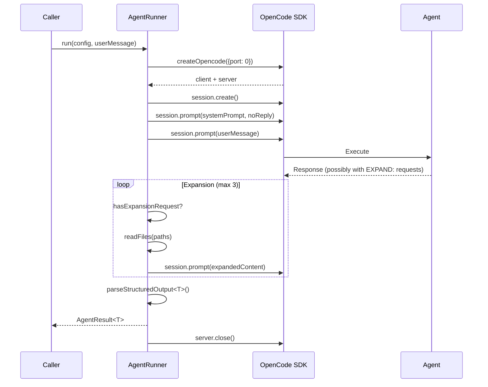

# Agent Profiles

Agent profiles are YAML declarations that define how agents are configured and spawned. They decouple agent behavior (what flows and system prompts to use) from orchestration (how and when to spawn). The TUI reads profiles to populate its action menu and build the correct invocation for each agent type.

## Profile Loading

Profiles live in the `.allhands/harness/agents/` directory as YAML files.

[ref:.allhands/harness/src/lib/opencode/profiles.ts:loadAgentProfile:ef20442] loads a single profile by name: reads the YAML, validates it against `RawAgentProfileSchema` via Zod, normalizes it with `normalizeProfile`, and runs semantic validation with `validateProfileSemantics`. Returns `null` if the file is missing or validation fails.

[ref:.allhands/harness/src/lib/opencode/profiles.ts:listAgentProfiles:ef20442] enumerates all `.yaml` / `.yml` files in the agents directory, returning profile names (filenames without extensions).

[ref:.allhands/harness/src/lib/opencode/profiles.ts:loadAllProfiles:ef20442] loads every profile, collecting both valid profiles and per-profile error/warning lists. The TUI calls this at startup to validate the entire profile set and report issues in the activity log.

## TUI Action Mapping

[ref:.allhands/harness/src/lib/opencode/profiles.ts:getProfilesByTuiAction:ef20442] builds a `Map<string, AgentProfile[]>` keyed by TUI action ID (e.g., "coordinator", "planner", "ideation"). Each TUI action button can trigger one or more agent profiles -- for example, a "planner" action might spawn both a planning agent and a dependency-check agent.

This mapping is what connects the TUI's action pane to actual agent configurations.

## Template Resolution

Profiles use template variables (e.g., `{{spec_name}}`, `{{branch}}`, `{{planning_dir}}`) in their system prompts, flow paths, and arguments. [ref:.allhands/harness/src/lib/opencode/profiles.ts:resolveTemplate:ef20442] performs string substitution using a `TemplateContext` object.

The context is validated at invocation time via `validateContext` from the template-vars schema, ensuring all required variables are provided before spawning. Missing variables produce clear error messages rather than silently passing `{{undefined}}` tokens to agents.

## Invocation Building

[ref:.allhands/harness/src/lib/opencode/profiles.ts:buildAgentInvocation:ef20442] transforms a profile + context into a concrete `AgentInvocation` -- the fully resolved command, arguments, environment variables, and system prompt ready for tmux execution.

[ref:.allhands/harness/src/lib/opencode/profiles.ts:buildAgentInvocationByName:ef20442] is a convenience wrapper that loads the profile by name and builds the invocation in one call.

Before building, [ref:.allhands/harness/src/lib/opencode/profiles.ts:validateProfileFlowExists:ef20442] verifies that the flow file referenced by the profile actually exists on disk. Flow files live in [ref:.allhands/harness/src/lib/opencode/profiles.ts:getFlowsDir:ef20442] (`.allhands/flows/`). This catches stale profile-to-flow references at spawn time rather than mid-execution.

## Agent Runner (OpenCode SDK)

[ref:.allhands/harness/src/lib/opencode/runner.ts:AgentRunner:c3a3694] provides a different execution model: instead of spawning agents in tmux windows, it runs sub-agents programmatically via the OpenCode SDK. This is used for internal harness tasks (oracle analysis, knowledge aggregation) that need structured JSON output.

### Execution Flow

### Key Design Decisions

**Port 0 allocation** -- Each `run()` call spawns a fresh OpenCode server on an OS-assigned port, enabling parallel sub-agent execution without port conflicts.

**Expansion protocol** -- Agents can request file contents by including `EXPAND: path/to/file` lines in their response. The runner reads those files (with 1MB size limit) and sends them back, up to 3 expansion rounds. This lets agents pull in context incrementally rather than requiring all files upfront.

**Structured output parsing** -- Responses are parsed as JSON, first trying code block extraction (`\`\`\`json ... \`\`\``), then raw parse. If parsing fails, the runner sends one retry prompt requesting JSON format before reporting failure.

**Model resolution** -- Uses the profile's `config.model` if set, falls back to `settings.opencodeSdk.model`, then to the OpenCode SDK default. This three-tier precedence lets operators override models at the project level while profiles can pin specific models for specialized tasks.

## Module Structure

[ref:.allhands/harness/src/lib/opencode/index.ts::20598fd] is the barrel export that re-exports profile functions and the `AgentRunner` class. It also defines the shared type interfaces (`AgentConfig`, `AgentResult`, `McpServerConfig`, `SearchResult`, `AggregatorInput`, `AggregatorOutput`) used across the harness for agent communication.
