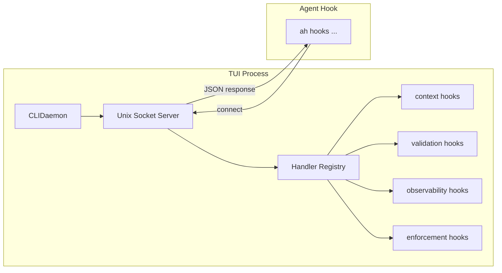

# CLI Daemon

The CLI daemon solves a performance problem: every hook invocation spawns a new Node.js process, paying ~400ms of startup overhead. When the TUI is running dozens of hooks per minute across multiple agents, this adds up. The daemon pre-loads all hook handlers into a long-running process and serves them over a Unix socket.

## The Problem

```
Without daemon:
  Agent tool call -> Claude Code hook -> spawn node -> parse CLI -> import modules -> run hook -> exit
  ~400ms per invocation

With daemon:
  Agent tool call -> Claude Code hook -> connect socket -> send JSON -> receive result
  ~5ms per invocation
```

## Architecture



[ref:.allhands/harness/src/lib/cli-daemon.ts:CLIDaemon:79b9873] manages the server lifecycle. It listens on a Unix socket at `.allhands/harness/.cache/cli-daemon.sock` (resolved by [ref:.allhands/harness/src/lib/cli-daemon.ts:getSocketPath:79b9873]).

## Handler Registration

[ref:.allhands/harness/src/lib/cli-daemon.ts:registerHandler:79b9873] adds hook handlers to a global registry keyed by `"category.name"` (e.g., `"context.tldr-inject"`, `"validation.schema-check"`). Hook modules register via [ref:.allhands/harness/src/hooks/shared.ts:registerCategoryForDaemon:d7e4a93], which takes the same `HookCategory` definition used for CLI registration and adapts it for daemon mode.

This dual-registration design means hook authors define their hooks once. The same handler function works whether invoked via the CLI (Commander subcommand) or the daemon (socket message).

## I/O Interception

The core challenge: existing hooks call `process.exit()` and write to `process.stdout`. In a daemon, these would kill the server or corrupt the socket stream.

[ref:.allhands/harness/src/lib/cli-daemon.ts:runWithInterceptedIO:79b9873] solves this by:

1. **Replacing `process.exit()`** with a throw of [ref:.allhands/harness/src/lib/cli-daemon.ts:ExitSignal:79b9873] -- a custom error class that the runner catches. The hook thinks it exited; the daemon stays alive.
2. **Replacing `process.stdout.write()`** with a buffer capture. Hook output is collected into a string instead of going to the terminal.
3. **Setting `AH_VIA_DAEMON=1`** in the environment so hooks can detect daemon mode for trace logging.
4. **Restoring all originals** in a `finally` block, ensuring the daemon's I/O is never permanently corrupted even if a hook throws.

## Command Protocol

Communication uses newline-delimited JSON over the Unix socket:

| Command | Fields | Response |
|---------|--------|----------|
| `hook` | `category`, `name`, `input` (HookInput) | `{success, output}` or `{success, output, fallback: true}` |
| `ping` | -- | `{success, pong: true, handlers: N}` |
| `list` | -- | `{success, handlers: ["ctx.tldr-inject", ...]}` |
| `shutdown` | -- | `{success, shutting_down: true}` |

[ref:.allhands/harness/src/lib/cli-daemon.ts:processCommand:79b9873] dispatches commands. For `hook` commands, it looks up the handler, runs it with intercepted I/O, and returns the captured output. If the handler is not registered, it returns `fallback: true` -- signaling the caller to fall back to CLI execution.

[ref:.allhands/harness/src/lib/cli-daemon.ts:createConnectionHandler:79b9873] handles socket connections with buffered reads, splitting on newlines to support multiple commands per connection.

## Stale Socket Handling

On startup, `CLIDaemon.start()` checks if the socket file already exists. If another daemon is actively listening (verified by attempting a connection), it skips starting. If the socket is stale (left behind by a crashed process), it unlinks the file and starts fresh.

On stop, the server closes and the socket file is cleaned up.

## TLDR Daemon (Companion)

The CLI daemon coexists with the TLDR daemon -- a separate process that handles code analysis. Key TLDR lifecycle functions:

- [ref:.allhands/harness/src/lib/tldr.ts:isTldrInstalled:79b9873] -- Checks if the `tldr` binary is available
- [ref:.allhands/harness/src/lib/tldr.ts:isTldrDaemonRunning:79b9873] -- Checks the TLDR socket (separate from CLI daemon socket)
- [ref:.allhands/harness/src/lib/tldr.ts:ensureTldrDaemon:79b9873] -- Starts the TLDR daemon if not running
- [ref:.allhands/harness/src/lib/tldr.ts:hasSemanticIndex:79b9873] / [ref:.allhands/harness/src/lib/tldr.ts:buildSemanticIndex:79b9873] -- Manages the semantic search index
- [ref:.allhands/harness/src/lib/tldr.ts:warmCallGraph:79b9873] -- Pre-builds the call graph cache for impact analysis

The TLDR daemon communicates via its own Unix socket, queried synchronously by [ref:.allhands/harness/src/lib/tldr.ts:queryDaemonSync:79b9873] or asynchronously by [ref:.allhands/harness/src/lib/tldr.ts:queryDaemon:79b9873]. When the daemon is unavailable, functions like [ref:.allhands/harness/src/lib/tldr.ts:searchDaemon:79b9873] fall back to [ref:.allhands/harness/src/lib/tldr.ts:ripgrepFallback:79b9873].

The TUI starts both daemons at initialization and stops them on teardown.
