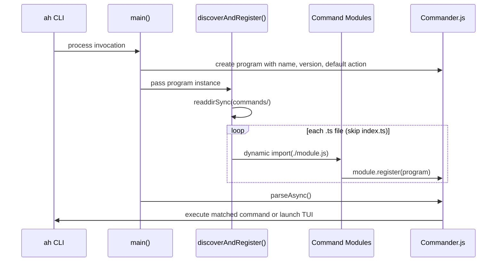

# CLI Entry and Command Discovery

## Why This Architecture Exists

The harness CLI (`ah`) serves as the single entry surface for both human operators and agent processes. Two constraints shaped its design:

1. **Commands must be independently deployable** -- adding a new capability should require only dropping a file into the commands directory, with zero registration boilerplate.
2. **Every invocation must be observable** -- agents operate autonomously, so every command execution needs trace logging for post-hoc debugging.

These constraints produced a three-layer stack: a thin entry point, a filesystem-based command registry, and a shared base-command layer that handles cross-cutting concerns.

## Boot Sequence

When no subcommand is provided, [ref:.allhands/harness/src/cli.ts:main:dc6aae1] falls through to the default action, which launches the TUI via `launchTUI`. This makes the bare `ah` command an interactive experience while subcommands remain agent-scriptable.

## Command Auto-Discovery

[ref:.allhands/harness/src/commands/index.ts:discoverAndRegister:33f0cd2] implements convention-over-configuration discovery:

| Rule | Behavior |
|------|----------|
| File ends with `.ts` | Candidate for import |
| File is `index.ts` | Skipped (it *is* the registry) |
| File is a directory | Skipped (single-file modules only) |
| Module exports `register(program)` | Registered as a command |
| Module fails to load | Warning logged, other commands unaffected |

The `CommandModule` interface enforces a single contract: export a `register` function that receives a Commander `Command` instance. This means adding a new CLI command is a single-file operation with no central manifest to update.

**Key decision**: Error isolation. A broken command module logs a warning but does not prevent the rest of the CLI from functioning. This is critical for agent reliability -- a partial harness is better than no harness.

## Base Command Utilities

[ref:.allhands/harness/src/lib/base-command.ts::b6b76d4] provides the cross-cutting layer that every command can opt into.

### Environment Context

[ref:.allhands/harness/src/lib/base-command.ts:getEnvContext:b6b76d4] reads agent identity from environment variables (`AGENT_TYPE`, `PROMPT_NUMBER`, `SPEC_NAME`). These are set by the tmux window spawner when agents are launched, providing automatic trace attribution without commands needing to accept explicit agent flags.

### Context Resolution

[ref:.allhands/harness/src/lib/base-command.ts:parseContext:b6b76d4] merges CLI options with environment context. The precedence order:

1. Explicit `--agent` flag (highest)
2. `AGENT_TYPE` environment variable
3. Undefined (no agent context)

This allows both human operators (who pass flags) and automated agents (who inherit env vars) to use the same commands.

### Output Formatting

[ref:.allhands/harness/src/lib/base-command.ts:formatOutput:b6b76d4] switches between JSON (for agent consumption) and human-readable text based on the `--json` flag. Every command that uses `executeCommand` gets this for free.

### Traced Execution

Two patterns exist for adding trace logging:

| Pattern | Use Case |
|---------|----------|
| [ref:.allhands/harness/src/lib/base-command.ts:executeCommand:b6b76d4] | Commands that return `CommandResult` objects |
| [ref:.allhands/harness/src/lib/base-command.ts:tracedAction:b6b76d4] | Lightweight wrapper for commands that handle their own output |

Both patterns log start, success, and error events to the trace store. `tracedAction` is the more common pattern -- it wraps a Commander action handler and extracts arguments for logging automatically, filtering out the Commander object that Commander.js appends as the last argument.

### Common Options

[ref:.allhands/harness/src/lib/base-command.ts:addCommonOptions:b6b76d4] attaches `--agent`, `--json`, and `--verbose` flags to any command. These are the harness-standard options that enable agent-mode operation and observability.
