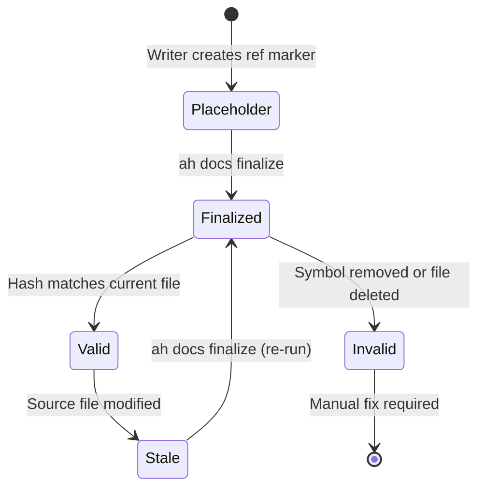

## Intent

Documentation in this codebase uses file-reference markers (with file path, symbol name, and git hash components) instead of code snippets. This solves the staleness problem -- when code changes, refs become stale rather than silently incorrect. The docs command provides the validation and finalization pipeline that makes this reference system work.

The core trade-off: **references add maintenance overhead but eliminate silent drift**. A stale ref is a known problem; a stale code snippet is an unknown one.

## Reference Lifecycle

Writers create placeholder refs during authoring (file path and symbol name, without a hash). The finalize command resolves these into versioned refs by appending the git blob hash of the referenced file. Blob hashes are content-addressable, meaning they depend only on file content -- not commit history. This makes staleness detection resilient to merges, rebases, squash merges, and cherry-picks. Validation then checks that hashes still match and symbols still exist.

## Validation Pipeline

[ref:.allhands/harness/src/commands/docs.ts:validate:3912018] orchestrates the full validation pass:

1. Check ctags availability ([ref:.allhands/harness/src/lib/ctags.ts:checkCtagsAvailable:45c4520])
2. Generate a ctags index for the project ([ref:.allhands/harness/src/lib/ctags.ts:generateCtagsIndex:45c4520])
3. Find all markdown files in the docs path ([ref:.allhands/harness/src/lib/docs-validation.ts:findMarkdownFiles:8f3104d])
4. For each file, run [ref:.allhands/harness/src/lib/docs-validation.ts:validateDocs:8f3104d] which:
   - Validates frontmatter (requires `description` field) via [ref:.allhands/harness/src/lib/docs-validation.ts:validateFrontMatter:8f3104d]
   - Extracts all ref patterns via [ref:.allhands/harness/src/lib/docs-validation.ts:extractRefs:8f3104d]
   - Validates each ref via [ref:.allhands/harness/src/lib/docs-validation.ts:validateRef:8f3104d]
   - Detects placeholder hashes via [ref:.allhands/harness/src/lib/docs-validation.ts:detectPlaceholders:8f3104d]
   - Detects unfinalized refs via [ref:.allhands/harness/src/lib/docs-validation.ts:detectUnfinalizedRefs:8f3104d]

### Ref Validation Logic

[ref:.allhands/harness/src/lib/docs-validation.ts:validateRef:8f3104d] classifies each reference into three states:

| State | Condition | Meaning |
|-------|-----------|---------|
| **valid** | File exists, hash matches, symbol found (if code file) | Reference is current |
| **stale** | File exists but hash differs from ref | Source has been modified since ref was created |
| **invalid** | File missing, git hash lookup failed, or symbol not found | Reference is broken |

For non-code files (markdown, YAML, JSON), the symbol portion is treated as a label -- only the file hash is verified. For code files, [ref:.allhands/harness/src/lib/ctags.ts:lookupSymbol:45c4520] checks that the symbol exists in the ctags index.

## Finalization

[ref:.allhands/harness/src/commands/docs.ts:finalize:3912018] converts placeholder refs into finalized refs:

1. Scan all markdown files for ref patterns without existing hash
2. Batch-collect all referenced files and compute their blob hashes via [ref:.allhands/harness/src/lib/docs-validation.ts:batchGetBlobHashes:8f3104d]
3. For each placeholder in [ref:.allhands/harness/src/commands/docs.ts:finalizeSingleFile:3912018]:
   - Verify the file exists
   - Look up the blob hash
   - For code files with symbols, verify the symbol exists via [ref:.allhands/harness/src/lib/ctags.ts:findSymbolInFile:45c4520]
   - Append the resolved blob hash to each placeholder ref
4. Write modified content back to disk

Supports both single-file and directory (batch) operation. Certain paths are excluded from processing (e.g., `docs/memories.md`, `docs/solutions`).

### Refresh Mode

When `--refresh` is passed, `ah docs finalize --refresh` operates on ALL finalized refs (not just placeholders). For each existing `[ref:file:symbol:hash]` marker, it recomputes the current blob hash and replaces the stored hash in-place. This is useful after switching from commit-based hashes to blob-based hashes, or after any operation that may have caused hash drift without changing file content (e.g., merges, rebases).

Counts reported: updated (hash changed), unchanged (hash already correct), errored (file missing or hash lookup failed).

## Ctags Integration

The ctags layer ([ref:.allhands/harness/src/lib/ctags.ts::45c4520]) provides symbol lookup without requiring language-specific AST parsers:

- [ref:.allhands/harness/src/lib/ctags.ts:generateCtagsIndex:45c4520] runs Universal Ctags to build an index mapping files to their symbols
- [ref:.allhands/harness/src/lib/ctags.ts:lookupSymbol:45c4520] finds symbols by name within a specific file
- [ref:.allhands/harness/src/lib/ctags.ts:findSymbolInFile:45c4520] is the single-file variant used during finalization
- [ref:.allhands/harness/src/lib/ctags.ts:searchSymbol:45c4520] searches across all files for a symbol name
- [ref:.allhands/harness/src/lib/ctags.ts:getFileSymbols:45c4520] returns all symbols in a file (used by the complexity command)

This design choice (ctags over AST parsing) trades precision for breadth -- ctags supports TypeScript, Python, Go, Rust, Java, and Ruby with a single tool.

## Doc Tree Coverage

[ref:.allhands/harness/src/commands/docs.ts:tree:3912018] generates a source tree annotated with documentation coverage. For each source file, it checks whether a corresponding doc exists at predictable paths (`docs/{path}.md`, `docs/{dir}/{name}.md`, `docs/{path}/index.md`). The output includes coverage statistics (total files, covered files, percentage).
