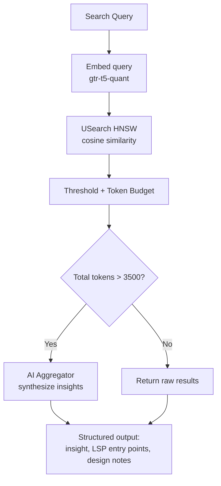

# Knowledge Command

## Intent

Agents need to discover relevant project knowledge without knowing exact file paths or keywords. The knowledge system provides semantic search -- query with a natural language description and get back the most relevant documents ranked by embedding similarity. This is the infrastructure behind `ah knowledge docs search <query>`.

## Architecture

## Index Configuration

[ref:.allhands/harness/src/lib/knowledge.ts:KnowledgeService:79b9873] manages multiple named indexes, each configured for a specific document domain:

| Index | Paths Scanned | Description |
|-------|---------------|-------------|
| `docs` | `docs/`, `specs/` | Project documentation and specifications |
| `roadmap` | `specs/roadmap/` | Planned work specifications |

Each index stores its data as two files in `.allhands/harness/.knowledge/`:
- `{name}.usearch` -- the HNSW vector index (768-dimensional, cosine metric)
- `{name}.meta.json` -- bidirectional path-to-ID mappings, document metadata, timestamps

Files named `memories.md` are excluded from indexing -- they contain project-specific learnings that are not suited for semantic search.

## Embedding and Search

[ref:.allhands/harness/src/lib/knowledge.ts:KnowledgeService:79b9873] exposes an `embed` method that generates 768-dimensional embeddings using the `gtr-t5-quant` model from `@visheratin/web-ai-node`. The model is lazy-loaded on first use and cached for the process lifetime.

The `search` method on [ref:.allhands/harness/src/lib/knowledge.ts:KnowledgeService:79b9873] executes similarity search with several filtering layers:

| Filter | Threshold | Purpose |
|--------|-----------|---------|
| Similarity minimum | 0.65 (configurable) | Discard irrelevant results |
| Token budget | 5000 tokens (configurable) | Bound context size for agents |
| Full context threshold | 0.82 (configurable) | Only include full file content for high-confidence matches |

The similarity score converts cosine distance to a 0-1 scale: `similarity = 1 - distance/2`. The search over-fetches by 2x to compensate for deleted entries that remain in the vector index (USearch does not support true deletion).

Thresholds are configurable via project settings under `knowledge.similarityThreshold`, `knowledge.contextTokenLimit`, and `knowledge.fullContextSimilarityThreshold`.

## Search Command with Aggregation

[ref:.allhands/harness/src/commands/knowledge.ts:SearchCommand:79b9873] adds an AI aggregation layer on top of raw search results. When the total token count of results exceeds 3500 tokens, it invokes an aggregator agent that synthesizes the raw results into structured output: an insight summary, LSP entry points for code navigation, and design notes.

The aggregation can be disabled with `--no-aggregate` for raw results, or `--metadata-only` for just file paths and descriptions without content.

## Indexing

### Full Reindex

The `reindexAll` method on [ref:.allhands/harness/src/lib/knowledge.ts:KnowledgeService:79b9873] rebuilds an index from scratch:

1. Discovers all files matching the index configuration (paths + extensions)
2. Parses frontmatter from markdown files for metadata (description, relevant_files)
3. Strips frontmatter from content before embedding (when configured)
4. Generates embeddings and adds vectors to a fresh USearch index
5. Saves index and metadata to disk

### Incremental Reindex

The `reindexFromChanges` method on [ref:.allhands/harness/src/lib/knowledge.ts:KnowledgeService:79b9873] updates an existing index based on a list of file changes:

- **Added/Modified files**: Re-embed and upsert into the index
- **Deleted files**: Remove from metadata (vector remains in index but is filtered during search)

[ref:.allhands/harness/src/commands/knowledge.ts:getChangesFromGit:79b9873] detects changes by comparing the current branch against the base branch using `git diff --name-status`. This powers the `--from-changes` flag on reindex commands.

[ref:.allhands/harness/src/commands/knowledge.ts:ReindexCommand:79b9873] supports both full and incremental modes, and can operate on a single index or all indexes at once.

### Document Indexing

The `indexDocument` method on [ref:.allhands/harness/src/lib/knowledge.ts:KnowledgeService:79b9873] handles individual document insertion. It assigns or reuses numeric IDs, removes old entries before re-adding (USearch requires unique keys), generates embeddings, and stores metadata including description, relevant files, and estimated token count.

## Status Checking

[ref:.allhands/harness/src/commands/knowledge.ts:StatusCommand:79b9873] reports which indexes exist on disk, enabling agents to determine whether they need to trigger a reindex before searching.
