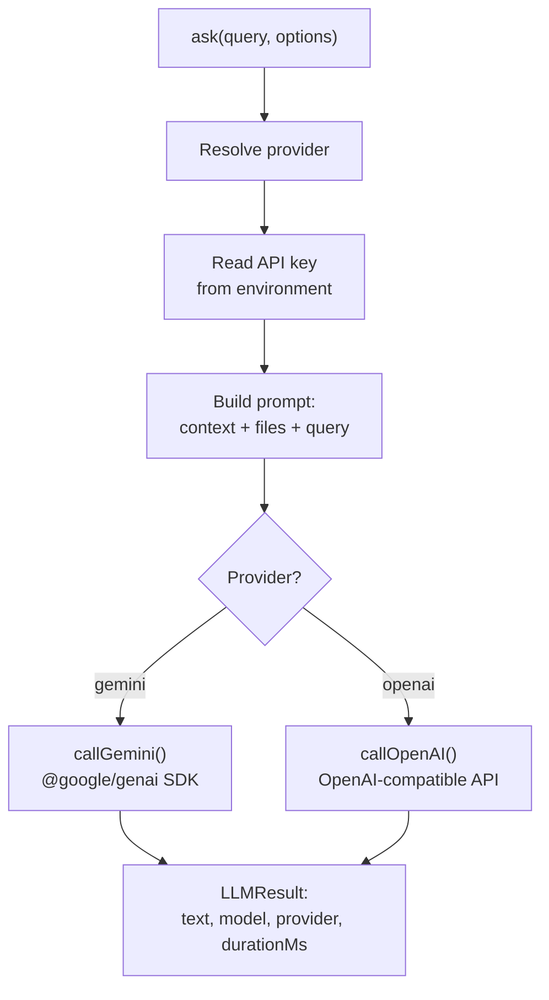
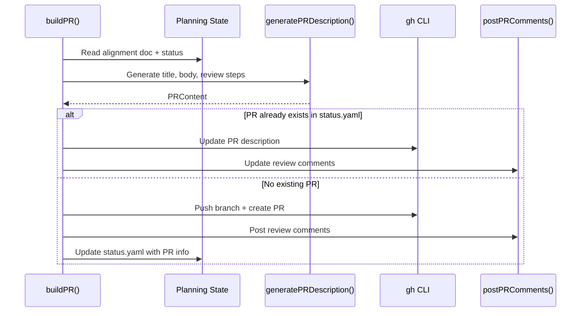

# Oracle Command

## Intent

The oracle is the harness's bridge to external LLM providers. It serves two purposes:

1. **Generic inference** (`ah oracle ask`) -- a provider-agnostic way for any harness component to call an LLM
2. **Harness-specific AI tasks** -- PR generation, conversation analysis, and retry recommendations that are internal functions not exposed to agents

The separation between [ref:.allhands/harness/src/lib/llm.ts::697d7e2] (generic provider layer) and [ref:.allhands/harness/src/lib/oracle.ts::3d01f6c] (harness-specific logic) keeps the LLM infrastructure reusable while concentrating domain-specific prompting in one place.

## Provider Architecture



[ref:.allhands/harness/src/lib/llm.ts:ask:697d7e2] is the unified entry point. It resolves the provider, reads the API key from environment, builds a prompt with optional file and context prefixes, dispatches to the provider-specific implementation, and returns a result with timing metadata.

### Provider Configuration

| Provider | API Key Env Var | Default Model | SDK |
|----------|----------------|---------------|-----|
| Gemini | `GEMINI_API_KEY` | `gemini-3-pro-preview` | `@google/genai` |
| OpenAI | `OPENAI_API_KEY` | `gpt-5.2` | OpenAI-compatible REST |

[ref:.allhands/harness/src/lib/llm.ts:getDefaultProvider:697d7e2] reads the default from project settings (`oracle.defaultProvider`), falling back to `gemini`.

[ref:.allhands/harness/src/lib/llm.ts:getCompactionProvider:697d7e2] is separate because compaction (conversation analysis) benefits from large context windows. It defaults to `gemini` for its 1M+ token context, configurable via `oracle.compactionProvider`.

### Provider Implementations

[ref:.allhands/harness/src/lib/llm.ts:callGemini:697d7e2] uses the official `@google/genai` SDK with API key authentication (Gemini Developer API, not Vertex AI).

[ref:.allhands/harness/src/lib/llm.ts:callOpenAI:697d7e2] uses the OpenAI-compatible REST API.

[ref:.allhands/harness/src/lib/llm.ts:callProvider:697d7e2] dispatches to the appropriate implementation based on provider name.

## PR Generation

[ref:.allhands/harness/src/lib/oracle.ts:buildPR:3d01f6c] orchestrates the full PR creation workflow:



[ref:.allhands/harness/src/lib/oracle.ts:generatePRDescription:3d01f6c] takes alignment content, spec name, and optional spec content, then:

1. Gets the git diff from base branch
2. Parses changed files from the diff
3. Prompts the LLM to generate a title, body, and review steps grouped by file category
4. Validates the response against a Zod schema (`PRContentSchema`)
5. Falls back to [ref:.allhands/harness/src/lib/oracle.ts:extractAlignmentSummary:3d01f6c] + [ref:.allhands/harness/src/lib/oracle.ts:generateFallbackReviewSteps:3d01f6c] if LLM fails

**Key decision**: The fallback groups changed files by type (Core Logic, API/Routes, Components, Tests, Configuration) using path pattern matching, ensuring review steps always exist even when the LLM is unavailable.

[ref:.allhands/harness/src/lib/oracle.ts:postPRComments:3d01f6c] adds review step comments to the PR via `gh api`. [ref:.allhands/harness/src/lib/oracle.ts:updatePRDescription:3d01f6c] and [ref:.allhands/harness/src/lib/oracle.ts:updatePRComments:3d01f6c] handle the update-existing-PR path, finding and replacing previous harness-generated comments.

## Conversation Analysis

[ref:.allhands/harness/src/lib/oracle.ts:analyzeConversation:3d01f6c] examines agent conversation logs after a session to extract:

- Whether the agent was making meaningful progress
- Estimated completion percentage (0-100)
- Key learnings for the next attempt
- Blockers that prevented completion
- Partial work worth preserving

The response is validated against `ConversationAnalysisSchema` (Zod with `z.coerce` to handle LLMs returning strings for boolean/number fields). On failure, it returns a conservative fallback assuming 50% progress.

## Action Recommendation

[ref:.allhands/harness/src/lib/oracle.ts:recommendAction:3d01f6c] uses the conversation analysis to decide the next step:

| Decision | Criteria |
|----------|----------|
| `continue` | >40% progress, code compiles, meaningful logic exists |
| `scratch` | <20% progress, code broken, mostly boilerplate, wrong approach |

The recommendation includes `preserveFiles` and `discardFiles` lists, enabling selective code preservation during retry. On LLM failure, it defaults to `continue` to avoid losing code unnecessarily.

## Response Parsing

All oracle functions that expect structured LLM responses use [ref:.allhands/harness/src/lib/oracle.ts:extractJSON:3d01f6c] to handle the variety of response formats LLMs produce. It tries markdown code block extraction first (```` ```json ... ``` ````), then falls back to brace-matching with proper string escape handling.
