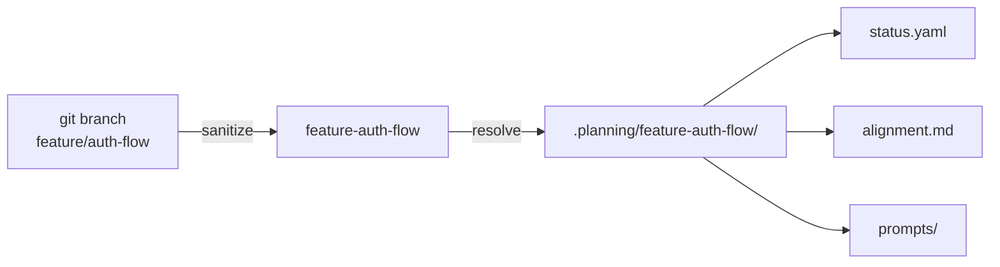
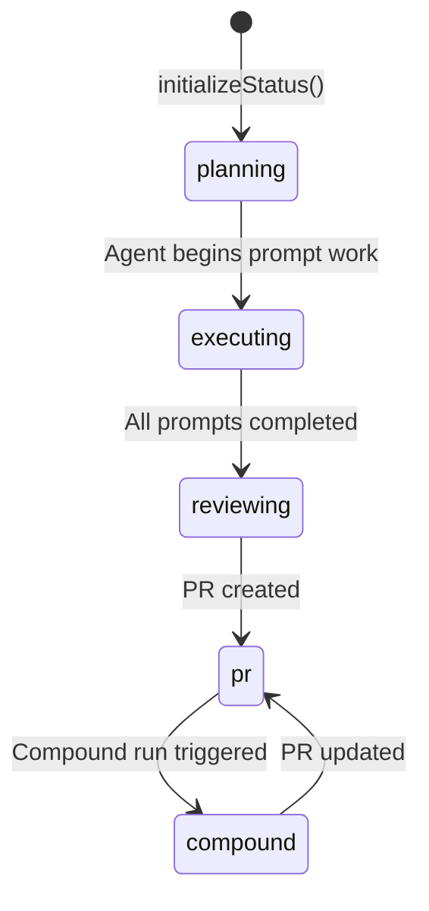

# Planning Command

## Intent

Every spec under active development needs a working directory for mutable planning state: which stage the work is in, what decisions have been made, and what the alignment document says. The planning system maps this state to git branches, making the current branch the sole determinant of which planning context is active.

This is the harness's answer to the question: *where does ephemeral implementation state live?*

## Branch-to-Directory Model

[ref:.allhands/harness/src/lib/planning.ts:sanitizeBranchForDir:79b9873] converts branch names to filesystem-safe directory keys by replacing non-alphanumeric characters (slashes, dots) with hyphens. `feature/foo-bar` becomes `feature-foo-bar`.

### Locked Branches

Not every branch should have planning state. [ref:.allhands/harness/src/lib/planning.ts:isLockedBranch:79b9873] prevents planning directories for:

| Category | Examples |
|----------|----------|
| Protected names | `main`, `master`, `develop`, `staging`, `production` |
| Configured base branch | Whatever `BASE_BRANCH` resolves to |
| Prefix patterns | `wt-*` (worktrees), `quick/*` (quick fixes) |

## Planning Directory Structure

Each planning directory at `.planning/{key}/` contains:

| File | Purpose | Managed By |
|------|---------|------------|
| `status.yaml` | Session state: stage, loop config, PR info | [ref:.allhands/harness/src/lib/planning.ts:writeStatus:79b9873] |
| `alignment.md` | Decisions, overview, hard requirements | [ref:.allhands/harness/src/lib/planning.ts:initializeAlignment:79b9873] |
| `prompts/` | Prompt files for agent execution | External (planner agents) |

### Status Lifecycle

[ref:.allhands/harness/src/lib/planning.ts:initializeStatus:79b9873] creates the initial `StatusFile` with the `planning` stage, linking it to the spec path and recording the original branch name for collision detection.

[ref:.allhands/harness/src/lib/planning.ts:updateStatus:79b9873] performs partial updates, merging new fields into the existing status while preserving the `updated` timestamp.

### Alignment Document

The alignment document is the shared memory between planning and execution agents. It contains:

- **Frontmatter**: spec name, spec path, timestamps
- **Overview**: high-level description from the planner
- **Hard Requirements**: non-negotiable constraints from the spec
- **Decisions**: append-only log of implementation decisions

[ref:.allhands/harness/src/lib/planning.ts:appendDecision:79b9873] adds timestamped decision entries recording which prompt prompted the decision, what was decided, which files were affected, and a summary. This creates an audit trail that execution agents and PR reviewers can reference.

[ref:.allhands/harness/src/lib/planning.ts:readAlignment:79b9873] returns the full alignment content, while [ref:.allhands/harness/src/lib/planning.ts:readAlignmentFrontmatter:79b9873] returns just the parsed YAML header for metadata access without loading the full document body.

## CLI Subcommands

[ref:.allhands/harness/src/commands/planning.ts:register:79b9873] exposes three subcommands:

- **`ah planning status`** -- Reports the current branch's planning state. Resolves the branch, finds the linked spec via [ref:.allhands/harness/src/lib/specs.ts:getSpecForBranch:79b9873], and reads the status file. Outputs spec info, stage, and PR status when available.

- **`ah planning list`** -- Enumerates all planning directories via [ref:.allhands/harness/src/lib/planning.ts:listPlanningDirs:79b9873], showing key, spec path, stage, and marking the current branch's directory.

- **`ah planning ensure`** -- Idempotent setup: creates the planning directory and initializes status if they do not exist for the current branch. Requires a spec to be linked to the branch.

## Planning Utilities

[ref:.allhands/harness/src/lib/planning-utils.ts:findSpecForPath:79b9873] resolves a spec path to its planning directory key, bridging the gap when code needs to go from a spec file to its planning state. It does this by checking spec frontmatter for a `branch` field and sanitizing it.

[ref:.allhands/harness/src/lib/planning-utils.ts:listAllSpecs:79b9873] provides a flat list of all specs with their planning directory links, useful for TUI spec selection and overview displays.

## Key Design Decisions

- **Branch as key, not spec name**: Using the branch ensures each working context is independent even when the same spec is attempted on different branches.
- **Append-only decisions**: The alignment document never overwrites previous decisions, preserving the reasoning chain for future agents and human reviewers.
- **Locked branches**: Prevents accidental planning state on shared branches, which would cause conflicts in multi-agent environments.
