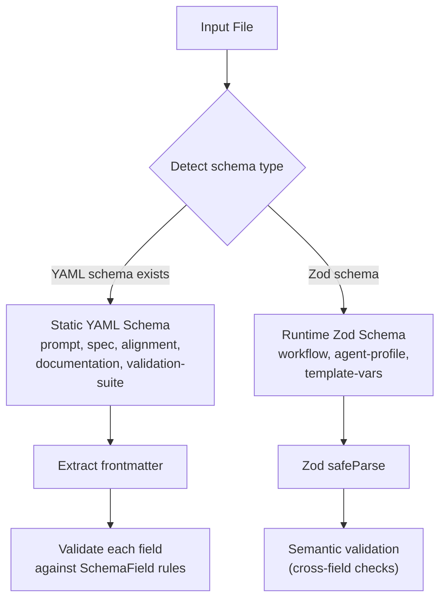

# Schema and Validation Commands

## Intent

The harness manages many structured file types (prompts, specs, alignment docs, agent profiles, validation suites). Each has a required frontmatter shape and sometimes body structure. The schema system is the single source of truth for these requirements, serving two audiences:

1. **Agents** query schemas to understand how to write valid files (`ah schema <type>`)
2. **Validation** checks files against schemas before they enter the pipeline (`ah validate <file>`)

## Two Validation Approaches

The codebase uses two complementary validation strategies depending on the file type:

### Static YAML Schemas

YAML schema files in `.allhands/schemas/` define frontmatter field requirements. [ref:.allhands/harness/src/lib/schema.ts:loadSchema:79b9873] reads and caches these definitions. [ref:.allhands/harness/src/lib/schema.ts:listSchemas:79b9873] discovers available types by scanning the schema directory.

[ref:.allhands/harness/src/lib/schema.ts:validateField:79b9873] checks individual values against their field definition, supporting these types:

| Type | Validation Rule |
|------|----------------|
| `string` | `typeof === 'string'` |
| `integer` | `typeof === 'number'` and `Number.isInteger()` |
| `boolean` | `typeof === 'boolean'` |
| `date` | String parseable as ISO 8601 |
| `enum` | Value in allowed `values` list |
| `array` | `Array.isArray()` |
| `object` | Recursive property validation via nested `properties` |

### Runtime Zod Schemas

For types requiring cross-field validation or normalization from YAML snake_case to TypeScript camelCase:

**Workflow configs**: [ref:.allhands/harness/src/lib/schemas/workflow.ts:parseWorkflowConfig:79b9873] validates workflow YAML against a Zod schema (`name`, `description`, `hypothesis_domains`) and normalizes to a `WorkflowConfig` TypeScript interface.

**Agent profiles**: [ref:.allhands/harness/src/lib/schemas/agent-profile.ts:validateProfileSemantics:79b9873] performs semantic validation beyond schema checks -- verifying that template variables referenced in `message_template` match the declared `template_vars` list, and that no unknown variables are used.

**Template variables**: [ref:.allhands/harness/src/lib/schemas/template-vars.ts:validateTemplateString:79b9873] extracts `${VAR_NAME}` references from templates and validates each against the registry of known variables (SPEC_PATH, ALIGNMENT_PATH, BRANCH, etc.). [ref:.allhands/harness/src/lib/schemas/template-vars.ts:validateContext:79b9873] checks that all required variables have valid values at resolution time.

## Schema Type Detection

The system can automatically determine which schema applies to a file:

[ref:.allhands/harness/src/lib/schema.ts:detectSchemaType:79b9873] uses glob pattern matching against known paths:

| Pattern | Schema Type |
|---------|-------------|
| `.planning/**/prompts/*.md` | `prompt` |
| `.planning/**/alignment.md` | `alignment` |
| `specs/**/*.spec.md` | `spec` |
| `docs/**/*.md` | `documentation` |
| `.allhands/validation/*.md` | `validation-suite` |
| `.allhands/skills/*/SKILL.md` | `skill` |

[ref:.allhands/harness/src/lib/schema.ts:inferSchemaType:79b9873] provides a string-matching fallback when glob patterns fail, using path segments and file name patterns.

## CLI Commands

### `ah schema <type> [property]`

[ref:.allhands/harness/src/commands/schema.ts:register:79b9873] exposes schema definitions to agents. Given a type name, it reads the corresponding YAML schema and outputs it. The optional `property` argument extracts a single top-level key, reducing output for agents that only need to understand one aspect of a schema.

[ref:.allhands/harness/src/commands/schema.ts:getAvailableSchemas:79b9873] lists all `.yaml` files in the schemas directory when an unknown type is requested, guiding agents toward valid types.

### `ah validate <file>`

[ref:.allhands/harness/src/commands/validate.ts:register:79b9873] validates a file against its detected or inferred schema. The validation pipeline:

1. Read the file
2. Detect schema type from path (glob match, then string inference)
3. Extract frontmatter
4. Validate against schema fields
5. Format errors with [ref:.allhands/harness/src/lib/schema.ts:formatErrors:79b9873]

### `ah validation-tools list`

[ref:.allhands/harness/src/commands/validation-tools.ts:register:79b9873] discovers validation suite definitions in `.allhands/validation/`. Each suite is a markdown file with frontmatter declaring `name`, `description`, and `globs` (file patterns the suite validates). This lets agents find relevant validation tooling for the files they are working on.

## Key Design Decisions

- **YAML for static schemas, Zod for runtime**: YAML schemas are agent-readable (via `ah schema`) and work for simple field-level checks. Zod schemas handle normalization and cross-field logic that YAML cannot express.
- **Schema caching**: [ref:.allhands/harness/src/lib/schema.ts:loadSchema:79b9873] caches parsed schemas in memory, avoiding repeated filesystem reads during validation of multiple files.
- **Defaults via schema**: [ref:.allhands/harness/src/lib/schema.ts:applyDefaults:79b9873] fills missing frontmatter fields from schema defaults, enabling minimal frontmatter in files while maintaining complete data.
