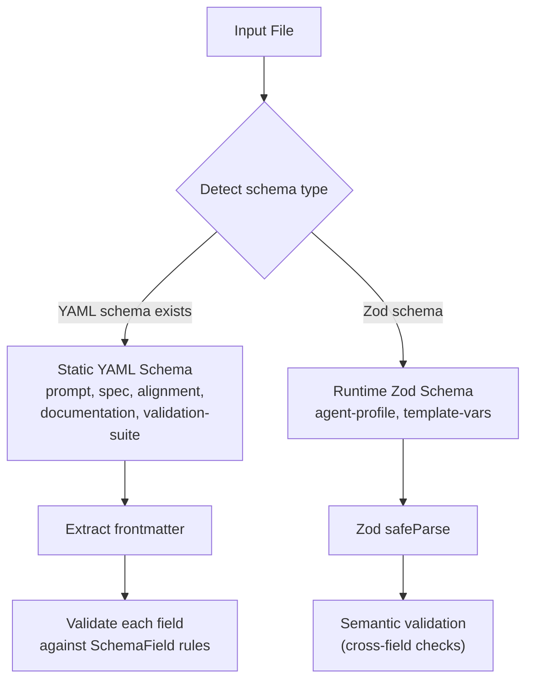

# Schema and Validation Commands

## Intent

The harness manages many structured file types (prompts, specs, alignment docs, agent profiles, validation suites). Each has a required frontmatter shape and sometimes body structure. The schema system is the single source of truth for these requirements, serving two audiences:

1. **Agents** query schemas to understand how to write valid files (`ah schema <type>`)
2. **Validation** checks files against schemas before they enter the pipeline (`ah validate <file>`)

## Two Validation Approaches

The codebase uses two complementary validation strategies depending on the file type:

### Static YAML Schemas

YAML schema files in `.allhands/schemas/` define frontmatter field requirements. [ref:.allhands/harness/src/lib/schema.ts:loadSchema:4eddba4] reads and caches these definitions. [ref:.allhands/harness/src/lib/schema.ts:listSchemas:4eddba4] discovers available types by scanning the schema directory.

[ref:.allhands/harness/src/lib/schema.ts:validateField:4eddba4] checks individual values against their field definition, supporting these types:

| Type | Validation Rule |
|------|----------------|
| `string` | `typeof === 'string'` |
| `integer` | `typeof === 'number'` and `Number.isInteger()` |
| `boolean` | `typeof === 'boolean'` |
| `date` | String parseable as ISO 8601 |
| `enum` | Value in allowed `values` list |
| `array` | `Array.isArray()`, plus item-type enforcement when schema specifies `items` |
| `object` | Recursive property validation via nested `properties` |

When a schema field declares `items` (e.g., `items: string`), [ref:.allhands/harness/src/lib/schema.ts:validateField:4eddba4] enforces that every element matches the declared type. For example, `tools: [123]` is rejected when the schema specifies `items: string`. Integer item validation also catches floats -- `[1, 2.5]` fails against `items: integer`. Arrays without an `items` constraint accept mixed types.

### Runtime Zod Schemas

For types requiring cross-field validation or normalization from YAML snake_case to TypeScript camelCase:

**Agent profiles**: [ref:.allhands/harness/src/lib/schemas/agent-profile.ts:validateProfileSemantics:aa2cf15] performs semantic validation beyond schema checks -- verifying that template variables referenced in `message_template` match the declared `template_vars` list, and that no unknown variables are used.

**Template variables**: [ref:.allhands/harness/src/lib/schemas/template-vars.ts:validateTemplateString:aa2cf15] extracts `${VAR_NAME}` references from templates and validates each against the registry of known variables. [ref:.allhands/harness/src/lib/schemas/template-vars.ts:validateContext:aa2cf15] checks that all required variables have valid values at resolution time.

The template variable registry [ref:.allhands/harness/src/lib/schemas/template-vars.ts:TemplateVars:aa2cf15] defines all valid variables with individual Zod schemas:

| Variable | Type | Description |
|----------|------|-------------|
| `SPEC_PATH` | `string` | Path to spec file |
| `ALIGNMENT_PATH` | `string` | Path to alignment doc |
| `PROMPTS_FOLDER` | `string` | Path to prompts directory |
| `PROMPT_PATH` | `string` | Path to specific prompt file |
| `OUTPUT_PATH` | `string` | Output file path |
| `PLANNING_FOLDER` | `string` | Path to `.planning/{branch}` directory |
| `SPEC_NAME` | `string` | Current spec name |
| `PROMPT_NUMBER` | `string` (regex: `/^\d{2}$/`) | Two-digit prompt number |
| `BRANCH` | `string` | Current git branch name |
| `SPEC_TYPE` | `string` | Spec type from frontmatter (milestone, investigation, optimization, refactor, documentation, triage) |
| `HYPOTHESIS_DOMAINS` | `string` | Comma-separated hypothesis domains from settings.json |

[ref:.allhands/harness/src/lib/schemas/template-vars.ts:TEMPLATE_VAR_NAMES:aa2cf15] exports the full variable name list for runtime validation.

## Schema Type Detection

The system can automatically determine which schema applies to a file:

[ref:.allhands/harness/src/lib/schema.ts:detectSchemaType:4eddba4] uses glob pattern matching against known paths:

| Pattern | Schema Type |
|---------|-------------|
| `.planning/**/prompts/*.md` | `prompt` |
| `.planning/**/alignment.md` | `alignment` |
| `specs/**/*.spec.md` | `spec` |
| `docs/**/*.md` | `documentation` |
| `.allhands/validation/*.md` | `validation-suite` |
| `.allhands/skills/*/SKILL.md` | `skill` |

[ref:.allhands/harness/src/lib/schema.ts:inferSchemaType:4eddba4] provides a string-matching fallback when glob patterns fail, using path segments and file name patterns.

## CLI Commands

### `ah schema <type> [property]`

[ref:.allhands/harness/src/commands/schema.ts:register:4eddba4] exposes schema definitions to agents. Given a type name, it reads the corresponding YAML schema and outputs it. The optional `property` argument extracts a single top-level key, reducing output for agents that only need to understand one aspect of a schema.

[ref:.allhands/harness/src/commands/schema.ts:getAvailableSchemas:4eddba4] lists all `.yaml` files in the schemas directory when an unknown type is requested, guiding agents toward valid types.

### `ah validate <file>`

[ref:.allhands/harness/src/commands/validate.ts:register:4eddba4] validates a file against its detected or inferred schema. The validation pipeline:

1. Read the file
2. Detect schema type from path (glob match, then string inference)
3. Extract frontmatter
4. Validate against schema fields
5. Format errors with [ref:.allhands/harness/src/lib/schema.ts:formatErrors:4eddba4]

### `ah validation-tools list`

[ref:.allhands/harness/src/commands/validation-tools.ts:register:4eddba4] discovers validation suite definitions in `.allhands/validation/`. Each suite is a markdown file with frontmatter declaring:

| Field | Type | Purpose |
|-------|------|---------|
| `name` | `string` | Unique suite identifier (matches filename) |
| `description` | `string` | When/why to use this suite |
| `globs` | `string[]` | File patterns the suite validates (used for discovery) |
| `tools` | `string[]` | CLI tools and packages the suite uses (e.g., `agent-browser`, `playwright`) |

The `tools` field enables agent-to-suite mapping -- agents can find which validation suites are relevant based on the tools they have available. [ref:.allhands/harness/src/commands/validation-tools.ts:listValidationSuites:4eddba4] delegates frontmatter validation to [ref:.allhands/harness/src/lib/schema.ts:validateFrontmatter:4eddba4], ensuring suites with invalid or incomplete frontmatter are silently excluded from the listing rather than causing errors. This delegation keeps schema enforcement centralized in `lib/schema.ts` rather than duplicated in command files.

## Validation Suite Schema

The `validation-suite` schema type ([ref:.allhands/schemas/validation-suite.yaml::6668667]) defines the structure for two-dimensional validation playbooks in `.allhands/validation/`. Per **Agentic Validation Tooling**, every suite has both a stochastic dimension (agent-driven exploratory testing) and a deterministic dimension (CI-gated binary pass/fail).

### Frontmatter Fields

| Field | Type | Required | Description |
|-------|------|----------|-------------|
| `name` | `string` | Yes | Unique suite identifier matching filename |
| `description` | `string` | Yes | Use case description for suite discovery |
| `globs` | `array` (`items: string`) | Yes | File patterns this suite validates |
| `tools` | `array` (`items: string`) | Yes | CLI tools and packages used by the suite |

The `tools` and `globs` fields both enforce item-type validation via `items: string` in the schema -- non-string array elements are rejected at validation time.

### Body Sections

The schema defines 5 body sections that structure the validation playbook:

| Section | Required | Content |
|---------|----------|---------|
| **Purpose** | Yes | Quality aspects this suite validates (stability, performance, UX, accessibility) |
| **Tooling** | Yes | Tools used, installation, and configuration |
| **Stochastic Validation** | Yes | Agent-driven exploratory playbook: patterns, edge case strategies, death spiral escape hatches |
| **Deterministic Integration** | Yes | CI-gated scripted validation: test scripts, success/failure criteria, artifact capture |
| **ENV Configuration** | No | Environment variables needed for both dimensions (only when suite requires external configuration) |

This structure reflects the crystallization lifecycle from principles: stochastic exploration discovers patterns, patterns crystallize into deterministic checks, deterministic checks entrench in CI/CD, and stochastic exploration shifts to the frontier.

## Key Design Decisions

- **YAML for static schemas, Zod for runtime**: YAML schemas are agent-readable (via `ah schema`) and work for simple field-level checks. Zod schemas handle normalization and cross-field logic that YAML cannot express.
- **Schema caching**: [ref:.allhands/harness/src/lib/schema.ts:loadSchema:4eddba4] caches parsed schemas in memory, avoiding repeated filesystem reads during validation of multiple files.
- **Defaults via schema**: [ref:.allhands/harness/src/lib/schema.ts:applyDefaults:4eddba4] fills missing frontmatter fields from schema defaults, enabling minimal frontmatter in files while maintaining complete data.
