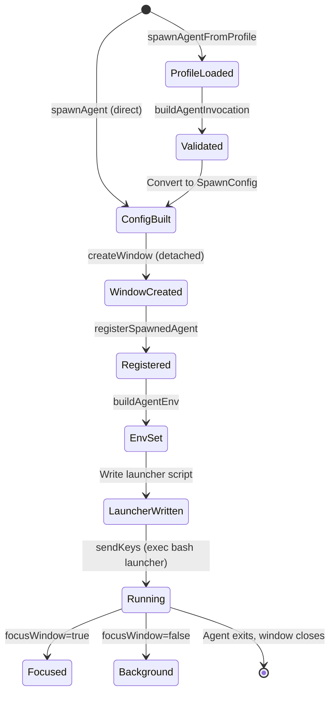

## Intent

The spawn system solves the problem of running multiple concurrent Claude Code agents in isolated environments while maintaining a coherent session model. Each agent runs in its own tmux window with dedicated environment variables, ensuring MCP daemon isolation via AGENT_ID and preventing resource conflicts between agents.

The key design decision is that **tmux windows are the unit of agent isolation**. The window name becomes the AGENT_ID, which cascades into MCP daemon socket paths, trace event attribution, and session state tracking.

## Agent Lifecycle



## Three Spawning Paths

| Path | Entry Point | Use Case |
|------|-------------|----------|
| Profile-based | [ref:.allhands/harness/src/lib/tmux.ts:spawnAgentFromProfile:4eddba4] | Preferred path. Loads YAML profile from `.allhands/agents/`, validates template variables, resolves message template. Supports `flowOverride` for type-routed spawning. |
| Direct spawn | [ref:.allhands/harness/src/lib/tmux.ts:spawnAgent:4eddba4] | Lower-level. Takes a complete SpawnConfig with explicit flow path and preamble |
| Custom flow | [ref:.allhands/harness/src/lib/tmux.ts:spawnCustomFlow:4eddba4] | Ad-hoc flows. Takes an absolute flow path and custom message, uses a generated window name |

The `ah spawn codesearch` CLI command ([ref:.allhands/harness/src/commands/spawn.ts:CodesearchCommand:4eddba4]) takes a separate approach entirely -- it uses the OpenCode SDK's AgentRunner rather than tmux, running an AI agent with ast-grep, ripgrep, and LSP tools within a single process with a tool budget and step limit.

## Flow Override

[ref:.allhands/harness/src/lib/tmux.ts:ProfileSpawnConfig:4eddba4] accepts an optional `flowOverride` field. When provided, it takes precedence over the profile's default flow path in the resulting `SpawnConfig`:

```
flowPath = config.flowOverride || invocation.flowPath
```

This enables **type-routed spawning**: the TUI's New Initiative action selects a spec type, looks up the corresponding scoping flow via [ref:.allhands/harness/src/commands/tui.ts:SCOPING_FLOW_MAP:4eddba4], and passes it as `flowOverride` to the ideation agent profile. The same agent profile serves all initiative types -- only the flow changes.

For milestone spec type, `flowOverride` is `undefined` (profile default flow is used). All other spec types resolve to a dedicated scoping flow file (e.g., `INVESTIGATION_SCOPING.md`, `REFACTOR_SCOPING.md`).

## Template Context Resolution

[ref:.allhands/harness/src/lib/tmux.ts:buildTemplateContext:4eddba4] constructs the `TemplateContext` used for resolving `${VAR_NAME}` placeholders in agent profile message templates. It resolves variables from the current git state, planning paths, spec metadata, and project settings:

| Variable | Resolution Source |
|----------|-------------------|
| `BRANCH` | Current git branch via `getCurrentBranch()` |
| `PLANNING_FOLDER` | `.planning/{branch}` root directory |
| `PROMPTS_FOLDER` | `.planning/{branch}/prompts/` |
| `ALIGNMENT_PATH` | `.planning/{branch}/alignment.md` |
| `OUTPUT_PATH` | `.planning/{branch}/e2e-test-plan.md` |
| `SPEC_NAME` | Display name from status, or planning key |
| `SPEC_PATH` | Read from `status.yaml` spec field |
| `SPEC_TYPE` | Spec frontmatter type via `getSpecForBranch()`, defaults to `'milestone'` |
| `PROMPT_NUMBER` | Zero-padded two-digit number (when prompt-scoped) |
| `PROMPT_PATH` | Absolute path to prompt file (when prompt-scoped) |
| `HYPOTHESIS_DOMAINS` | Comma-separated list from [ref:.allhands/harness/src/hooks/shared.ts:EmergentSettings:4eddba4] in `settings.json`, defaulting to `testing, stability, performance, feature, ux, integration` |

`SPEC_TYPE` is resolved by reading the spec file's frontmatter `type` field for the current branch. This enables type-aware agent behavior -- agents can tailor their approach based on whether the initiative is a milestone, investigation, refactor, etc.

`HYPOTHESIS_DOMAINS` is read from the `emergent.hypothesisDomains` array in `.allhands/settings.json` and joined with commas for template injection.

## EmergentSettings

[ref:.allhands/harness/src/hooks/shared.ts:EmergentSettings:4eddba4] is the TypeScript interface for the `emergent` section of `.allhands/settings.json`:

| Field | Type | Default | Purpose |
|-------|------|---------|---------|
| `hypothesisDomains` | `string[]` | `["testing", "stability", "performance", "feature", "ux", "integration"]` | Pool of domains the emergent planner diversifies across when generating hypothesis prompts |

The settings schema is defined in [ref:.allhands/harness/src/schemas/settings.schema.json::edcd9d1]. The `emergent` object replaces the removed workflow YAML configuration system -- hypothesis domains are now centralized in project settings rather than per-workflow YAML files.

## Window Naming and Prompt Scoping

Window naming determines agent identity and concurrency rules:

- **Non-prompt-scoped agents** (planner, coordinator): Window name = agent name. Only one instance allowed. [ref:.allhands/harness/src/lib/tmux.ts:buildWindowName:4eddba4] throws if a window with that name already exists.
- **Prompt-scoped agents** (executor): Window name = `{name}-{promptNumber:02d}` (e.g., `executor-01`). Multiple concurrent instances allowed, one per prompt. Existing windows are killed and recreated on re-spawn.

## Environment Variable Propagation

[ref:.allhands/harness/src/lib/tmux.ts:buildAgentEnv:4eddba4] constructs the environment for each spawned agent:

| Variable | Source | Purpose |
|----------|--------|---------|
| AGENT_ID | Window name | MCP daemon socket isolation, trace attribution |
| AGENT_TYPE | Profile name | Agent role identification |
| BRANCH | Current git branch | Branch context for operations |
| PROMPT_NUMBER | SpawnConfig (if prompt-scoped) | Prompt tracking |
| SPEC_NAME | SpawnConfig | Spec context |
| PROMPT_SCOPED | "true" if applicable | Signals prompt-scoped behavior |
| CLAUDE_AUTOCOMPACT_PCT_OVERRIDE | Project settings | Configurable autocompact threshold for prompt-scoped agents |
| PYENV_REHASH_SKIP | Always "1" | Avoids lock contention when spawning multiple agents |

## Session Management

The tmux session layer handles multi-agent coordination through a standardized session named `ah-hub`.

[ref:.allhands/harness/src/lib/tmux.ts:setupTUISession:4eddba4] orchestrates session setup with this decision tree:

- **Not in tmux** --> Create new session, rename to `ah-hub`
- **In tmux, multiple windows** --> Prompt user: create new session or reuse current
- **In tmux, single window** --> Reuse current session, rename to `ah-hub`

[ref:.allhands/harness/src/lib/tmux.ts:getSessionDecision:4eddba4] encodes this logic as a pure function returning `'create-new' | 'use-current' | 'no-prompt-needed'`.

## Persistent Session State

[ref:.allhands/harness/src/lib/session.ts::4eddba4] persists session state to `.allhands/harness/.cache/session.json` (not git-tracked). This enables cross-process visibility into which agents are running.

The state tracks two things:
- **hub_window_id**: The tmux window ID where the TUI runs ([ref:.allhands/harness/src/lib/session.ts:setHubWindowId:4eddba4])
- **spawned_windows**: List of agent window names ([ref:.allhands/harness/src/lib/session.ts:addSpawnedWindow:4eddba4], [ref:.allhands/harness/src/lib/session.ts:removeSpawnedWindow:4eddba4])

All mutations go through [ref:.allhands/harness/src/lib/session.ts:withSessionLock:4eddba4], which uses `proper-lockfile` for cross-process file locking to prevent race conditions when multiple agents modify session state simultaneously.

## Launcher Script Pattern

Rather than constructing complex shell commands with escaping issues, the spawn system writes a temporary bash launcher script per agent. This script:

1. Exports all environment variables
2. Reads the combined prompt from a separate file (flow content + preamble + base branch info)
3. Invokes `claude --settings .claude/settings.json --dangerously-skip-permissions` with the prompt
4. Uses `exec bash` so the shell process is replaced, ensuring the window closes when claude exits

Old launcher scripts (>24 hours) are cleaned up automatically by [ref:.allhands/harness/src/lib/tmux.ts:cleanupOldLaunchers:4eddba4].
