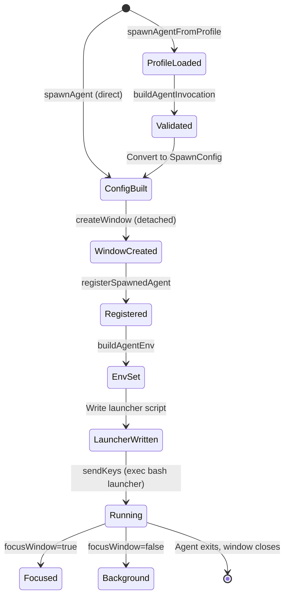

## Intent

The spawn system solves the problem of running multiple concurrent Claude Code agents in isolated environments while maintaining a coherent session model. Each agent runs in its own tmux window with dedicated environment variables, ensuring MCP daemon isolation via AGENT_ID and preventing resource conflicts between agents.

The key design decision is that **tmux windows are the unit of agent isolation**. The window name becomes the AGENT_ID, which cascades into MCP daemon socket paths, trace event attribution, and session state tracking.

## Agent Lifecycle

## Three Spawning Paths

| Path | Entry Point | Use Case |
|------|-------------|----------|
| Profile-based | [ref:.allhands/harness/src/lib/tmux.ts:spawnAgentFromProfile:79b9873] | Preferred path. Loads YAML profile from `.allhands/agents/`, validates template variables, resolves message template |
| Direct spawn | [ref:.allhands/harness/src/lib/tmux.ts:spawnAgent:79b9873] | Lower-level. Takes a complete SpawnConfig with explicit flow path and preamble |
| Custom flow | [ref:.allhands/harness/src/lib/tmux.ts:spawnCustomFlow:79b9873] | Ad-hoc flows. Takes an absolute flow path and custom message, uses a generated window name |

The `ah spawn codesearch` CLI command ([ref:.allhands/harness/src/commands/spawn.ts:CodesearchCommand:79b9873]) takes a separate approach entirely -- it uses the OpenCode SDK's AgentRunner rather than tmux, running an AI agent with ast-grep, ripgrep, and LSP tools within a single process with a tool budget and step limit.

## Window Naming and Prompt Scoping

Window naming determines agent identity and concurrency rules:

- **Non-prompt-scoped agents** (planner, coordinator): Window name = agent name. Only one instance allowed. [ref:.allhands/harness/src/lib/tmux.ts:buildWindowName:79b9873] throws if a window with that name already exists.
- **Prompt-scoped agents** (executor): Window name = `{name}-{promptNumber:02d}` (e.g., `executor-01`). Multiple concurrent instances allowed, one per prompt. Existing windows are killed and recreated on re-spawn.

## Environment Variable Propagation

[ref:.allhands/harness/src/lib/tmux.ts:buildAgentEnv:79b9873] constructs the environment for each spawned agent:

| Variable | Source | Purpose |
|----------|--------|---------|
| AGENT_ID | Window name | MCP daemon socket isolation, trace attribution |
| AGENT_TYPE | Profile name | Agent role identification |
| BRANCH | Current git branch | Branch context for operations |
| PROMPT_NUMBER | SpawnConfig (if prompt-scoped) | Prompt tracking |
| SPEC_NAME | SpawnConfig | Spec context |
| PROMPT_SCOPED | "true" if applicable | Signals prompt-scoped behavior |
| CLAUDE_AUTOCOMPACT_PCT_OVERRIDE | Project settings | Configurable autocompact threshold for prompt-scoped agents |
| PYENV_REHASH_SKIP | Always "1" | Avoids lock contention when spawning multiple agents |

## Session Management

The tmux session layer handles multi-agent coordination through a standardized session named `ah-hub`.

[ref:.allhands/harness/src/lib/tmux.ts:setupTUISession:79b9873] orchestrates session setup with this decision tree:

- **Not in tmux** --> Create new session, rename to `ah-hub`
- **In tmux, multiple windows** --> Prompt user: create new session or reuse current
- **In tmux, single window** --> Reuse current session, rename to `ah-hub`

[ref:.allhands/harness/src/lib/tmux.ts:getSessionDecision:79b9873] encodes this logic as a pure function returning `'create-new' | 'use-current' | 'no-prompt-needed'`.

## Persistent Session State

[ref:.allhands/harness/src/lib/session.ts::79b9873] persists session state to `.allhands/harness/.cache/session.json` (not git-tracked). This enables cross-process visibility into which agents are running.

The state tracks two things:
- **hub_window_id**: The tmux window ID where the TUI runs ([ref:.allhands/harness/src/lib/session.ts:setHubWindowId:79b9873])
- **spawned_windows**: List of agent window names ([ref:.allhands/harness/src/lib/session.ts:addSpawnedWindow:79b9873], [ref:.allhands/harness/src/lib/session.ts:removeSpawnedWindow:79b9873])

All mutations go through [ref:.allhands/harness/src/lib/session.ts:withSessionLock:79b9873], which uses `proper-lockfile` for cross-process file locking to prevent race conditions when multiple agents modify session state simultaneously.

## Launcher Script Pattern

Rather than constructing complex shell commands with escaping issues, the spawn system writes a temporary bash launcher script per agent. This script:

1. Exports all environment variables
2. Reads the combined prompt from a separate file (flow content + preamble + base branch info)
3. Invokes `claude --settings .claude/settings.json --dangerously-skip-permissions` with the prompt
4. Uses `exec bash` so the shell process is replaced, ensuring the window closes when claude exits

Old launcher scripts (>24 hours) are cleaned up automatically by [ref:.allhands/harness/src/lib/tmux.ts:cleanupOldLaunchers:79b9873].
