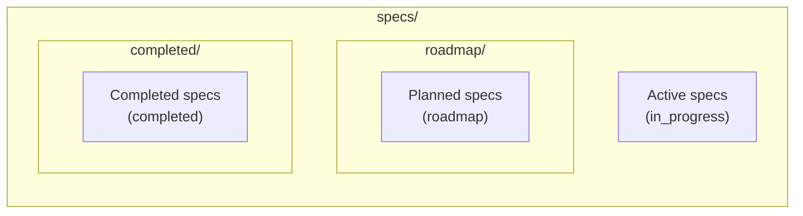

# Specs Command

## Intent

Specs are the units of planned work in the harness. They live as markdown files with YAML frontmatter, organized into directories by lifecycle stage. The specs command manages the transitions between these stages, maintains the link between specs and git branches, and keeps knowledge indexes consistent when files move.

## Spec File Organization

Each spec file (`*.spec.md` or `*.md`) contains frontmatter with:

| Field | Type | Purpose |
|-------|------|---------|
| `name` | string | Spec identifier |
| `domain_name` | string | Grouping domain (e.g., `harness`, `tui`) |
| `status` | enum | `roadmap`, `in_progress`, or `completed` |
| `dependencies` | string[] | Other spec names this depends on |
| `branch` | string | Source of truth for which git branch implements this spec |

## Spec Discovery

Two discovery implementations exist for different contexts:

**Library layer** ([ref:.allhands/harness/src/lib/specs.ts:loadAllSpecs:79b9873]): Scans `specs/roadmap/`, `specs/`, and `specs/completed/` directories. Returns specs grouped by category with full metadata including title extraction from H1 headings via [ref:.allhands/harness/src/lib/specs.ts:extractTitle:79b9873].

**Command layer** ([ref:.allhands/harness/src/commands/specs.ts:loadAllSpecs:79b9873]): Scans `specs/` and `specs/roadmap/` for `.spec.md` files specifically. Used by CLI subcommands for listing and status changes.

## Branch-Spec Linking

The `branch` field in spec frontmatter is the source of truth for which branch implements a spec. Two lookup functions serve different use cases:

- [ref:.allhands/harness/src/lib/specs.ts:findSpecByBranch:79b9873] -- strict match: scans all specs for one whose `branch` field matches the given branch name exactly
- [ref:.allhands/harness/src/lib/specs.ts:getSpecForBranch:79b9873] -- enhanced match: tries `findSpecByBranch` first, then falls back to initializing a planning directory if the branch has a spec assigned

[ref:.allhands/harness/src/lib/specs.ts:findSpecById:79b9873] provides ID-based lookup, searching across all category groups.

## CLI Subcommands

### `ah specs list`

Lists all specs grouped by `domain_name`. Supports filtering:

| Flag | Effect |
|------|--------|
| `--roadmap` | Only roadmap status specs |
| `--completed` | Only completed specs |
| `--in-progress` | Only in-progress specs |
| `--domain <name>` | Filter to a single domain |
| `--domains-only` | Just list domain names |

### `ah specs current`

Shows the spec linked to the current git branch. Uses [ref:.allhands/harness/src/lib/specs.ts:getSpecForBranch:79b9873] with the current branch to display spec ID, title, path, domain, status, and dependencies.

### `ah specs complete <name>`

Marks a spec as completed:

1. Finds the spec by name via [ref:.allhands/harness/src/commands/specs.ts:findSpecByName:79b9873]
2. Updates frontmatter status to `completed` via [ref:.allhands/harness/src/commands/specs.ts:updateSpecStatus:79b9873]
3. If the spec was in `specs/roadmap/`, moves it to `specs/`
4. Triggers knowledge reindexing via [ref:.allhands/harness/src/commands/specs.ts:reindexAfterMove:79b9873]

### `ah specs resurrect <name>`

Reverses completion -- moves a spec back to `specs/roadmap/` and sets status to `roadmap`. Mirrors the `complete` flow in reverse, including knowledge reindexing.

### `ah specs persist <path>`

Creates a branch for a spec, updates the spec frontmatter with the branch name, and commits the spec file to the base branch. This is the entry point for turning a planned spec into active work.

## Knowledge Reindexing on Move

When specs move between directories (complete or resurrect), the knowledge indexes must be updated to reflect the new file paths. [ref:.allhands/harness/src/commands/specs.ts:reindexAfterMove:79b9873] handles this:

- If the old path was in `specs/roadmap/`, mark it as deleted in the `roadmap` index
- If the new path is in `specs/roadmap/`, mark it as added in the `roadmap` index
- Always update the `docs` index (which covers all of `specs/`) with a delete + add pair

This ensures semantic search returns results with correct file paths immediately after a spec transitions.

## TUI Integration

[ref:.allhands/harness/src/lib/specs.ts:specsToModalItems:79b9873] converts spec groups into a format suitable for TUI selection modals, with category headers and selectable items. When no specs exist, it provides a helpful message directing users to create spec files.

[ref:.allhands/harness/src/lib/specs.ts:loadSpecsByDomain:79b9873] groups specs by `domain_name` for domain-oriented views, sorting both domains and specs within each domain alphabetically.
