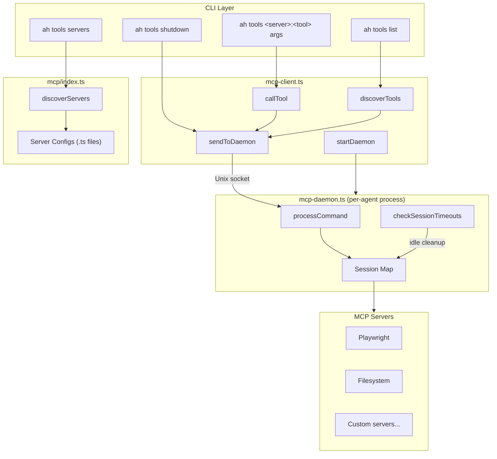

## Intent

The tools system gives agents access to external capabilities (browser automation, file operations, custom tools) through the Model Context Protocol. The central design tension is **session lifecycle management**: MCP servers are expensive to start, so the system uses a per-agent daemon process that keeps server sessions alive between tool calls. This avoids the cold-start penalty while preventing resource leaks through configurable timeouts.

## Architecture

## Daemon Lifecycle

The daemon is a long-lived background process scoped to a single agent (identified by AGENT_ID). It manages MCP server sessions via a Unix domain socket.

**Startup**: [ref:.allhands/harness/src/lib/mcp-client.ts:startDaemon:79b9873] spawns the daemon as a detached child process. The daemon writes its PID and creates the socket at a path derived from the agent ID.

**Communication**: [ref:.allhands/harness/src/lib/mcp-client.ts:sendToDaemon:79b9873] connects to the Unix socket and sends newline-delimited JSON commands. The daemon's [ref:.allhands/harness/src/lib/mcp-daemon.ts:handleConnection:79b9873] buffers incoming data and dispatches complete messages to [ref:.allhands/harness/src/lib/mcp-daemon.ts:processCommand:79b9873].

**Session management**: Each MCP server gets a session (client + transport) created on first use via [ref:.allhands/harness/src/lib/mcp-daemon.ts:ensureSession:79b9873]. Sessions track `lastUsedAt` timestamps and are reaped by [ref:.allhands/harness/src/lib/mcp-daemon.ts:checkSessionTimeouts:79b9873] when idle beyond their configured timeout.

**Shutdown**: [ref:.allhands/harness/src/lib/mcp-daemon.ts:gracefulShutdown:79b9873] closes all MCP transports, clears sessions, closes the server socket, and cleans up PID/socket files. The daemon also exits when its last session closes.

## Daemon Command Protocol

| Command | Handler | Behavior |
|---------|---------|----------|
| `call` | [ref:.allhands/harness/src/lib/mcp-daemon.ts:handleCall:79b9873] | Auto-starts session, invokes tool, returns result |
| `discover` | [ref:.allhands/harness/src/lib/mcp-daemon.ts:handleDiscover:79b9873] | Lists available tools (filters hiddenTools), caches per session |
| `restart` | [ref:.allhands/harness/src/lib/mcp-daemon.ts:handleRestart:79b9873] | Closes existing session, creates fresh one |
| `list` | [ref:.allhands/harness/src/lib/mcp-daemon.ts:handleList:79b9873] | Returns all active sessions with timing info |
| `ping` | [ref:.allhands/harness/src/lib/mcp-daemon.ts:handlePing:79b9873] | Refreshes all session timestamps (keepalive) |
| `info` | N/A | Returns PID, session count, session names |
| `shutdown` | N/A | Graceful shutdown of all sessions and daemon |

## Server Registry

[ref:.allhands/harness/src/mcp/index.ts:discoverServers:ce02241] auto-discovers server configurations by scanning `.ts` files in the `mcp/` directory (excluding `index.ts` and `_template.ts`). Each file exports a `config` object of type `McpServerConfig`.

Key config fields that shape behavior:

| Field | Effect |
|-------|--------|
| `stateful` | If true, daemon keeps session alive between calls. If false, one-shot connections |
| `stateful_session_timeout` | Custom idle timeout (default from `DAEMON_DEFAULT_MCP_TIMEOUT`) |
| `hiddenTools` | Tool names to exclude from discovery results |
| `toolHints` | Extra usage hints shown in `--help` output |

Built-in servers: [ref:.allhands/harness/src/mcp/filesystem.ts::ce02241] (stateless file operations) and [ref:.allhands/harness/src/mcp/playwright.ts::ce02241] (stateful browser automation). New servers are added by copying [ref:.allhands/harness/src/mcp/_template.ts::ce02241].

## Runtime Layer

[ref:.allhands/harness/src/lib/mcp-runtime.ts::79b9873] provides shared utilities used by both daemon and one-shot paths:

- [ref:.allhands/harness/src/lib/mcp-runtime.ts:buildServerCommand:79b9873] resolves the command array from config, handling `npx`, `uvx`, and direct binary paths
- [ref:.allhands/harness/src/lib/mcp-runtime.ts:resolveEnvVars:79b9873] interpolates `${VAR_NAME}` patterns in environment config from the process environment
- [ref:.allhands/harness/src/lib/mcp-runtime.ts:formatToolHelp:79b9873] generates human-readable help text for tools including parameter schemas and hints
- Tool discovery results are cached to disk per server ([ref:.allhands/harness/src/lib/mcp-runtime.ts:getToolsWithCache:79b9873]) to avoid repeated cold starts for tool listing

## CLI Surface

[ref:.allhands/harness/src/commands/tools.ts:register:79b9873] exposes these subcommands:

- `ah tools <server>:<tool> [args...]` -- Invoke a tool with key=value arguments ([ref:.allhands/harness/src/commands/tools.ts:parseToolArgs:79b9873] handles JSON auto-parsing)
- `ah tools list [server]` -- List tools for a server ([ref:.allhands/harness/src/commands/tools.ts:handleListTools:79b9873])
- `ah tools servers` -- List all available servers with session status ([ref:.allhands/harness/src/commands/tools.ts:handleListServers:79b9873])
- `ah tools sessions` -- Show active daemon sessions ([ref:.allhands/harness/src/commands/tools.ts:handleListSessions:79b9873])
- `ah tools shutdown` -- Shut down the daemon ([ref:.allhands/harness/src/commands/tools.ts:handleShutdownDaemon:79b9873])
- `ah tools restart <server>` -- Restart a server session ([ref:.allhands/harness/src/commands/tools.ts:handleSessionRestart:79b9873])

## One-Shot vs Daemon Path

The client layer ([ref:.allhands/harness/src/lib/mcp-client.ts::79b9873]) transparently routes through the daemon when running or falls back to one-shot connections via [ref:.allhands/harness/src/lib/mcp-client.ts:createOneShot:79b9873]. This dual-path design means tools work even without the daemon, at the cost of cold-starting the server each time.
