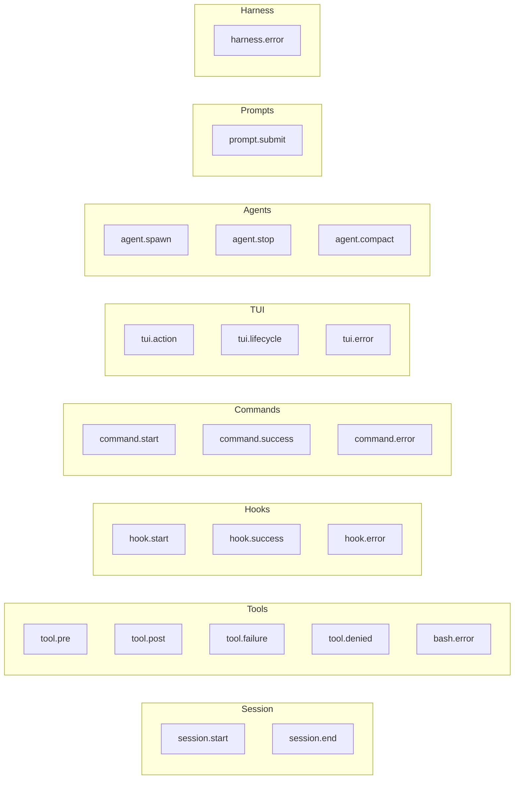

## Intent

When multiple agents run concurrently across tmux windows, debugging failures requires structured observability. The trace system captures events from every harness subsystem -- hooks, CLI commands, TUI actions, agent spawning -- and stores them in both a queryable SQLite database and a greppable JSONL file. The dual-storage design reflects the two access patterns: SQL for filtered queries and aggregation, JSONL for `grep`/`tail -f` workflows.

## Event Model

Every trace event carries agent context derived from environment variables (AGENT_ID, AGENT_TYPE, PROMPT_NUMBER, SPEC_NAME, BRANCH), enabling filtering by which agent produced the event. The `viaDaemon` flag distinguishes events from the CLI daemon vs direct tsx execution.

### Event Types

Error events are explicitly enumerated for fast filtering: `tool.failure`, `tool.denied`, `bash.error`, `hook.error`, `harness.error`, `tui.error`, `command.error`.

## Storage Architecture

[ref:.allhands/harness/src/lib/trace-store.ts:logEvent:79b9873] writes to both backends on every event:

- **SQLite** (`.allhands/harness/.cache/trace/trace.db`): Indexed columns for agent_id, agent_type, event_type, tool_name, timestamp, is_error. Enables efficient filtered queries.
- **JSONL** (`.allhands/harness/.cache/trace/trace.jsonl`): Append-only file, one JSON object per line. Enables `grep`, `jq`, and file-watching workflows.

Both writes use silent failure -- trace errors never break the operation being traced.

## Payload Sanitization

To prevent log bloat from large tool inputs/outputs, payloads are trimmed before storage:

| Control | Default | Env Override |
|---------|---------|--------------|
| Max string length | 200 chars | `TRACE_MAX_STRING_LENGTH` |
| Max nesting depth | 3 levels | `TRACE_MAX_DEPTH` |
| Max array items | 5 | `TRACE_MAX_ARRAY_ITEMS` |
| Max object keys | 8 | `TRACE_MAX_OBJECT_KEYS` |

[ref:.allhands/harness/src/lib/trace-store.ts:sanitizePayload:79b9873] applies [ref:.allhands/harness/src/lib/trace-store.ts:trimStrings:79b9873] and [ref:.allhands/harness/src/lib/trace-store.ts:truncateStructure:79b9873] to enforce these limits with cycle detection via WeakSet.

## Structured Logging Helpers

The trace store provides typed logging functions that construct appropriate event payloads:

| Function | Event Type | Use Case |
|----------|-----------|----------|
| [ref:.allhands/harness/src/lib/trace-store.ts:logHarnessError:79b9873] | `harness.error` | Internal harness failures |
| [ref:.allhands/harness/src/lib/trace-store.ts:logHookStart:79b9873] | `hook.start` | Hook execution begins |
| [ref:.allhands/harness/src/lib/trace-store.ts:logHookSuccess:79b9873] | `hook.success` | Hook completes |
| [ref:.allhands/harness/src/lib/trace-store.ts:logCommandStart:79b9873] | `command.start` | CLI command begins |
| [ref:.allhands/harness/src/lib/trace-store.ts:logCommandSuccess:79b9873] | `command.success` | CLI command completes |
| [ref:.allhands/harness/src/lib/trace-store.ts:logCommandError:79b9873] | `command.error` | CLI command fails |
| [ref:.allhands/harness/src/lib/trace-store.ts:logTuiError:79b9873] | `tui.error` | TUI runtime error |
| [ref:.allhands/harness/src/lib/trace-store.ts:logTuiAction:79b9873] | `tui.action` | User action in TUI |

## Query Interface

[ref:.allhands/harness/src/lib/trace-store.ts:queryEvents:79b9873] builds parameterized SQL queries from filter options:

- `agentId`, `agentType` -- Filter by agent identity
- `eventType` -- Single event type filter
- `toolName` -- Filter by tool
- `since` -- Time filter supporting relative strings (`1h`, `30m`, `2d`) and ISO timestamps
- `errorsOnly` -- Boolean flag that filters on `is_error = 1`
- `limit`/`offset` -- Pagination (default limit: 100)

[ref:.allhands/harness/src/lib/trace-store.ts:getStats:79b9873] provides aggregate statistics with breakdowns by event type, agent type, and tool name, all supporting the `since` time filter.

## CLI Commands

[ref:.allhands/harness/src/commands/trace.ts:register:79b9873] exposes four subcommands:

- **`ah trace list`** -- Query events with full filter support. Human-readable output highlights errors in red, shows truncated payloads for tool events, and displays prompt text for `prompt.submit` events.
- **`ah trace errors`** -- Shortcut for `list --errors`. Prominently displays error messages, command summaries, hook names, and truncated stack traces.
- **`ah trace stats`** -- Aggregate statistics with breakdowns. Useful for understanding activity patterns and error rates across agents.
- **`ah trace tail`** -- Real-time event watching via filesystem change detection on the JSONL file. Supports `--agent` and `--type` filters. Uses `fs.watch` with position tracking to read only new lines.
