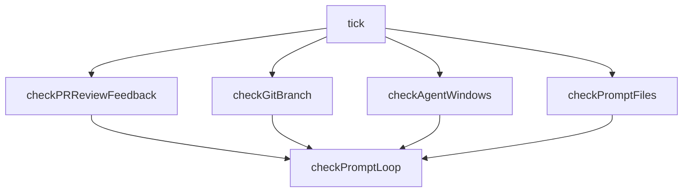
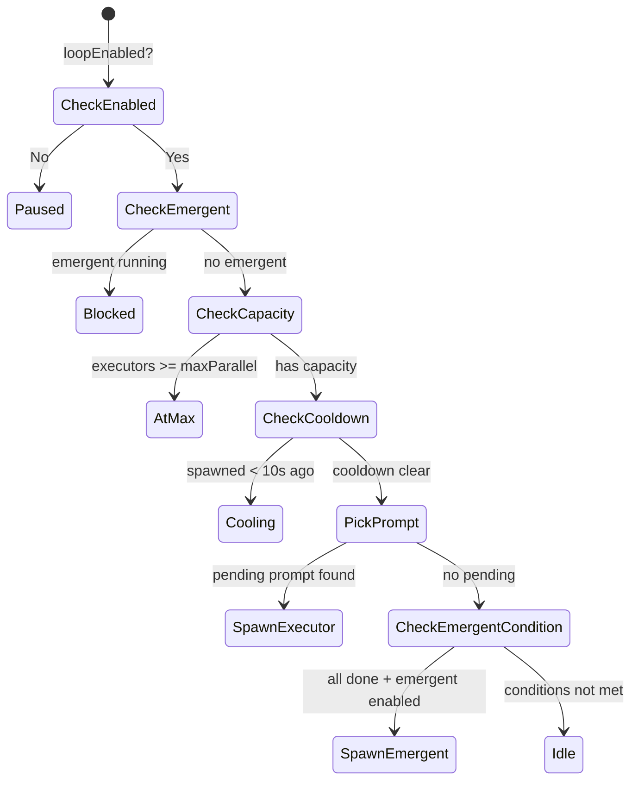

# Event Loop

The event loop is a non-blocking polling daemon that bridges external state (git, tmux, GitHub) with the TUI's reactive model. It runs on a configurable tick interval and fires callbacks when state changes, enabling the TUI to stay current without blocking user interaction.

## Tick Architecture

Each tick runs four independent checks in parallel, followed by a sequential prompt loop check:

[ref:.allhands/harness/src/lib/event-loop.ts:EventLoop:79b9873] stores all state in an `EventLoopState` object that tracks the current branch, spec, PR URL, active agents, executor prompts, and tick count.

## Check: PR Review Feedback

[ref:.allhands/harness/src/lib/pr-review.ts:checkPRReviewStatus:79b9873] polls GitHub for PR review comments. The event loop only runs this check every N ticks (configured via `settings.prReview.checkFrequency`, default 3) since reviews take minutes to complete.

The detection pipeline:
1. [ref:.allhands/harness/src/lib/pr-review.ts:parsePRUrl:79b9873] validates the PR URL format
2. Reads `lastReviewRunTime` from `status.yaml` to filter old comments
3. Checks for comments matching the configured `reviewDetectionString` (default: "greptile")
4. [ref:.allhands/harness/src/lib/pr-review.ts:hasNewReview:79b9873] compares previous and current `PRReviewState` to detect new reviews
5. On detection, fires `onPRReviewFeedback` callback and updates `status.yaml`

[ref:.allhands/harness/src/lib/pr-review.ts:triggerPRReview:79b9873] posts a comment (default: "@greptile") to trigger a new review cycle.

## Check: Git Branch

The event loop treats the git branch as the primary context key. On each tick, it reads the current branch and compares it to stored state. When a branch change is detected:

1. Updates `currentBranch`, `planningKey` (sanitized branch name for `.planning/` lookup)
2. Resolves the new spec via `getSpecForBranch()`
3. Fires `onBranchChange` callback so the TUI reloads prompts and planning artifacts

This implements the **branch-keyed model**: no separate "active spec" tracking is needed because the branch determines the spec.

## Check: Agent Windows

Monitors tmux windows to track which agents are alive. Only considers windows that appear in the spawned agent registry (preventing pickup of unrelated tmux windows).

When agents disappear:
- Their MCP daemons are cleaned up via `shutdownDaemon()`
- They are unregistered from the spawn registry
- Active executor prompt numbers are reconciled (executor/emergent windows encode prompt numbers in their names, e.g., `executor-03`)
- The spawn cooldown timestamp is cleared to allow new spawns

The reconciliation step also runs proactively: if `activeExecutorPrompts` contains numbers with no matching running window, those entries are pruned. This handles edge cases where an agent dies before the next `checkAgentWindows` tick.

## Check: Prompt Files

[ref:.allhands/harness/src/lib/prompts.ts:loadAllPrompts:79b9873] reads all prompt files from the current planning directory. The event loop computes a hash-based snapshot of prompt filenames, statuses, and numbers. When the hash changes, it fires `onPromptsChange` with the full prompt list and a `PromptSnapshot` containing counts by status.

This makes the harness the coordinator: it detects when agents create, modify, or complete prompts without those agents needing to know about the TUI.

## Prompt Execution Loop

The prompt loop is the sequential check that runs after all parallel checks complete. It implements the automated agent dispatch logic:

### Parallel Execution Rules

1. **One agent per tick** -- Only one agent spawns per event loop cycle, preventing thundering herds
2. **Emergent exclusivity** -- At most one emergent agent runs at a time; emergent only triggers when ALL prompts are done
3. **Parallel executors** -- When parallel mode is enabled, up to `settings.spawn.maxParallelPrompts` (default 3) executors can run simultaneously
4. **10-second cooldown** -- After spawning, a cooldown prevents race conditions where tmux hasn't registered the new window yet
5. **Prompt exclusion** -- `activeExecutorPrompts` tracks which prompts have running agents, preventing duplicate assignments

### Prompt Selection

[ref:.allhands/harness/src/lib/prompts.ts:pickNextPrompt:79b9873] selects the next prompt to execute:
- Filters to `pending` status only
- Checks dependency satisfaction via [ref:.allhands/harness/src/lib/prompts.ts:dependenciesSatisfied:79b9873] -- all dependency prompt numbers must be `done`
- Excludes prompts already being worked on (`excludePrompts` parameter)
- Returns the lowest-numbered eligible prompt (FIFO ordering)

[ref:.allhands/harness/src/lib/prompts.ts:markPromptInProgress:79b9873] atomically updates the prompt's frontmatter status to `in_progress` using file locking via [ref:.allhands/harness/src/lib/prompts.ts:withFileLock:79b9873].

## Configuration

All timing and behavior is configurable via `.allhands/settings.json`:

| Setting | Path | Default | Purpose |
|---------|------|---------|---------|
| Tick interval | `eventLoop.tickIntervalMs` | 5000 | Milliseconds between ticks |
| PR check frequency | `prReview.checkFrequency` | 3 | Check PR every N ticks |
| Review detection | `prReview.reviewDetectionString` | "greptile" | Comment substring to detect |
| Rerun comment | `prReview.rerunComment` | "@greptile" | Comment to post for rerun |
| Max parallel | `spawn.maxParallelPrompts` | 3 | Max concurrent executors |

## Lifecycle

- **Start**: `start()` begins the interval timer and runs an initial tick
- **Stop**: `stop()` clears the interval
- **Force tick**: `forceTick()` triggers an immediate tick, used when enabling parallel mode to spawn without waiting
- **Branch sync**: `setBranchContext()` manually overrides branch state after TUI-initiated changes, preventing the event loop from re-detecting the change and overwriting TUI state
