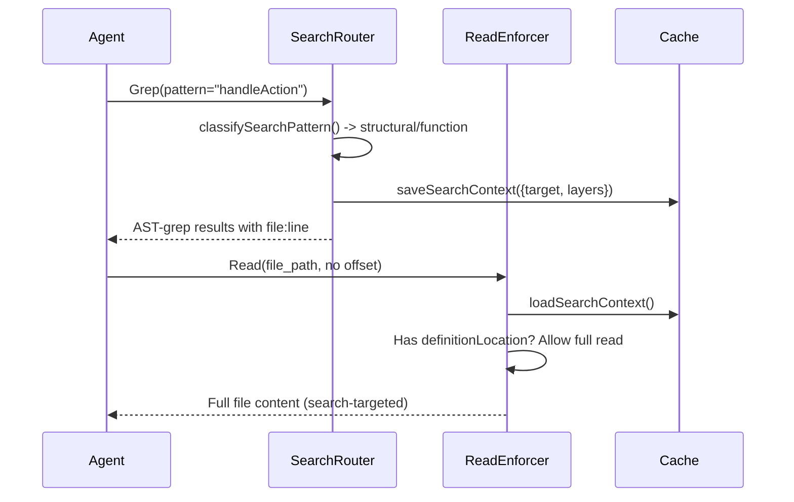

# Context Hooks

Context hooks intercept tool invocations to inject code intelligence before, during, and after agent tool use. They bridge the TLDR analysis daemon with the agent's tool pipeline, ensuring agents receive structured code understanding without consuming raw file tokens.

All hooks gracefully degrade when TLDR is not installed -- they fall back to allowing the tool unmodified.

## Intent-Driven Context Injection

The primary entry point [ref:.allhands/harness/src/hooks/context.ts:detectIntent:f5da0a1] classifies agent prompts into analysis intents that determine which TLDR layers to query:

| Intent | Trigger Patterns | TLDR Layers |
|--------|-----------------|-------------|
| `debug` | "debug", "investigate", "trace", "why does" | Call Graph + CFG |
| `dataflow` | "where does", "come from", "data flow" | DFG |
| `slice` | "what affects", "depends on", "impact of" | PDG/slice |
| `structure` | "show structure", "list functions" | AST only |
| `arch` | "plan", "design", "refactor", "architecture" | Architecture layers |
| `default` | Everything else | Call Graph |

[ref:.allhands/harness/src/hooks/context.ts:extractReferences:f5da0a1] supplements intent detection by pulling function/symbol references from backtick-quoted identifiers and function-call syntax in prompts.

## Hook Inventory

### PreToolUse Hooks

**tldr-inject** -- [ref:.allhands/harness/src/hooks/context.ts:tldrContextInject:f5da0a1]
Intercepts Task tool invocations. Routes to the appropriate TLDR daemon endpoint (context, CFG, DFG, arch) based on detected intent. Injects the analysis result as additional context so the agent sees code structure alongside its task.

**edit-inject** -- [ref:.allhands/harness/src/hooks/context.ts:editContextInject:f5da0a1]
Intercepts Edit tool invocations. Before an edit executes, fetches the file's code structure via TLDR extract, providing the agent with function signatures, class definitions, and import maps for the target file.

**arch-inject** -- [ref:.allhands/harness/src/hooks/context.ts:archContextInject:f5da0a1]
Intercepts architecture-related tool calls. Queries [ref:.allhands/harness/src/lib/tldr.ts:archDaemon:702ae0d] to inject architectural layer information (module boundaries, dependency direction, layer violations) into the agent's context.

**signature-helper** -- [ref:.allhands/harness/src/hooks/context.ts:signatureHelper:f5da0a1]
Intercepts code editing operations. Extracts function calls from the code being edited via [ref:.allhands/harness/src/hooks/context.ts:extractFunctionCalls:f5da0a1], then searches for their signatures using [ref:.allhands/harness/src/hooks/context.ts:getSearchPattern:f5da0a1]. Prevents agents from guessing function signatures by providing the actual definitions.

**import-validator** -- [ref:.allhands/harness/src/hooks/context.ts:importValidator:f5da0a1]
Validates import statements in edited files. Cross-references imports against the TLDR daemon's knowledge of the project's module graph, catching broken imports before they reach runtime.

**read-enforcer** -- [ref:.allhands/harness/src/hooks/context.ts:tldrReadEnforcer:f5da0a1]
Intercepts Read tool calls for large code files. Instead of allowing the agent to consume an entire file's tokens, returns a TLDR-generated summary (imports, classes, functions with signatures and line numbers) and denies the raw read. Bypasses for: files under 100 lines, explicit offset/limit parameters, non-code files, and recent search context indicating a specific location.

**search-router** -- [ref:.allhands/harness/src/hooks/context.ts:smartSearchRouter:f5da0a1]
Intercepts Grep tool calls and routes them through a three-tier search strategy:
1. AST-grep for structural code patterns (function defs, class declarations)
2. TLDR semantic search for natural language / conceptual queries
3. Literal ripgrep fallback if both fail

Uses [ref:.allhands/harness/src/hooks/context.ts:classifySearchPattern:f5da0a1] to determine query type and [ref:.allhands/harness/src/hooks/context.ts:suggestLayers:f5da0a1] to select the optimal search layer. Saves search context via [ref:.allhands/harness/src/hooks/shared.ts:saveSearchContext:ca0caaf] for downstream hooks (read-enforcer uses this to allow targeted reads after a search).

### PostToolUse Hooks

**post-edit-diagnostics** -- [ref:.allhands/harness/src/hooks/context.ts:postEditDiagnostics:f5da0a1]
Runs after Edit tool completes. Queries [ref:.allhands/harness/src/lib/tldr.ts:diagnosticsDaemon:702ae0d] against the edited file, surfacing type errors and lint issues immediately so agents can self-correct without a separate diagnostic step.

**edit-notify** -- [ref:.allhands/harness/src/hooks/context.ts:editNotify:f5da0a1]
Async notification after file edits. Calls [ref:.allhands/harness/src/lib/tldr.ts:notifyFileChanged:702ae0d] to update the TLDR daemon's dirty file tracking, keeping the analysis cache consistent with the current working tree.

### UserPromptSubmit Hooks

**impact-refactor** -- [ref:.allhands/harness/src/hooks/context.ts:impactRefactor:f5da0a1]
Triggers when a user prompt mentions refactoring keywords (refactor, rename, move, delete, extract, inline). Extracts function names via [ref:.allhands/harness/src/hooks/context.ts:extractImpactFunctionNames:f5da0a1], queries [ref:.allhands/harness/src/lib/tldr.ts:impactDaemon:702ae0d] for the reverse call graph, and injects a caller listing so agents understand the blast radius before modifying code.

**transcript-safeguard** -- [ref:.allhands/harness/src/hooks/context.ts:transcriptSafeguardPre:f5da0a1]
PreToolUse guard on TaskOutput. Blocks all TaskOutput calls unconditionally -- background tasks broadcast a completion notification with their result when they finish, making TaskOutput redundant. Blocking prevents dumping massive raw transcripts into agent context.

## Search Context Pipeline

The search context cache connects the search-router and read-enforcer hooks. When a search finds a specific definition location, the subsequent read is allowed in full rather than being replaced with a summary. This prevents the frustrating pattern of search finding a result but the read being blocked.

## Graceful Degradation

Every hook in this module checks [ref:.allhands/harness/src/lib/tldr.ts:isTldrInstalled:702ae0d] and [ref:.allhands/harness/src/lib/tldr.ts:isTldrDaemonRunning:702ae0d] before attempting analysis. If TLDR is unavailable, hooks call [ref:.allhands/harness/src/hooks/shared.ts:allowTool:ca0caaf] and exit silently. This means the harness functions without TLDR -- agents just lose the enriched context layer.
