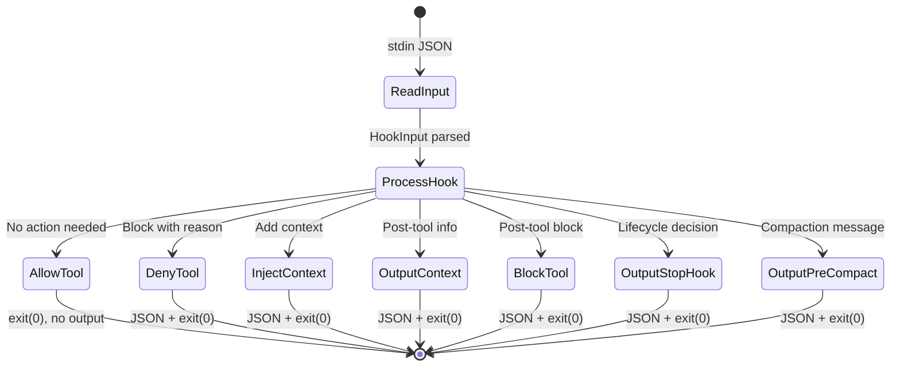

# Lifecycle, Observability, and Infrastructure Hooks

This document covers the hooks that manage agent lifecycles, record observability data, enforce access policies, handle notifications, and provide the shared infrastructure that all hooks depend on.

## Agent Lifecycle

### Stop Handler

[ref:.allhands/harness/src/hooks/lifecycle.ts:handleAgentStop:166f290] runs when an agent signals completion. It:
1. Checks if the agent's tmux window exists via the tmux library
2. Sends a notification that the agent has stopped
3. Retrieves the prompt associated with the agent via [ref:.allhands/harness/src/lib/prompts.ts:getPromptByNumber:89011a7]
4. Kills the tmux window to free resources

The stop handler uses [ref:.allhands/harness/src/hooks/shared.ts:outputStopHook:ca0caaf] with `decision: 'approve'` to confirm the agent should terminate.

### Compaction Handler

[ref:.allhands/harness/src/hooks/lifecycle.ts:handleAgentCompact:166f290] intercepts the PreCompact event -- triggered when an agent's context window fills up. Instead of losing context, it:
1. Delegates to [ref:.allhands/harness/src/lib/compaction.ts:runCompaction:031e2fc] which analyzes the conversation state
2. The compaction system uses an oracle to analyze what the agent accomplished and recommend next actions
3. Generates a progress update via [ref:.allhands/harness/src/lib/compaction.ts:formatProgressUpdate:031e2fc]
4. Appends the progress to the prompt file via [ref:.allhands/harness/src/lib/prompts.ts:appendToProgressSection:89011a7]
5. Executes the recommendation (commit, continue, or stop) via [ref:.allhands/harness/src/lib/compaction.ts:executeRecommendation:031e2fc]
6. Outputs a system message via [ref:.allhands/harness/src/hooks/shared.ts:outputPreCompact:ca0caaf] that survives the compaction

The compaction pipeline captures git diff state through [ref:.allhands/harness/src/lib/compaction.ts:getGitDiffSummary:031e2fc] and [ref:.allhands/harness/src/lib/compaction.ts:getGitDiffFull:031e2fc] to give the oracle full visibility into what changed.

### Session Start

[ref:.allhands/harness/src/hooks/session.ts:tldrWarm:98e8198] runs on SessionStart. It warms the TLDR daemon cache by calling [ref:.allhands/harness/src/lib/tldr.ts:warmIndex:702ae0d]. The hook is entirely non-blocking -- if TLDR is not installed or the daemon is already running, it exits silently. Errors are swallowed to never block session initialization.

## Observability

[ref:.allhands/harness/src/hooks/observability.ts::239a80d] provides structured logging across every hook event type. Each handler logs to the trace store via [ref:.allhands/harness/src/lib/trace-store.ts:logEvent:36af65f].

### Event Coverage

| Event | Handler | What Gets Logged |
|-------|---------|-----------------|
| SessionStart | [ref:.allhands/harness/src/hooks/observability.ts:handleSessionStart:239a80d] | Session ID, timestamp |
| PromptSubmit | [ref:.allhands/harness/src/hooks/observability.ts:handlePromptSubmit:239a80d] | Prompt content summary |
| PreToolUse | [ref:.allhands/harness/src/hooks/observability.ts:handleToolPre:239a80d] | Tool name, input summary |
| PostToolUse | [ref:.allhands/harness/src/hooks/observability.ts:handleToolPost:239a80d] | Tool result, error detection |
| ToolFailure | [ref:.allhands/harness/src/hooks/observability.ts:handleToolFailure:239a80d] | Error details, stderr |
| ToolDenied | [ref:.allhands/harness/src/hooks/observability.ts:handleToolDenied:239a80d] | Denial reason |
| TaskSpawn | [ref:.allhands/harness/src/hooks/observability.ts:handleTaskSpawn:239a80d] | Sub-agent metadata |
| AgentStop | [ref:.allhands/harness/src/hooks/observability.ts:handleAgentStop:239a80d] | Completion status |
| AgentCompact | [ref:.allhands/harness/src/hooks/observability.ts:handleAgentCompact:239a80d] | Compaction trigger reason |

[ref:.allhands/harness/src/hooks/observability.ts:shouldLogTool:239a80d] filters noise by skipping high-frequency, low-value tool calls. [ref:.allhands/harness/src/hooks/observability.ts:summarizeBashCommand:239a80d] truncates long shell commands to keep log entries readable. [ref:.allhands/harness/src/hooks/observability.ts:isBashError:239a80d] parses Bash tool results to detect non-zero exit codes and stderr output.

[ref:.allhands/harness/src/hooks/observability.ts:handleToolPreWithTaskRouting:239a80d] extends the base PreToolUse handler with task-aware routing logic, tracking sub-agent spawns alongside regular tool usage.

## Enforcement Rules

[ref:.allhands/harness/src/hooks/enforcement.ts::e905788] contains PreToolUse hooks that enforce access policies:

- [ref:.allhands/harness/src/hooks/enforcement.ts:enforceGitHubUrl:e905788] -- Intercepts WebFetch/WebSearch for GitHub URLs and redirects agents to use `gh` CLI instead, which has authenticated access and richer output
- [ref:.allhands/harness/src/hooks/enforcement.ts:enforceResearchFetch:e905788] -- Controls web fetch operations during research phases, ensuring agents use approved research channels
- [ref:.allhands/harness/src/hooks/enforcement.ts:enforceResearchSearch:e905788] -- Controls web search operations, applying similar research-phase policies

Enforcement hooks use [ref:.allhands/harness/src/hooks/shared.ts:denyTool:ca0caaf] with specific guidance messages, redirecting agents to better alternatives rather than simply blocking.

## Notifications

[ref:.allhands/harness/src/hooks/notification.ts:handleStopNotification:5b5578d] and [ref:.allhands/harness/src/hooks/notification.ts:handleCompactNotification:5b5578d] send system notifications when agents stop or compact. They use [ref:.allhands/harness/src/lib/notification.ts:sendGateNotification:8f14a76] to deliver alerts, keeping operators informed of agent lifecycle events without requiring TUI visibility.

## Transcript Parsing

[ref:.allhands/harness/src/hooks/transcript-parser.ts:parseTranscript:338596c] is a utility that processes Claude Code JSONL transcript files into structured summaries (`TranscriptSummary`). It streams the file line-by-line via readline for memory efficiency.

[ref:.allhands/harness/src/hooks/transcript-parser.ts:summarizeToolInput:338596c] condenses verbose tool inputs into one-line summaries. [ref:.allhands/harness/src/hooks/transcript-parser.ts:buildCompactionMessage:338596c] transforms a parsed transcript summary into a system message suitable for compaction injection.

## Hook Registration Infrastructure

### Auto-Discovery

[ref:.allhands/harness/src/hooks/index.ts:discoverAndRegisterHooks:8fe9903] scans the hooks directory at runtime, dynamically importing every `.ts` file (except `index.ts`, `shared.ts`, and `transcript-parser.ts`). Each module must export a `register(parent: Command)` function that attaches its subcommands to the CLI.

This pattern means adding a new hook category requires only creating the file -- no manual registration.

### Category-Based Registration

[ref:.allhands/harness/src/hooks/shared.ts:registerCategory:ca0caaf] provides declarative hook registration. A `HookCategory` object describes all hooks in a category with their names, event types, matchers, and handler functions. The function generates Commander subcommands for CLI execution.

[ref:.allhands/harness/src/hooks/shared.ts:registerCategoryForDaemon:ca0caaf] does the same registration but targets the CLI daemon's in-process handler registry instead of Commander, enabling the same hook definitions to work in both CLI and daemon modes.

### Shared I/O Protocol

All hooks communicate through a JSON stdin/stdout protocol defined in [ref:.allhands/harness/src/hooks/shared.ts::ca0caaf]:

Key I/O functions:
- [ref:.allhands/harness/src/hooks/shared.ts:readHookInput:ca0caaf] -- Reads and parses stdin JSON, normalizing `tool_response` to `tool_result`
- [ref:.allhands/harness/src/hooks/shared.ts:allowTool:ca0caaf] -- Silent exit (no output = allow)
- [ref:.allhands/harness/src/hooks/shared.ts:denyTool:ca0caaf] -- Outputs deny decision with reason
- [ref:.allhands/harness/src/hooks/shared.ts:blockTool:ca0caaf] -- Outputs block decision with message
- [ref:.allhands/harness/src/hooks/shared.ts:injectContext:ca0caaf] -- Modifies tool input to add context
- [ref:.allhands/harness/src/hooks/shared.ts:preToolContext:ca0caaf] -- Adds pre-tool context
- [ref:.allhands/harness/src/hooks/shared.ts:outputContext:ca0caaf] -- Adds post-tool context
- [ref:.allhands/harness/src/hooks/shared.ts:outputStopHook:ca0caaf] -- Approve or block agent stop
- [ref:.allhands/harness/src/hooks/shared.ts:outputPreCompact:ca0caaf] -- Inject compaction system message

### Utility Functions

- [ref:.allhands/harness/src/hooks/shared.ts:getProjectDir:ca0caaf] -- Resolves the project root directory
- [ref:.allhands/harness/src/hooks/shared.ts:loadProjectSettings:ca0caaf] -- Reads `.allhands/settings.json` for project-level configuration
- [ref:.allhands/harness/src/hooks/shared.ts:getBaseBranch:ca0caaf] -- Determines the base branch for git operations
- [ref:.allhands/harness/src/hooks/shared.ts:detectLanguage:ca0caaf] -- Infers programming language from file extension, glob pattern, or type hints
- [ref:.allhands/harness/src/hooks/shared.ts:getCacheDir:ca0caaf] / [ref:.allhands/harness/src/hooks/shared.ts:getCacheSubdir:ca0caaf] -- Manage per-project cache directories
- [ref:.allhands/harness/src/hooks/shared.ts:saveSearchContext:ca0caaf] / [ref:.allhands/harness/src/hooks/shared.ts:loadSearchContext:ca0caaf] -- Persist search state between hooks within a session
