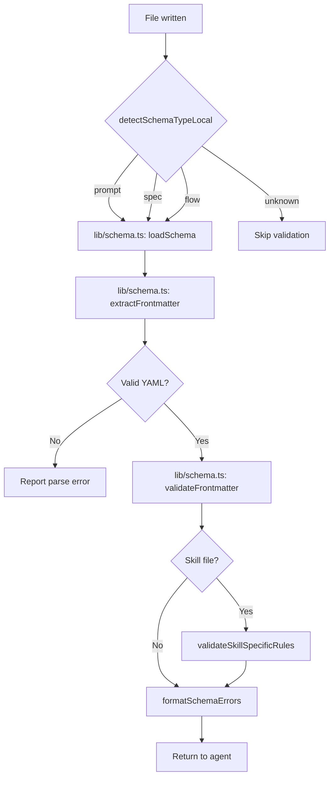

# Validation Hooks

Validation hooks enforce structural correctness at write time. They intercept file creation and editing to run schema checks, type diagnostics, and formatting rules, surfacing errors to agents before bad content reaches the repository.

## Diagnostics Pipeline

[ref:.allhands/harness/src/hooks/validation.ts:runDiagnostics:0e448c6] is the orchestrator. It dispatches to language-specific diagnostic runners based on file extension:

| Language | Runner | Tool | File Extensions |
|----------|--------|------|----------------|
| Python | [ref:.allhands/harness/src/hooks/validation.ts:runPyrightDiagnostics:0e448c6] | pyright | `.py` |
| Python | [ref:.allhands/harness/src/hooks/validation.ts:runRuffDiagnostics:0e448c6] | ruff | `.py` |
| TypeScript | [ref:.allhands/harness/src/hooks/validation.ts:runTscDiagnostics:0e448c6] | tsc | `.ts`, `.tsx` |

Each runner:
1. Checks tool availability via [ref:.allhands/harness/src/hooks/validation.ts:isToolAvailable:0e448c6]
2. Executes the tool against the target file
3. Returns a `DiagnosticResult` with severity, message, and location

For TypeScript, [ref:.allhands/harness/src/hooks/validation.ts:findTsConfig:0e448c6] walks up the directory tree to locate the nearest `tsconfig.json`, ensuring diagnostics respect project-level compiler settings.

[ref:.allhands/harness/src/hooks/validation.ts:formatDiagnosticsContext:0e448c6] transforms diagnostic results into agent-readable markdown, grouping by severity and providing file:line references agents can act on.

## Schema Validation

Schema validation targets frontmatter in markdown files used by the harness (prompts, specs, alignment docs, flow files).

### Delegation Architecture

Schema parsing and validation logic lives in [ref:.allhands/harness/src/lib/schema.ts::c65e65d]. The hooks layer (`validation.ts`) delegates all core operations there:

- **Frontmatter extraction** -- [ref:.allhands/harness/src/lib/schema.ts:extractFrontmatter:c65e65d] (imported into hooks)
- **Schema loading** -- [ref:.allhands/harness/src/lib/schema.ts:loadSchema:c65e65d] (imported as `loadSchemaFromLib`)
- **Frontmatter validation** -- [ref:.allhands/harness/src/lib/schema.ts:validateFrontmatter:c65e65d] (imported as `validateFrontmatterFromLib`)

This consolidation eliminated 4 behavioral divergences that existed when hooks had their own implementations:

1. Frontmatter parsing regex required a trailing newline after the closing `---` in hooks but not in lib
2. Hooks were missing `boolean`, `date`, and `object` type validation branches
3. Return type shape differences between hooks and lib validation results
4. Schema field fallback behavior (`schema.fields` vs `schema.frontmatter`) was inconsistent

### Key Functions

- [ref:.allhands/harness/src/hooks/validation.ts:detectSchemaTypeLocal:0e448c6] -- Thin wrapper over [ref:.allhands/harness/src/lib/schema.ts:detectSchemaType:c65e65d], determines which schema applies based on file path patterns
- [ref:.allhands/harness/src/hooks/validation.ts:validateSkillSpecificRules:0e448c6] -- Additional validation for skill folders via [ref:.allhands/harness/src/hooks/validation.ts:extractSkillFolderName:0e448c6] (skill name must match containing folder)
- [ref:.allhands/harness/src/hooks/validation.ts:runSchemaValidation:0e448c6] -- Full pipeline: detect type, delegate to lib for schema load/parse/validate, then apply skill-specific rules
- [ref:.allhands/harness/src/hooks/validation.ts:runSchemaValidationOnContent:0e448c6] -- Same pipeline but accepts content string instead of reading from disk (used for PreToolUse interception before the file is written)
- [ref:.allhands/harness/src/hooks/validation.ts:formatSchemaErrors:0e448c6] -- Formats validation errors with the schema type for agent display

### Pre vs Post Validation

Two hook entry points handle the timing difference:

- [ref:.allhands/harness/src/hooks/validation.ts:validateSchemaPre:0e448c6] -- **PreToolUse**: Validates content _before_ it reaches disk. Uses `runSchemaValidationOnContent` on the proposed file content from `tool_input`. Blocks the write if schema violations are found.
- [ref:.allhands/harness/src/hooks/validation.ts:validateSchema:0e448c6] -- **PostToolUse**: Validates the file _after_ it has been written. Uses `runSchemaValidation` on the persisted file. Reports errors as context for the agent to fix.

The pre-validation path is stricter -- it can prevent invalid content from being committed. Post-validation is a safety net that catches issues from tools that bypass pre-hooks.

## Formatting Enforcement

[ref:.allhands/harness/src/hooks/validation.ts:runFormat:0e448c6] enforces code formatting after file writes. It reads format configuration from project settings via [ref:.allhands/harness/src/hooks/shared.ts:loadProjectSettings:ca0caaf] and dispatches to the appropriate formatter.

[ref:.allhands/harness/src/hooks/validation.ts:getFormatCommand:0e448c6] maps file extensions to format commands from the project's `FormatConfig`. If a formatter is configured for the file type, it runs the command and reports any changes made.

## Design Decision: Deny vs Context

Schema validation uses [ref:.allhands/harness/src/hooks/shared.ts:denyTool:ca0caaf] for pre-write validation (prevents the tool call) and [ref:.allhands/harness/src/hooks/shared.ts:outputContext:ca0caaf] for post-write diagnostics (informs the agent). This distinction matters: pre-write denial is cheap (no disk I/O wasted), while post-write context lets the agent decide how to remediate.

## Test Coverage

Two e2e test suites verify schema validation behavior:

- [ref:.allhands/harness/src/__tests__/e2e/validation-hooks.test.ts::363c496] -- **28 tests** covering PreToolUse (Write/Edit interception), PostToolUse (file-on-disk validation), and the contract suite verifying hook registration and schema discovery.
- [ref:.allhands/harness/src/__tests__/e2e/validation-path-consistency.test.ts::d19007e] -- **17 tests** documenting the 4 behavioral divergences that existed before delegation consolidation. These tests pin the now-unified behavior: trailing newline handling, boolean/date/object type validation, return type shapes, and schema field fallback paths. Both the lib path and hooks path are exercised to confirm they produce identical results.
