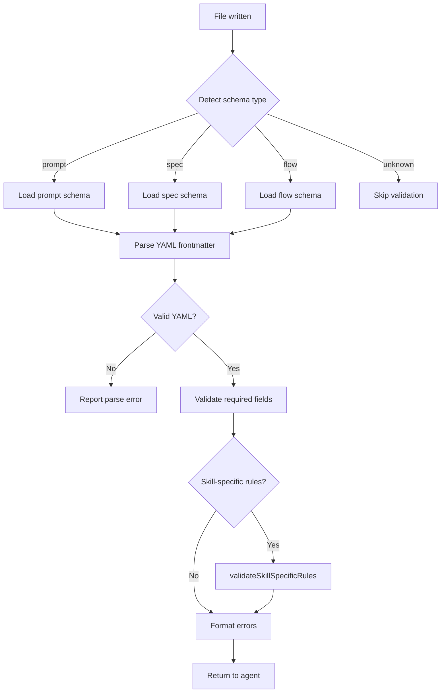

# Validation Hooks

Validation hooks enforce structural correctness at write time. They intercept file creation and editing to run schema checks, type diagnostics, and formatting rules, surfacing errors to agents before bad content reaches the repository.

## Diagnostics Pipeline

[ref:.allhands/harness/src/hooks/validation.ts:runDiagnostics:d7e4a93] is the orchestrator. It dispatches to language-specific diagnostic runners based on file extension:

| Language | Runner | Tool | File Extensions |
|----------|--------|------|----------------|
| Python | [ref:.allhands/harness/src/hooks/validation.ts:runPyrightDiagnostics:d7e4a93] | pyright | `.py` |
| Python | [ref:.allhands/harness/src/hooks/validation.ts:runRuffDiagnostics:d7e4a93] | ruff | `.py` |
| TypeScript | [ref:.allhands/harness/src/hooks/validation.ts:runTscDiagnostics:d7e4a93] | tsc | `.ts`, `.tsx` |

Each runner:
1. Checks tool availability via [ref:.allhands/harness/src/hooks/validation.ts:isToolAvailable:d7e4a93]
2. Executes the tool against the target file
3. Returns a `DiagnosticResult` with severity, message, and location

For TypeScript, [ref:.allhands/harness/src/hooks/validation.ts:findTsConfig:d7e4a93] walks up the directory tree to locate the nearest `tsconfig.json`, ensuring diagnostics respect project-level compiler settings.

[ref:.allhands/harness/src/hooks/validation.ts:formatDiagnosticsContext:d7e4a93] transforms diagnostic results into agent-readable markdown, grouping by severity and providing file:line references agents can act on.

## Schema Validation

Schema validation targets frontmatter in markdown files used by the harness (prompts, specs, alignment docs, flow files).

### Key Functions

- [ref:.allhands/harness/src/hooks/validation.ts:parseFrontmatter:d7e4a93] -- Extracts YAML frontmatter from markdown content between `---` delimiters
- [ref:.allhands/harness/src/hooks/validation.ts:detectSchemaTypeLocal:d7e4a93] -- Determines which schema applies based on file path patterns
- [ref:.allhands/harness/src/hooks/validation.ts:loadSchema:d7e4a93] -- Loads the schema definition for a given type
- [ref:.allhands/harness/src/hooks/validation.ts:validateFrontmatter:d7e4a93] -- Checks parsed frontmatter against schema field requirements (type, required, enum values)
- [ref:.allhands/harness/src/hooks/validation.ts:validateSkillSpecificRules:d7e4a93] -- Additional validation for skill folders via [ref:.allhands/harness/src/hooks/validation.ts:extractSkillFolderName:d7e4a93]
- [ref:.allhands/harness/src/hooks/validation.ts:runSchemaValidation:d7e4a93] -- Full pipeline: detect type, load schema, parse frontmatter, validate
- [ref:.allhands/harness/src/hooks/validation.ts:runSchemaValidationOnContent:d7e4a93] -- Same pipeline but accepts content string instead of reading from disk (used for PreToolUse interception before the file is written)
- [ref:.allhands/harness/src/hooks/validation.ts:formatSchemaErrors:d7e4a93] -- Formats validation errors with the schema type for agent display

### Pre vs Post Validation

Two hook entry points handle the timing difference:

- [ref:.allhands/harness/src/hooks/validation.ts:validateSchemaPre:d7e4a93] -- **PreToolUse**: Validates content _before_ it reaches disk. Uses `runSchemaValidationOnContent` on the proposed file content from `tool_input`. Blocks the write if schema violations are found.
- [ref:.allhands/harness/src/hooks/validation.ts:validateSchema:d7e4a93] -- **PostToolUse**: Validates the file _after_ it has been written. Uses `runSchemaValidation` on the persisted file. Reports errors as context for the agent to fix.

The pre-validation path is stricter -- it can prevent invalid content from being committed. Post-validation is a safety net that catches issues from tools that bypass pre-hooks.

## Formatting Enforcement

[ref:.allhands/harness/src/hooks/validation.ts:runFormat:d7e4a93] enforces code formatting after file writes. It reads format configuration from project settings via [ref:.allhands/harness/src/hooks/shared.ts:loadProjectSettings:d7e4a93] and dispatches to the appropriate formatter.

[ref:.allhands/harness/src/hooks/validation.ts:getFormatCommand:d7e4a93] maps file extensions to format commands from the project's `FormatConfig`. If a formatter is configured for the file type, it runs the command and reports any changes made.

## Design Decision: Deny vs Context

Schema validation uses [ref:.allhands/harness/src/hooks/shared.ts:denyTool:d7e4a93] for pre-write validation (prevents the tool call) and [ref:.allhands/harness/src/hooks/shared.ts:outputContext:d7e4a93] for post-write diagnostics (informs the agent). This distinction matters: pre-write denial is cheap (no disk I/O wasted), while post-write context lets the agent decide how to remediate.
