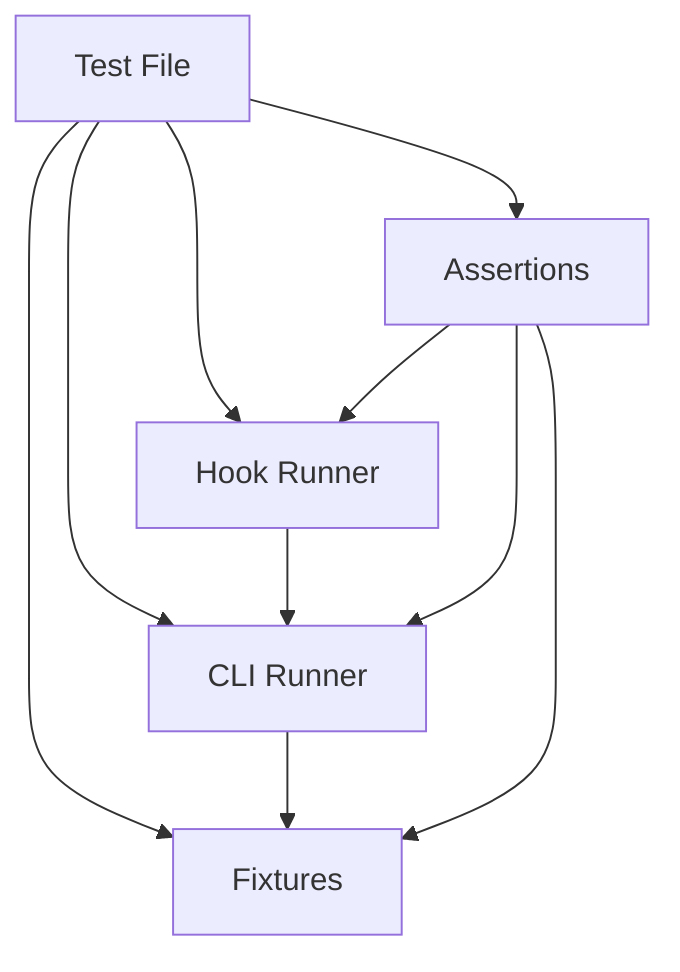

# Test Harness

The test harness enables headless end-to-end testing of the `ah` CLI and its hook system. It creates isolated test environments, executes commands against them, and provides domain-specific assertions that understand hook protocols and harness conventions.

## Four Layers



Each layer builds on the ones below. Tests compose fixtures, runners, and assertions to verify end-to-end behavior.

## Fixtures

Fixtures create temporary directories that replicate the harness's expected file structure.

[ref:.allhands/harness/src/__tests__/harness/fixture.ts:createFixture:507b666] is the base factory. It:
- Creates a temp directory with a random suffix
- Initializes a git repository
- Copies the real `.allhands/harness` directory from the project (via [ref:.allhands/harness/src/__tests__/harness/fixture.ts:getRealHarnessDir:507b666]) so hooks and CLI resolve correctly
- Accepts `FixtureOptions` to customize initial files, planning structure, and project settings
- Returns a `TestFixture` with `dir` (path), `cleanup()` (removes temp dir), and helper methods

[ref:.allhands/harness/src/__tests__/harness/fixture.ts:createSpecFixture:507b666] creates a fixture pre-populated with a spec and N prompt files (default 3), simulating a project mid-planning. Prompts use the `PROMPT_TEMPLATE` with proper frontmatter.

[ref:.allhands/harness/src/__tests__/harness/fixture.ts:createMultiSpecFixture:507b666] creates a fixture with multiple specs, useful for testing spec switching and cross-spec operations.

### Fixture Pooling

[ref:.allhands/harness/src/__tests__/harness/fixture.ts:getPooledFixture:507b666] caches fixtures by name, reusing them across tests in a suite. [ref:.allhands/harness/src/__tests__/harness/fixture.ts:cleanupPool:507b666] tears down all pooled fixtures, typically called in `afterAll`. This avoids recreating expensive fixtures (git init, file copy) for every test.

### Built-in Templates

The fixture module exports templates for common file types:
- `PROMPT_TEMPLATE` -- Markdown prompt with valid frontmatter
- `ALIGNMENT_TEMPLATE` -- Alignment document structure
- `SPEC_TEMPLATE` -- Spec file with required fields
- `PYTHON_SAMPLE` / `TYPESCRIPT_SAMPLE` -- Source files for diagnostics testing

## CLI Runner

[ref:.allhands/harness/src/__tests__/harness/cli-runner.ts:runCli:432baa6] spawns the `ah` CLI as a child process using `tsx` for TypeScript execution. It captures stdout, stderr, and exit code into a `RunResult`. Supports timeout, stdin piping, environment overrides, and JSON output parsing.

[ref:.allhands/harness/src/__tests__/harness/cli-runner.ts:runInFixture:432baa6] wraps `runCli` with a fixture's directory as `cwd`, the most common test pattern.

### Specialized Runners

| Runner | Purpose |
|--------|---------|
| [ref:.allhands/harness/src/__tests__/harness/cli-runner.ts:runKnowledgeSearch:432baa6] | Executes `ah knowledge search` with query, optional path and k |
| [ref:.allhands/harness/src/__tests__/harness/cli-runner.ts:runValidate:432baa6] | Executes `ah validate` against a file path |
| [ref:.allhands/harness/src/__tests__/harness/cli-runner.ts:runCodeSearch:432baa6] | Executes code search with optional budget |
| [ref:.allhands/harness/src/__tests__/harness/cli-runner.ts:runToolsList:432baa6] | Lists available tools |
| [ref:.allhands/harness/src/__tests__/harness/cli-runner.ts:runSpecsList:432baa6] | Lists available specs |

[ref:.allhands/harness/src/__tests__/harness/cli-runner.ts:runBatch:432baa6] executes multiple commands sequentially against the same fixture, returning results in order. Useful for testing multi-step workflows.

[ref:.allhands/harness/src/__tests__/harness/cli-runner.ts:debugResult:432baa6] prints a formatted summary of a `RunResult` for test debugging.

## Hook Runner

[ref:.allhands/harness/src/__tests__/harness/hook-runner.ts:runHook:c357c05] executes a hook by building the correct CLI subcommand, piping `HookInput` as stdin JSON, and parsing the output as a `HookResult` with typed fields for `decision`, `reason`, `context`, and `output`.

### Specialized Hook Runners

| Runner | Hook | Input |
|--------|------|-------|
| [ref:.allhands/harness/src/__tests__/harness/hook-runner.ts:runContextHook:c357c05] | Any context hook | `PreToolUseInput` |
| [ref:.allhands/harness/src/__tests__/harness/hook-runner.ts:runEditInject:c357c05] | `edit-inject` | File path |
| [ref:.allhands/harness/src/__tests__/harness/hook-runner.ts:runReadEnforcer:c357c05] | `read-enforcer` | File path + optional offset/limit |
| [ref:.allhands/harness/src/__tests__/harness/hook-runner.ts:runSearchRouter:c357c05] | `search-router` | Search pattern |
| [ref:.allhands/harness/src/__tests__/harness/hook-runner.ts:runTldrInject:c357c05] | `tldr-inject` | Prompt text |
| [ref:.allhands/harness/src/__tests__/harness/hook-runner.ts:runValidationHook:c357c05] | Any validation hook | `PreToolUseInput` or `PostToolUseInput` |
| [ref:.allhands/harness/src/__tests__/harness/hook-runner.ts:runSchemaCheck:c357c05] | Schema validation | File path + content |
| [ref:.allhands/harness/src/__tests__/harness/hook-runner.ts:runLifecycleHook:c357c05] | Any lifecycle hook | `HookInput` |
| [ref:.allhands/harness/src/__tests__/harness/hook-runner.ts:runStopHook:c357c05] | Stop hook | Session ID |

### Contract Testing

[ref:.allhands/harness/src/__tests__/harness/hook-runner.ts:testHookContract:c357c05] verifies that a hook adheres to a declared contract -- a `HookContract` specifying the hook name, input, and expected output properties (decision, required context strings, timing bounds). Returns a `ContractResult` with pass/fail and specific failure messages.

[ref:.allhands/harness/src/__tests__/harness/hook-runner.ts:testHookContracts:c357c05] runs an array of contracts in sequence, collecting all results. Combined with [ref:.allhands/harness/src/__tests__/harness/assertions.ts:assertContractsPassed:51c46b6], this enables declarative hook testing:

```
Define contract -> Run contract -> Assert all passed
```

[ref:.allhands/harness/src/__tests__/harness/hook-runner.ts:debugHookResult:c357c05] prints a formatted hook result for debugging failures.

## Assertions

The assertion library uses vitest's `expect` under the hood, adding domain-specific checks.

### CLI Assertions

- [ref:.allhands/harness/src/__tests__/harness/assertions.ts:assertSuccess:51c46b6] -- Exit code 0
- [ref:.allhands/harness/src/__tests__/harness/assertions.ts:assertFailure:51c46b6] -- Non-zero exit code
- [ref:.allhands/harness/src/__tests__/harness/assertions.ts:assertStdoutContains:51c46b6] / [ref:.allhands/harness/src/__tests__/harness/assertions.ts:assertStderrContains:51c46b6] -- Substring match in output
- [ref:.allhands/harness/src/__tests__/harness/assertions.ts:assertStdoutMatches:51c46b6] -- Regex match in stdout
- [ref:.allhands/harness/src/__tests__/harness/assertions.ts:assertJsonOutput:51c46b6] -- Parse stdout as JSON and run a validator function
- [ref:.allhands/harness/src/__tests__/harness/assertions.ts:assertTimedWithin:51c46b6] -- Execution completed within a time budget

### Hook Assertions

- [ref:.allhands/harness/src/__tests__/harness/assertions.ts:assertHookAllowed:51c46b6] -- Hook returned allow decision
- [ref:.allhands/harness/src/__tests__/harness/assertions.ts:assertHookDenied:51c46b6] -- Hook returned deny decision
- [ref:.allhands/harness/src/__tests__/harness/assertions.ts:assertHookBlocked:51c46b6] -- Hook returned block decision
- [ref:.allhands/harness/src/__tests__/harness/assertions.ts:assertHookInjectedContext:51c46b6] -- Hook output contains `additionalContext`
- [ref:.allhands/harness/src/__tests__/harness/assertions.ts:assertHookContextContains:51c46b6] -- Injected context contains a specific substring
- [ref:.allhands/harness/src/__tests__/harness/assertions.ts:assertDenialReasonContains:51c46b6] -- Denial reason contains expected text

### Fixture Assertions

- [ref:.allhands/harness/src/__tests__/harness/assertions.ts:assertFileExists:51c46b6] / [ref:.allhands/harness/src/__tests__/harness/assertions.ts:assertFileNotExists:51c46b6] -- File presence in fixture
- [ref:.allhands/harness/src/__tests__/harness/assertions.ts:assertFileContains:51c46b6] / [ref:.allhands/harness/src/__tests__/harness/assertions.ts:assertFileMatches:51c46b6] -- File content checks
- [ref:.allhands/harness/src/__tests__/harness/assertions.ts:assertValidFrontmatter:51c46b6] -- Parses YAML frontmatter and checks required fields

### Git Assertions

- [ref:.allhands/harness/src/__tests__/harness/assertions.ts:assertGitTracked:51c46b6] -- File is tracked by git
- [ref:.allhands/harness/src/__tests__/harness/assertions.ts:assertGitDirty:51c46b6] -- File has uncommitted changes

### Composite Assertions

- [ref:.allhands/harness/src/__tests__/harness/assertions.ts:assertWorkflowSuccess:51c46b6] -- All results in a named sequence succeeded
- [ref:.allhands/harness/src/__tests__/harness/assertions.ts:assertContractsPassed:51c46b6] -- All hook contracts passed

## Barrel Export

[ref:.allhands/harness/src/__tests__/harness/index.ts::c1cd207] re-exports everything from all four layers. Tests import from this single entry point:

```
import { createFixture, runInFixture, runHook, assertSuccess } from '../harness/index.js';
```

This keeps test files clean and decoupled from internal module structure.
