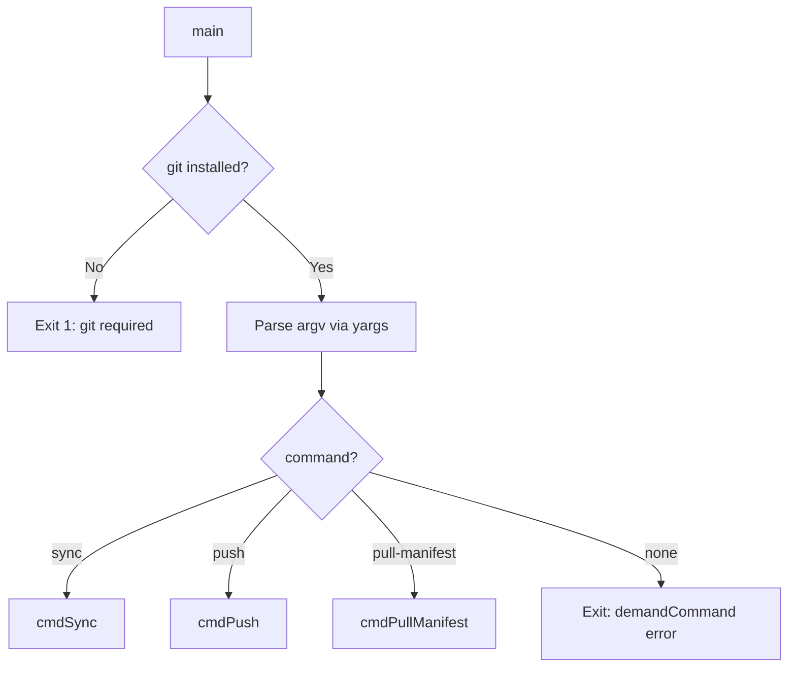

# CLI Entrypoint and Command Registration

The sync-cli is the distribution tool for the allhands framework. It handles moving framework files between the upstream source and target repositories, managing conflicts, and contributing changes back.

## Startup Sequence

[ref:src/sync-cli.ts:main:f39cefb] gates on [ref:src/lib/git.ts:checkGitInstalled:827a9fa] before any command parsing occurs. This is the only dependency check at the entrypoint level -- the `push` command performs its own additional prerequisite checks (gh CLI, auth, repo detection).

## Command Surface

| Command | Entry | Purpose |
|---|---|---|
| `sync [target]` | [ref:src/sync-cli.ts:syncHandler:f39cefb] | Initialize or update allhands in a target repo |
| `push` | [ref:src/commands/push.ts:cmdPush:827a9fa] | Contribute local changes back upstream via fork + PR |
| `pull-manifest` | [ref:src/commands/pull-manifest.ts:cmdPullManifest:827a9fa] | Scaffold the sync config file for push customization |

## Key Design Decision: Separated Builder/Handler

[ref:src/sync-cli.ts:syncBuilder:f39cefb] and [ref:src/sync-cli.ts:syncHandler:f39cefb] are extracted as named functions rather than inlined in the yargs `.command()` call. This enables reuse if the sync command needs to be composed or tested independently. The other commands inline their builders since they have no reuse need.

## Process Exit Convention

Every command handler resolves to a numeric exit code (`Promise<number>`). The entrypoint calls `process.exit(code)` after awaiting the handler. This keeps command implementations testable (they return codes, not call exit themselves) while ensuring the CLI process terminates cleanly.
