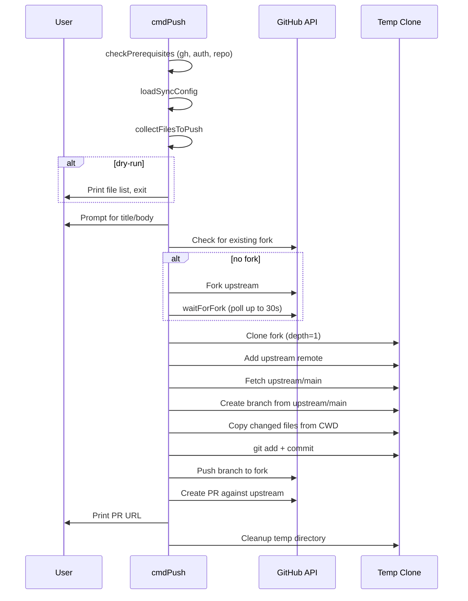

# Push Command

The push command enables downstream consumers to contribute their local allhands modifications back to the upstream repository. It uses a fork-based workflow -- forking the upstream repo, cloning to a temp directory, copying changed files, and opening a pull request.

## Contribution Flow

## File Collection Logic

[ref:src/commands/push.ts:collectFilesToPush:e7d51e3] determines which files to include in the PR through a layered filtering pipeline:

1. **Distributable files** -- Gets the upstream manifest's distributable set via [ref:src/lib/manifest.ts:Manifest:e06b487]
2. **Blocklist filter** -- Removes files in [ref:src/lib/constants.ts:PUSH_BLOCKLIST:61d6025] (e.g., `CLAUDE.project.md`, sync config)
3. **Exclude filter** -- Removes files matching user-provided or config-defined exclude patterns
4. **Gitignore filter** -- Skips files not tracked by git in the user's repo
5. **Diff filter** -- Only includes files where [ref:src/lib/manifest.ts:filesAreDifferent:e06b487] detects byte-level changes
6. **Include expansion** -- [ref:src/commands/push.ts:expandGlob:e7d51e3] adds extra files matching include patterns that aren't already queued

Files are classified as `M` (modified upstream file) or `A` (additional file via includes).

## Sync Config Integration

[ref:src/commands/push.ts:loadSyncConfig:e7d51e3] reads `.allhands-sync-config.json` if present. CLI flags (`--include`, `--exclude`) take precedence over config values. This allows repositories to persist their push customization in version control while still supporting one-off overrides.

## Prerequisite Checks

[ref:src/commands/push.ts:checkPrerequisites:e7d51e3] validates four conditions before any work begins:

| Check | Failure |
|---|---|
| `gh` CLI installed | [ref:src/lib/gh.ts:checkGhInstalled:64ba656] |
| `gh` authenticated | [ref:src/lib/gh.ts:checkGhAuth:64ba656] |
| Current directory is a git repo | [ref:src/lib/git.ts:isGitRepo:70a743c] |
| GitHub username resolvable | [ref:src/lib/gh.ts:getGhUser:64ba656] |

## Fork Readiness Polling

[ref:src/commands/push.ts:waitForFork:e7d51e3] handles GitHub's async fork creation by polling the fork's existence via the gh API every 2 seconds for up to 30 seconds (15 attempts). This avoids race conditions where the CLI tries to clone a fork that hasn't propagated yet.

## Branch Naming Convention

Branches are created as `contrib/<github-user>/<timestamp>`, ensuring uniqueness across multiple pushes from the same user without collision. The branch is based on `upstream/main` regardless of the fork's default branch state.

## Temp Directory Lifecycle

The entire git operation (clone, branch, copy, commit, push) happens in a temp directory under `os.tmpdir()`. The directory is cleaned up in a `finally` block via [ref:src/commands/push.ts:createPullRequest:e7d51e3], ensuring no orphaned clones accumulate even on failure.
