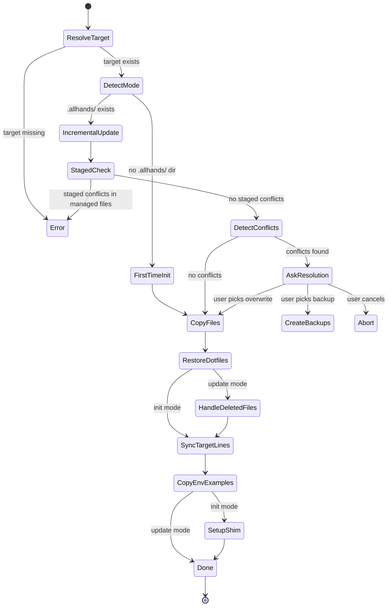

# Sync Command

The sync command is the primary distribution mechanism. It copies distributable files from the allhands package source into a target repository, detecting whether this is a first-time initialization or an incremental update, and handling conflicts accordingly.

## Lifecycle

## Conflict Resolution Strategy

[ref:src/commands/sync.ts:cmdSync:ca521c9] employs a two-phase conflict detection approach:

1. **Staged file guard** -- Before any file operations, checks if the target repo has staged git changes that overlap with managed files. This prevents the sync from silently overwriting work the user intends to commit. Uses [ref:src/lib/manifest.ts:Manifest:e06b487] to determine the managed file set and [ref:src/lib/git.ts:getStagedFiles:70a743c] to detect staging conflicts.

2. **Content-level diff** -- Iterates all distributable files and uses [ref:src/lib/manifest.ts:filesAreDifferent:e06b487] (byte-level comparison) to identify files that differ between source and target. The user is then presented with three options via [ref:src/lib/ui.ts:askConflictResolution:6374626]:

| Resolution | Behavior |
|---|---|
| **Backup** | Creates `file.backup_N.ext` via [ref:src/lib/ui.ts:getNextBackupPath:6374626], then overwrites |
| **Overwrite** | Replaces target files directly (local changes lost) |
| **Cancel** | Aborts with no changes made |

The `--yes` flag forces overwrite mode, skipping all interactive prompts.

## Post-Copy Processing

After file copying, three post-processing steps run in sequence:

- **Dotfile restoration** -- [ref:src/lib/dotfiles.ts:restoreDotfiles:8d2662f] renames npm-safe names back to dotfiles (e.g., `gitignore` to `.gitignore`). This is necessary because npm strips dotfiles during package publishing.
- **Target-line injection** -- [ref:src/lib/target-lines.ts:ensureTargetLines:c2f18b9] appends required lines to target-repo files (like `.gitignore`, `CLAUDE.md`, `.tldrignore`) without duplicating existing entries.
- **Deleted file cleanup** (update only) -- Detects files that exist in the target but were removed from the source, prompting the user to delete them.

## The `ah` CLI Shim

On first-time init, [ref:src/commands/sync.ts:setupAhShim:ca521c9] installs a bash shim to `~/.local/bin/ah`. The shim walks up the directory tree from `$PWD` looking for `.allhands/harness/ah`, enabling project-local `ah` invocation from anywhere within a synced repository. It warns if `~/.local/bin` is not in `PATH`.

## Full Replace Alternative

[ref:src/lib/full-replace.ts:fullReplace:827a9fa] provides a wholesale directory replacement strategy as an alternative to the file-by-file approach in `cmdSync`. It backs up entire `.allhands` and `.claude` directories with timestamped names via [ref:src/lib/full-replace.ts:getBackupDirName:827a9fa], then restores preserved items (like `node_modules` and `settings.local.json`) from the backup. [ref:src/lib/full-replace.ts:checkPreservedFiles:827a9fa] identifies root-level files that should never be overwritten (`.env`, `.env.ai`, `.env.local`).
