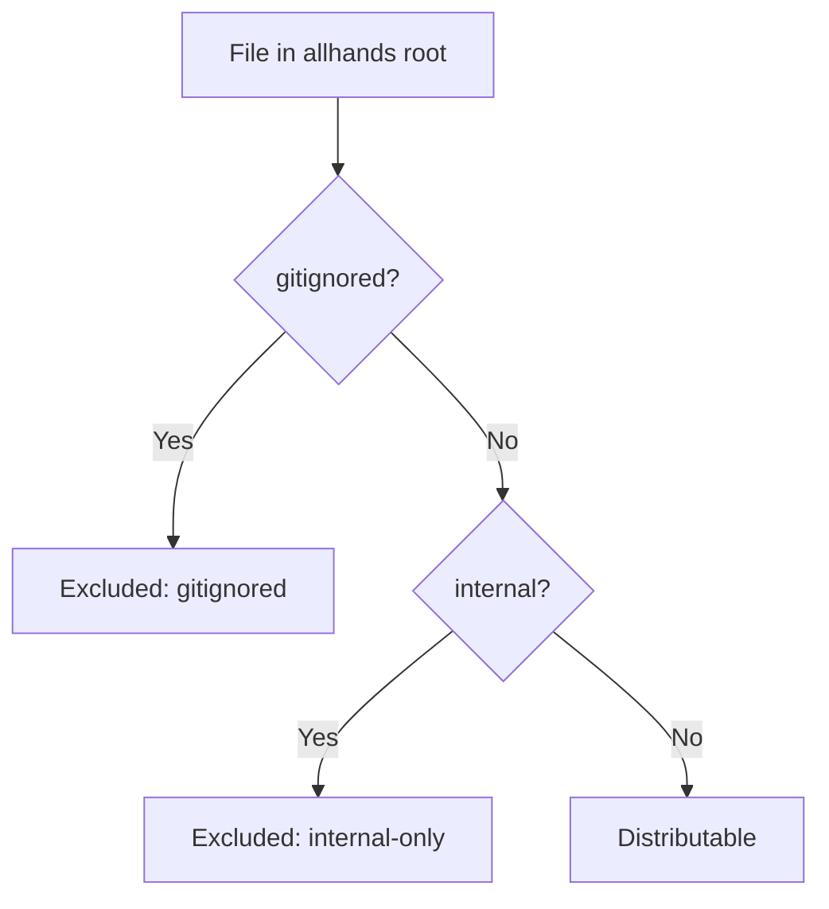

# Manifest and Distribution System

The manifest system is the gatekeeper for file distribution. Every file in the allhands source is classified into one of three categories, and only distributable files flow to target repositories.

## File Classification

[ref:src/lib/manifest.ts:Manifest:e06b487] loads two data sources at construction:
- **`.internal.json`** -- Lists glob patterns for internal-only files (not shipped to consumers)
- **`.gitignore` files** -- Parsed by [ref:src/lib/gitignore.ts:GitignoreFilter:0ee79f8] across the full directory tree

A file is distributable if and only if it passes both checks: `!isInternal(path) && !isGitignored(path)`.

## Gitignore Parsing

The gitignore system replicates git's own ignore semantics rather than shelling out to `git check-ignore`. This was a deliberate choice -- the allhands root may not itself be a git repository (e.g., when running from an npm package).

[ref:src/lib/gitignore.ts:parseGitignoreFile:0ee79f8] handles:
- Comment lines (`#`) and blank lines
- Negation patterns (`!pattern`)
- Directory-scoped patterns (trailing `/`)
- Root-relative patterns (leading `/`)
- Level-agnostic patterns (no slash -- matches at any depth via `**/` prefix)

[ref:src/lib/gitignore.ts:matchesPattern:0ee79f8] resolves each rule relative to the `.gitignore` file's directory, matching git's behavior where nested `.gitignore` files scope their rules to their own subtree.

[ref:src/lib/gitignore.ts:GitignoreFilter:0ee79f8] walks the entire directory tree, loading every `.gitignore` it encounters. The last-match-wins evaluation order mirrors git's precedence rules, with negation patterns able to re-include previously ignored paths.

## Byte-Level Comparison

[ref:src/lib/manifest.ts:filesAreDifferent:e06b487] performs an optimized two-step comparison:
1. **Size check** -- If file sizes differ, return `true` immediately (no I/O beyond stat)
2. **Content check** -- Full buffer comparison via `Buffer.equals`

This avoids timestamp-based false positives that would trigger unnecessary conflict resolution during sync.

## Directory Walking

[ref:src/lib/fs-utils.ts:walkDir:3041b62] provides the recursive traversal used by both the gitignore filter and dotfile restoration. It skips `.git` and `node_modules` directories -- these are never relevant for distribution or ignore-rule collection.
